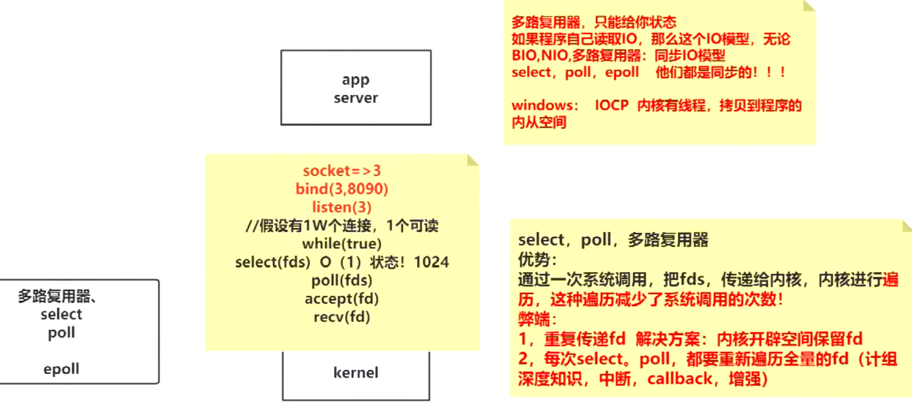

# IO 


## 底层原理

[原理爽文：BIO / NIO / 多路复用](https://mp.weixin.qq.com/s/_Eh7eZLtcUjrp9QiCvLmrw)	

[理论基础](https://www.bilibili.com/video/BV1Af4y117ZK?t=7&p=2)	


`时钟中断` ==> 保护现场【现在的执行程序】 ==> CPU执行内核的程序调度 ==> 恢复现场【调度到的程序 之前的寄存器状态】

`程序的切换过程`：上下文 、保护现场、恢复现场、内存和CPU间的吞吐量

`中断（INT x80）`、`系统调用`：用户空间 **想**系统调用 内核空间时，所用到的方法【实际上是，CPU来调用】

- 【保护模式：用户空间不能直接调用内核空间】


## 高性能IO

[详细解说](https://mp.weixin.qq.com/s?subscene=23&__biz=MzIyNjMxOTY0NA==&mid=2247486319&idx=1&sn=3d49360a9451916b277b2cba6fca7873&chksm=e873071cdf048e0a4f64c7445a9815e61d3b820098da6fda9e2a70d5038ed92a0e13cbfca04d&scene=7&key=4cf40c946f4d610cb1109fbff319a16d3a900e480fdb645f4a98787800e1ff5ea2220003f4f92690d770fcb0febddb7075659706985f1b1de7f3ddcf01667d05aaa47cb2821dc4038c864e9d28c3b24e494342a82cee776f2991a240dca969cc4117b80925b7d6a7fd2240ede814f705f27d9449ee01ef72968ed0b01f39be21&ascene=0&devicetype=Windows+10+x64&version=62090538&lang=zh_CN&exportkey=A4TnNhVt1XAnKcBNTIaRRW4%3D&pass_ticket=gGX9IIfT9z8Xkp1Zru8gT7yx0lpDUCSJmzhIT9edLuBok%2BA4gr4cc5xoJi9NBnGg&wx_header=0)	

- I/O优化：零拷贝技术
- I/O优化：多路复用技术
- 线程池技术
- 无锁编程技术
- 进程间通信技术
- RPC && 序列化技术
- 数据库索引技术
- 缓存技术 && 布隆过滤器
- 全文搜索技术
- 负载均衡技术


## 磁盘操作：File
       File 类可以用于**表示文件和目录的信息**，但是它`不表示`文件的内容。
 * 从 Java7 开始，可以使用 Paths 和 Files 代替 File。
```java
import java.nio.file.Files;
import java.nio.file.Paths;
import java.nio.file.Path;    // Path就是取代File的，Path用于来表示文件路径和文件
```


## 字节操作：InputStream 和 OutputStream

```java
public abstract int read() throws IOException;
public int read(byte b[], int off, int len) throws IOException{...}
public int read(byte b[]) throws IOException {
        return read(b, 0, b.length);
    }
```
1. 无参的read()方法返回的**int类型**，是表示数据**下一个字节的字节码**，如果已经到达流的最后面了，那就返回-1
2. 两个带参数read()方法返回的是`实际`**读取的字节数**。


### 文件复制

```java
public static void copyFile(String src, String dist) throws IOException {
    FileInputStream in = new FileInputStream(src);
    FileOutputStream out = new FileOutputStream(dist);

    byte[] buffer = new byte[20 * 1024];
    int cnt;

    // 带参数的 read() 最多读取 buffer.length 个字节
    // 返回的是实际读取的个数
    // 返回 -1 的时候表示读到 eof，即文件尾
    while ((cnt = in.read(buffer, 0, buffer.length)) != -1) {
        out.write(buffer, 0, cnt);
    }

    in.close();
    out.close();
}
```
### 装饰者模式
Java I/O 使用了装饰者模式来实现。以 InputStream 为例：
* InputStream 是抽象组件；
* FileInputStream 是 InputStream 的子类，属于**具体组件**，提供了字节流的输入操作；
* FilterInputStream 属于**抽象装饰者**，装饰者用于装饰组件，`为组件提供额外的功能`。
* 例如 BufferedInputStream 为 FileInputStream 提供缓存的功能。
* DataInputStream 装饰者提供了对更多数据类型进行输入的操作，比如 int、double 等基本类型。


#### 具有缓存功能的字节流对象：
```java
FileInputStream fileInputStream = new FileInputStream(filePath);
BufferedInputStream bufferedInputStream = new BufferedInputStream(fileInputStream); 
// 只需要在 FileInputStream 对象上再套一层 BufferedInputStream 对象即可
```

## 字符操作：Reader 和 Writer
### 编码与解码
    编码就是把“字符转换为字节”
    
    而解码是把“字节重新组合成字符”
* GBK 编码中，中文字符占 2 个字节，英文字符占 1 个字节；
* UTF-8 编码中，中文字符占 3 个字节，英文字符占 1 个字节；
* UTF-16be 编码中，中文字符和英文字符都占 2 个字节。
    * **Java 的内存编码**使用双字节编码 UTF-16be，**这不是指** Java 只支持这一种编码方式，**而是说** char 这种类型使用 UTF-16be 进行编码。
    * char 类型占 16 位---->两个字节，Java 使用这种双字节编码是为了让一个中文或者一个英文`都能使用一个 char 来存储`。
    * UTF-16be 中的 be 指的是 Big Endian，也就是大端。相应地也有 UTF-16le，le 指的是 Little Endian，也就是小端。
> 位(bit)、字节(byte)、字符(word)、字

### String 的编码方式
- String 可以看成一个字符序列：
    * 可以指定一个编码方式将它编码为字节序列
    * 也可以指定一个编码方式将一个字节序列解码为 String
```java
    String str1 = "中文";
    byte[] bytes = str1.getBytes("UTF-8");
    String str2 = new String(bytes, "UTF-8");
    System.out.println(str2);
```

- 在调用无参数 getBytes() 方法时，`默认的编码`方式不是 UTF-16be
```java
byte[] bytes = str1.getBytes();
```
> 双字节编码的好处是可以`使用一个 char 存储中文和英文`
> 而将 String 转为 bytes[] 字节数组就不再需要这个好处，因此也就不再需要双字节编码。
         getBytes() 的默认编码方式与平台有关，一般为 UTF-8。

### Reader 与 Writer
    不管是磁盘还是网络传输，`最小的存储单元都是字节`，而不是字符。
    但是在程序中操作的`通常是`字符形式的数据，因此需要提供对字符进行操作的方法。
- InputStreamReader 实现从`字节流`解码成`字符流`
- OutputStreamWriter 实现`字符流`编码成为`字节流`

## 对象操作：Serializable
### 序列化
> 序列化就是将一个`对象`转换成`字节序列`，方便存储和传输。
- 序列化：ObjectOutputStream.writeObject()
- 反序列化：ObjectInputStream.readObject()
> 不会对静态变量进行序列化，因为序列化**只是保存对象的状态**，`静态变量属于类的状态`


### Serializable

> 序列化的类需要实现 Serializable 接口
> 它只是一个标准，`没有任何方法需要实现`
> 但是如果不去实现它的话而进行序列化，会抛出异常。


### transient

> transient 关键字可以`使一些属性不会被序列化`
```java
private transient Object[] elementData;
// ArrayList 中存储数据的数组 elementData 是用 transient 修饰的
// 因为这个数组是动态扩展的，并不是所有的空间都被使用，因此就不需要所有的内容都被序列化
```
通过`重写`序列化和反序列化方法，使得可以`只序列化`数组中有内容的那部分数据


## 网络操作：Socket


### Java 中的网络支持


#### InetAddress

用于表示网络上的硬件资源，即 IP 地址

没有公有的构造函数，只能通过`静态方法来创建`实例
```java
InetAddress.getByName(String host);
InetAddress.getByAddress(byte[] address);
```


#### URL

统一资源定位符

可以直接从 URL 中读取字节流数据。
```java
public static void main(String[] args) throws IOException {

    URL url = new URL("http://www.baidu.com");

    /* 字节流 */
    InputStream is = url.openStream();

    /* 字符流 */
    InputStreamReader isr = new InputStreamReader(is, "utf-8");

    /* 提供缓存功能 */
    BufferedReader br = new BufferedReader(isr);

    String line;
    while ((line = br.readLine()) != null) {
        System.out.println(line);
    }

    br.close();
}
```

#### Sockets

使用 TCP 协议实现网络通信

>ServerSocket：`服务器`端类
>Socket：`客户`端类
>服务器和客户端通过 `InputStream` 和 `OutputStream` 进行输入输出


两个流：网络流 和 本地流


#### Datagram

使用 UDP 协议实现网络通信

- DatagramSocket：通信类
- DatagramPacket：数据包类


## BIO


[Blocking IO 原理讲解](https://www.bilibili.com/video/BV1Af4y117ZK?p=3) 


## NIO


### New IO


- 新的输入/输出 (New IO) 库是在 `JDK 1.4 `中引入的，弥补了原来的 I/O 的不足，提供了`高速的、面向块`的 I/O。
> 块、通道、缓冲区


#### 流与块

|                    |          I/O          |           NIO            |
| ------------------ | --------------------- | ------------------------ |
| 数据打包和传输的方式 | 以`流`的方式处理数据    | 以`块`的方式处理数据      |
| 优点                | 创建过滤器非常容易      | 处理数据比按流处理要快得多 |
| 缺点                | 面向流的 I/O 通常相当慢 | 缺少面向流的优雅性和简单性 |
***
- java.io.* 已经以 NIO 为基础`重新实现`了，所以现在它可以利用 NIO 的一些特性
- 例如，java.io.* 包中的一些类`包含以块的形式`读写数据的方法，这使得即使在面向流的系统中，处理速度也会更快。


#### 通道 Channel
> 通道 Channel 是对原 I/O 包中的流的`模拟`，可以通过它读取和写入数据

|                              流                               |             通道             |
| :-----------------------------------------------------------: | :-------------------------: |
|                            `单向`                             |           `双向 `            |
| 只能在一个方向上移动(必须是 InputStream 或者 OutputStream 的子类 | 可以用于读、写或者同时读写 |

>通道包括以下类型：
- FileChannel：从`文件`中读写数据；
- DatagramChannel：通过 `UDP` 读写网络中数据；
- SocketChannel：通过 `TCP` 读写网络中数据；
- ServerSocketChannel：可以监听新进来的 TCP 连接，对每一个新进来的连接都会创建一个 SocketChannel。


#### 缓冲区 Buffer

> 发送给一个通道的所有数据都必须首`先放到缓冲区`中，同样地，从通道中读取的任何数据都要先读到缓冲区中。
> `不会直接`对通道进行读写数据，而是要先经过缓冲区。


缓冲区`实质上是一个数组`，但它`不仅仅`是一个数组


> 缓冲区提供了对数据的`结构化访问`，而且还可以跟`踪系统的读/写进程`。
> capacity：最大容量；
> position：当前已经读写的字节数；
> limit：还可以读写的字节数。

缓冲区包括以下类型：
- ByteBuffer
- CharBuffer
- ShortBuffer
- IntBuffer
- LongBuffer
- FloatBuffer
- DoubleBuffer


#### 文件 NIO 实例

```java
public static void fastCopy(String src, String dist) throws IOException {

    /* 获得源文件的输入字节流 */
    FileInputStream fin = new FileInputStream(src);

    /* 获取输入字节流的文件通道 */
    FileChannel fcin = fin.getChannel();

    /* 获取目标文件的输出字节流 */
    FileOutputStream fout = new FileOutputStream(dist);

    /* 获取输出字节流的文件通道 */
    FileChannel fcout = fout.getChannel();

    /* 为缓冲区分配 1024 个字节 */
    ByteBuffer buffer = ByteBuffer.allocateDirect(1024);

    while (true) {

        /* 从输入通道中读取数据到缓冲区中 */
        int r = fcin.read(buffer);

        /* read() 返回 -1 表示 EOF */
        if (r == -1) {
            break;
        }

        /* 切换读写 */
        buffer.flip();

        /* 把缓冲区的内容写入输出文件中 */
        fcout.write(buffer);

        /* 清空缓冲区 */
        buffer.clear();
    }
}
```


#### 选择器 Selector

select、poll、epoll、kqueue


### NonBlocking IO

内核的后续版本提供了 SOCK_NONBLOCK

```shell
# man socket
SOCK_NONBLOCK. SOCK_CLOEXEC
       Linux-specific shortcuts to specify the "O_NONBLOCK" and "FD_CLOEXEC" flags during a socket(2) call.
```


[追踪代码](https://www.bilibili.com/video/BV1Af4y117ZK?p=5) 

```shell
strace -ff -o out java SocketNIO
```

```java
import org.aspectj.weaver.ast.Var;
import java.io.IOException;
import java.net.InetSocketAddress;
import java.nio.ByteBuffer;
import java.nio.channels.ServerSocketChannel;
import java.nio.channels.SocketChannel;
import java.util.LinkedList;

public class SocketNIO {
    public static void main(String[] args) throws IOException, InterruptedException {
        // 创建客户端连接缓存？？该数据结构效率很差
        LinkedList<SocketChannel> clients = new LinkedList<>();
        ServerSocketChannel serverSocket = ServerSocketChannel.open();
        serverSocket.bind(new InetSocketAddress(9090));
        serverSocket.configureBlocking(false); // OS：NoNBlocking IO
	   // 接收客户端的连接      
        while (true) {
            Thread.sleep(1000);
            /**
             * 没有连接请求时候：(不会阻塞)
             *      1. java 返回 null
             *      2. OS   返回 -1
             */
            SocketChannel client = serverSocket.accept();
            if (client == null) {
                System.out.println("null......");
            }else {
                client.configureBlocking(false);
                int port = client.socket().getPort();
                System.out.println("client...port: " + port);
                clients.add(client);
            }

            ByteBuffer buffer = ByteBuffer.allocateDirect(4096);

            // 遍历每个链接进来的客户端，是否可以读写数据
            for (SocketChannel c : clients) {

                /**
                 * read() 方法不会阻塞（因为 client.configureBlocking(false);）
                 *
                 * 如果当前连接有数据则 >0，否则为 -1 或者 0
                 */
                int num = c.read(buffer);
                if (num > 0) {
                    buffer.flip();
                    byte[] bytes = new byte[buffer.limit()];
                    buffer.get(bytes);
                    String s = new String(bytes);
                    System.out.println(c.socket().getPort() + ":" + s);
                    buffer.clear();
                }
            }
        }
    }
}

```

分析：


== >  多路复用：
select、poll、epoll


## 多路复用


真正读之前，调用了某个kernel系统方法，*从用户态切换到内核态*，对所有的**fd**进行了筛选，**筛选**出真正有数据的**fd**

- 输入假设的1W次连接，返回有数据的具体连接


> 多路复用器：
>
> - *只是返回 IO的一个状态*，具体哪些文件描述符可以读写
> - 用一次的系统(kernel)调用，询问所有IO的状态，减少用户态到内核态的切换

很多个**fd** 复用一次系统调用==》多路复用器


### select/poll

- select 有1024的限制




- 同步IO模型：无论BIO，NIO，多路复用器，都需要程序自己读取IO

- 异步IO模型：Windows IOCP
  - 程序不想要调receive，只是注册了未来IO上读写的事件
  - 内核开辟线程，把注册的方法执行了，把数据拷贝到程序的内存空间
  - 程序不需要自己去调读写IO的方法


### epoll

[epoll的推导 30:00](https://www.bilibili.com/video/BV1Af4y117ZK?p=5) 

[空间换时间](https://www.bilibili.com/video/BV1Af4y117ZK?p=6)	：

CPU01进行内核态操作，CPU02进行用户态操作

对比：select、poll，两颗CPU不能并行的去 把这个操作过程**分开**执行

```c
#include <sys/epoll.h>
int epoll_create(...);
// 内核里面开辟一个空间
```

```c
#include <sys/epoll.h>
int epoll_ctl(int epfd, int op, int fd, struct epoll_event *events);
// epfd：内核里创建的空间
// op：操作
// fd：待操作的文件描述符
// epoll_event：关注什么事件
```

```c
#include <sys/epoll.h>
// 用户程序 想要状态时候执行
int epoll_wait(int epfd, struct epoll_event *events, int maxevents, int timeout);
int epoll_pwait(int epfd, struct epoll_event *events, int maxevents, 
                int timeout, const sigset_t *sigmask);
// 用户程序还是可能会阻塞等待，不过可以设置等待时间(timeout)，最优情况下复杂度为O(1)
```


```c
// epoll_wait 返回状态后：
accept(3) = 8;
// 用户程序自己去读写 ==> 同步模型
epoll_ctl(7, ADD, 8, read);
```


## Linux


### 输入输出流

[视频讲解](https://www.bilibili.com/video/BV1Af4y117ZK)	


- 8 相当于 Channel，可以用于读、写或者同时读写
- <> ：表示输入输出流；【如果输入输出流后面接的是文件描述符，需要在 <> 后面加一个 &，如上图所示】
- 实例：> 到文件；>& 到文件描述符
- 0 ：标准输入
- 1 ：标准输出
- 2 ：报错流
- `"GET / HTTP/1.0\n"` ：应用层中Http协议的请求头
- `"HTTP/1.0 200 OK"` ：应用层中Http协议的返回头


- $$ ：表示<u>当前所在位置</u>的**解释程序**
- fd ：文件描述符，？？类似Java中变量引用


### strace

```shell
strace -ff  -o out 待执行的程序 待执行的文件
# -ff ：未来程序所有的线程
# -o：输出
# out：以out三个字母开头的，每个线程的日志文件
```


## 零拷贝


 [mmap与sendFile的区别是什么？](https://www.cnblogs.com/ericli-ericli/articles/12923420.html)：   										时序图(DMA)

1. mmap 适合`小数据量读写`，sendFile 适合`大文件传输`。
2. mmap 需要 4 次上下文切换，3 次数据拷贝；sendFile 需要 3 次上下文切换，最少 2 次数据拷贝。
3. sendFile 可以利用 `DMA` 方式，减少 CPU 拷贝，mmap 则不能（必须从内核拷贝到 `Socket` 缓冲区）。


[零拷贝小故事](https://mp.weixin.qq.com/s?__biz=MzIyNjMxOTY0NA==&mid=2247485545&idx=1&sn=c7be17afdf3a6671e25050825403b305&scene=21#wechat_redirect)	

延申：[DMA( Direct Memory Access) 直接存储器访问](https://mp.weixin.qq.com/s?__biz=MzIyNjMxOTY0NA==&mid=2247485292&idx=1&sn=528260520a264ce655f9eede03738976&scene=21#wechat_redirect) ： 用于I/O外部设备与内存之间搬运数据 


