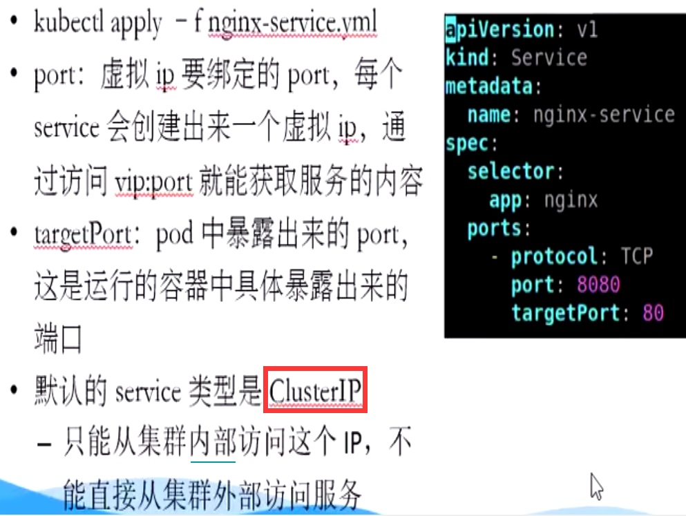

# Kubernetes


## 特点

一切皆为资源，资源实例后就是对象


- 轻量级，go语言编写的，资源消耗小

- 开源

- 弹性伸缩，不用重启、改配置

- 负载均衡，采用了IPVS(IP Virtual Service) 框架


## 架构图和组件

Borg架构：


- Paxos，分布式一致性算法


K8S架构图：


kubectl =  Kubernetes + controller

- Master

  - api server：对外统一提供restful API 来对资源进行操作（CRUD）
  - controller：负责监控pod状态和维护pod状态
  - scheduler ：将pod分配到哪个node上去
  - Dashboard：给 K8S 集群提供一个 B/S 结构访问体系

  

- etcd：**分布式键值数据库** ，储存K8S集群所有重要信息（持久化）


- node

  - kubelet：接收命令(直接跟容器引擎交互)，实现容器的生命周期管理
  - kube proxy：【负责写入规则至 IPTABLES、IPVS 实现服务映射访问的】服务发现，负载均衡

  

- CoreDNS：可以为集群中的SVC创建一个域名IP的对应关系解析

- Ingress Controller：官方只能实现四层代理，Ingress 可以实现七层代理

- Federation：提供一个跨集群中心，可以管理多个K8S集群的统一调度中心，目前尚不成熟

- Prometheus：提供K8S集群的监控能力

- ELK：提供 K8S 集群日志统一分析接入平台

etcd：内部架构图


> 高可用集群副本数据最好是 >= 3 奇数个


## Pod概念


### 自主式Pod


### 控制器管理的Pod

Pod 是一组紧密关联的容器集合

Pod中有多个容器，pause就是根容器，共享**网络栈**和**存储卷** 

同一个Pod共享一个网络栈，**相当于本地网络**，两个容器之间可以通过localhost访问

Pod 等同于一台服务器上运行了多个应用


 

[HPA 14:00 ](https://www.bilibili.com/video/BV1w4411y7Go?p=7) ：


- 水平自动扩展


[Statefulset 16:30 ](https://www.bilibili.com/video/BV1w4411y7Go?p=7) ：


[DaemonSet 00:00](https://www.bilibili.com/video/BV1w4411y7Go?p=8) ：


[Job、CronJob 02:27](https://www.bilibili.com/video/BV1w4411y7Go?p=8) : 


### 服务发现

客服端想去访问一组Pod，如果Pod无相关，是不能同Service统一代理的

service收集Pod，是通过标签去选择到的？？


### 网络通信方式


Kubernetes的网络模型**假定**所有Pod 都在一个**可以直接连通的** 、**扁平的**网络空间中，这在GCE(Google Compute Engine) 里面是现成的网络模型。

> 所以要构建K8S，要先解决这个扁平化的网络空间

扁平：所有的Pod都可以通过对方的IP “直接” 到达


[Flannel 04:27 ](https://www.bilibili.com/video/BV1w4411y7Go?p=9)： 


网络解决方案：Kubernetes + Flannel


K8S里的三层网络：


docker网络：


K8S：每个pod里面都会先创建pause容器，为了统一网络IP？？，可以通过localhost进行交互


## Controller

> controller 负责监控pod状态和维护pod状态

- Replication Controller (RC)
  - 确保Pod以指定的副本数运行，即如果有容器异常退出，会自动创建新的Pod来代替
  - 仅支持 equality-based-selector （ = 、!=）
- ReplicaSet (RS)
  - 确保Pod副本的数量，RC的升级版
  - 除了支持equality-based-selector （ = 、!=），还支持 set-based-selector（in、not in）
  - 不能支持服务的滚动部署
- Deployment
  - 提供 **声明式**的方法来 通过RS管理Pods
  - 支持Pod的**滚动部署**，并自动管理其后面的RS
    - liveness prob 探针，看滚动升级的服务是否正常启动
    - 正常后，才会删除老的版本Pod
    - 达到支持不断流
  - 支持Pod**回滚**到之前的revision


[视频讲解 09:47 ](https://www.bilibili.com/video/BV1w4411y7Go?p=7) 


## Services

**Service产生的原因**：Pod的生命周期不是永久的，Pod IP可能发生改变





## Pod生命周期


 


## Kubectl

Kubectl：á


```linux
kubectl cluster-info   # 查看集群信息
kubectl get node       # 查看集群中节点
kubectl get pods       # 查看集群中pod
kubectl get pods -o wide       # 查看集群中pod的详细信息
kubectl config view    # 显示当前kubectl配置
kubectl create -f pod.yml
kubectl describe pods nginx 
kubectl logs nginx
kubectl exec -it nginx sh
```


命令式和声明式：

```linux
kubectl create / delete  yaml_file   # 命令式类似Java
kubectl apply yaml_file				# 声明式类似SQL
```


## 资源清单


资源类型：


- work load ：pod 、RC ，RS, deployment，statefulSet（有状态下的pod），DeamonSet（守护进程），Job，CronJob（定时任务）
- Service Discovery / load Balance：service，ingress
- 配置与存储：Volume，configMap，secret（存放敏感信息的configMap）
- 集群级资源：namespace（把容器，负载均衡，controller隔离开来，默认放在kube-system），node（节点本身）
- 元数据相关资源：HPA（水平伸缩），podTemplate（模板），LimitRange


资源对象：


根据标签来执行：


## K8S调用流程


## kubeProxy

userspace代理模式


iptable模式：


