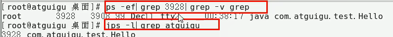

# Linux

==在Linux世界里，一切皆文件==

- /bin：Binary，存放最常用的命令
- /proc：Processor，存放正在运行的程序？？
- /etc：Editable Text Configuration，系统配置文件目录
  - /etc/fstab：是用来存放 文件系统(如硬盘) 的 静态信息(指定目录) 的文件；系统启动时，会自动将此文件中指定的文件系统挂载到指定的目录
- /tmp： Temporary，存放临时文件，会自动清除，也可以配置清除策略
- /dev： Device，类似于Windows的设备管理器，把所有的**硬件**用文件的形式存储
- /media：自动识别的一些设备，列如U盘、光驱等等，识别后，将挂载到这个目录下
- /mnt：让用户临时挂载别的文件系统，列如可以将外部的存储挂载到该目录上，进入该目录就可以查看存储的内容
- /opt：Option，额外安装软件的安装目录
- /usr：另一个给主机额外安装软件的安装目录
- /var：Variable，变量，存放不断扩充的东西，存放经常被修改的目录，列如各种日志文件

## 整机
- top

- uptime，系统性能命令的精简版

## CPU
- vmstat -n 2 3    （每两秒采样一次，共计采样三次）
    
    
    

    
    
- 额外查看CPU的命令
    

## 内存

- free
    

- 

## 硬盘
- df：查看磁盘剩余空间数
    

## 磁盘IO
- iostat
    
    

- 

## 网络IO
- ifstat
    下载：
    

## 网络服务(端口)

netstat -anp 查看系统网络服务(端口)

## CPU占用过高的定位分析思路

结合Linux和JDK命令一块分析

## JDK性能分析工具

还有javac
