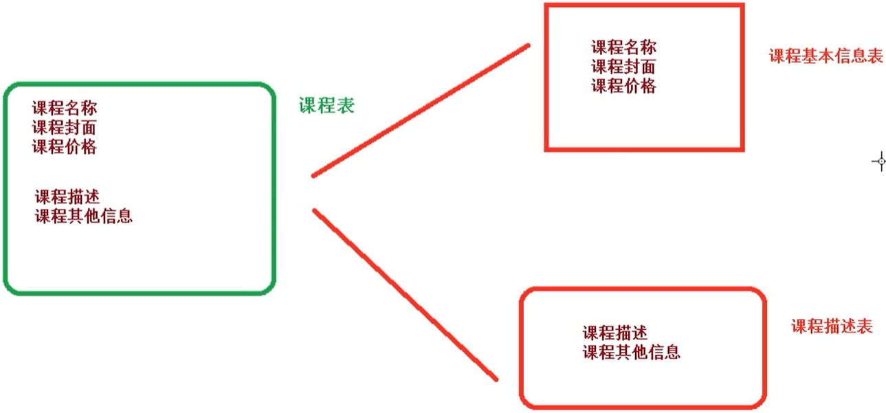
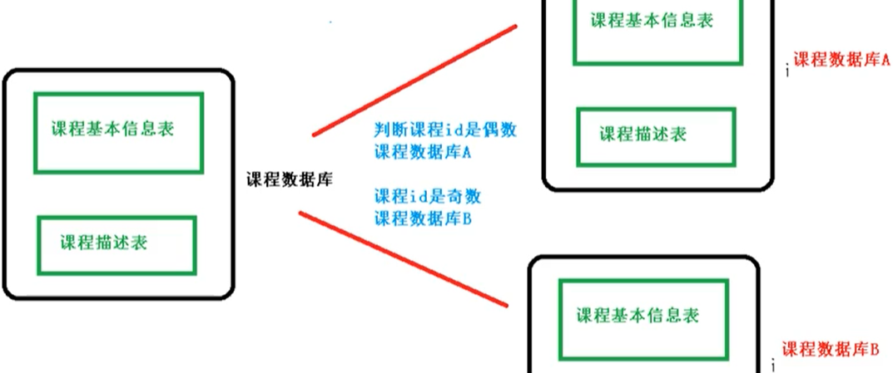
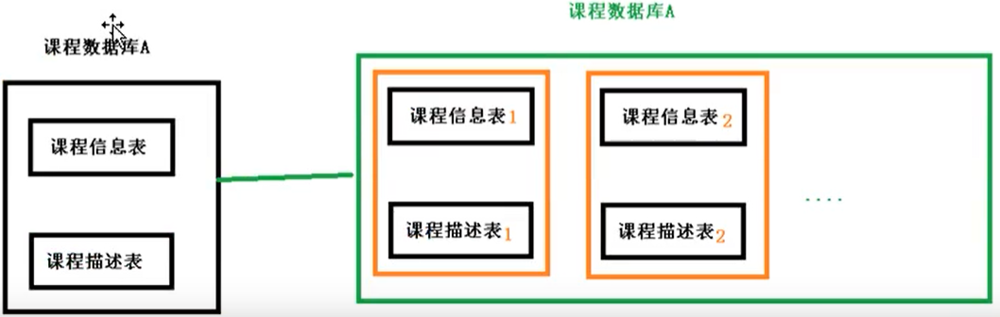

# ShardingSphere


## 简介

ShardingSphere 是一套开源的、分布式环境下的、数据库的、中间件解决方案，定位为 关系型数据库的中间件

- ShardingSphere-JDBC 可理解为增强版的 JDBC 驱动
- ShardingSphere-Proxy 定位为透明化的数据库代理端
  - 它可以使用任何兼容 MySQL/PostgreSQL 协议的访问客户端(如：MySQL Command Client, MySQL Workbench, Navicat 等)操作数据，对 DBA 更加友好


## 分库分表


`原因`： 数据库的数据量对开发人员来说是不可控的。随着时间流逝，业务的发展必定会造成表里面的数据越来越多，这时候再去对数据库表CURD，性能的影响肯定很大。

所有，分库分表是为了解决 因为数据量过大而造成数据库性能降低的问题。

分表：垂直拆字段，水平拆记录


### 垂直拆分（。。。）


垂直分表： 将数据库中的某张表，一部分字段存到一张新表，另一部分字段存到另外一张新表里面




垂直分库： 按照**业务**将单一数据库 划分成多个数据库，专库专表


优点：减少了数据库IO的压力

缺点：不能连表查询(join)、表中数据量大的问题依然存在


### 水平拆分 （相同结构）

水平分库： 创建多个相同数据库，将单一数据库的数据分到多个数据库中



水平分表： 将单一表拆分成多个相同结构的表，安装一定规则向不同表里面添加数据




### 实际应用

1. 设计数据库的时候，就要考虑垂直分库和垂直分表

2. 随着数据库数据量升高，**不要**马上考虑水平拆分
   - 先考虑 缓存处理、读写分离、使用索引等方式
   - 如果以上方式都不能解决问题，再考虑水平分库和水平分表

  

### 带来的问题


1. 跨节点连接查询问题 (分页、排序)

2. 多数据源管理问题


## Sharding JDBC

[官网](http://shardingsphere.apache.org/index_zh.html) 


### 简介

 轻量级Java框架 ， 可理解为**增强版的**JDBC驱动，完全兼容JDBC和各种ORM框架。 


- Sharding-JDBC 不是做分库分表
- 而是，数据分片和读写分离


目的，简化分库分表之后 数据的相关操作（分页/排序）


### 数据分片

```properties
# 配置数据源，给数据源起名称
spring.shardingsphere.datasource.names=ds0,ds1

# 允许一个实体类可以对应两张表，覆盖
spring.main.allow-bean-definition-overriding=true

# 配置数据源具体内容，包含连接池/驱动/地址/用户名/密码
spring.shardingsphere.datasource.ds0.type=org.apache.commons.dbcp.BasicDataSource
# SpringBoot 2.2 默认使用 Mysql8
spring.shardingsphere.datasource.ds0.driver-class-name=com.mysql.cj.jdbc.Driver
# GMT表示时区，%2B 表示转义
spring.shardingsphere.datasource.ds0.url=jdbc:mysql://localhost:3306/data_source0?serverTimezone=GMT%2B8
spring.shardingsphere.datasource.ds0.username=root
spring.shardingsphere.datasource.ds0.password=root

# 指定表的分布情况，配置表在哪个数据库里面，表名称都是什么
# t_order表示表的规则；如表course_1/course_2，t_order可以替换成course
# ？？t_order表示逻辑表
# ds$->{0..1} ：分库的时候处理
# t_order$->{0..1}：分表的时候处理
# ds0.t_order0/ds0.t_order1/ds1.t_order0/ds1.t_order1
spring.shardingsphere.sharding.tables.t_order.actual-data-nodes=ds$->{0..1}.t_order$->{0..1}

# 指定表里面主键的生成策略
# order_id，表的主键名称
# SNOWFLAKE，雪花算法，生成随机的唯一的数字
spring.shardingsphere.sharding.tables.t_order.key-generator.column=order_id
spring.shardingsphere.sharding.tables.t_order.key-generator.type=SNOWFLAKE

# 指定分片的策略  ？？按月分表
# sharding-column，根据哪个字段分片 ？？create_time
# t_order，表的前缀
spring.shardingsphere.sharding.tables.t_order.table-strategy.inline.sharding-column=order_id  
spring.shardingsphere.sharding.tables.t_order.table-strategy.inline.algorithm-expression=t_order$->{order_id % 2}

# 打开SQL的输出日志
spring.shardingsphere.props.sql.show=true
```


## demo


```xml
<sharding:data-source id="shardingDS">  // sharding配置数据源

    <sharding:sharding-rule data-source-names="shardingDataSource">
        <sharding:table-rules>
        <!-- 分表规则 -->
            <!-- shardingValue.getLogicTableName()获取t_sentinel_metric -->    <!-- 绑定分表策略 -->
            <sharding:table-rule logic-table="t_sentinel_metric" table-strategy-ref="tableShardingStrategy" />
        
        </sharding:table-rules>
    </sharding:sharding-rule>
</sharding:data-source>

<!-- 根据"id"字段来分表 t_sentinel_metric是要主表名称-->
<sharding:standard-strategy id="tableShardingStrategy"	
                            sharding-column="id" precise-algorithm-ref="shardingAlgorithm" />

<!-- 配置分表算法类，后面会给出这个类 -->
<bean id="shardingAlgorithm" class="com.example.shardingsphere.util.ShardingAlgorithm" />
```


