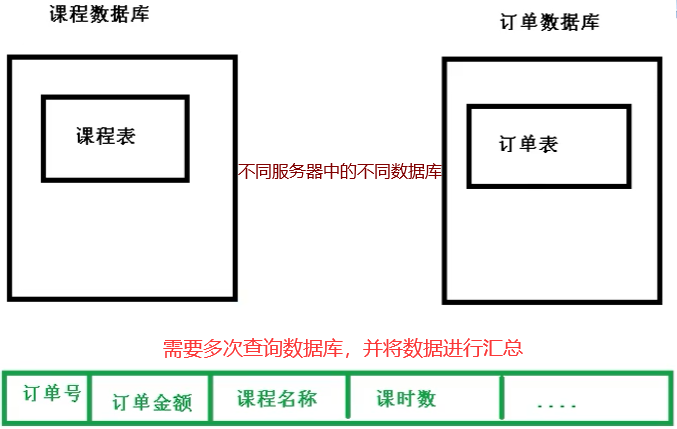

# ShardingSphere

## 简介

ShardingSphere 是一套开源的、分布式环境下的、数据库的、中间件解决方案，定位为 关系型数据库的中间件

- ShardingSphere-JDBC 可理解为增强版的 JDBC 驱动
- ShardingSphere-Proxy 定位为透明化的数据库代理端
  - 它可以使用任何兼容 MySQL/PostgreSQL 协议的访问客户端(如：MySQL Command Client, MySQL Workbench, Navicat 等)操作数据，对 DBA 更加友好

## 分库分表

`原因`： 数据库的数据量对开发人员来说是不可控的。随着时间流逝，业务的发展必定会造成表里面的数据越来越多，这时候再去对数据库表CURD，性能的影响肯定很大。

所有，分库分表是为了解决 因为数据量过大而造成数据库性能降低的问题。

分表：垂直拆字段，水平拆记录

### 垂直拆分

垂直分表： 将数据库中的某张表，一部分字段存到一张新表，另一部分字段存到另外一张新表里面

垂直分库： 按照**业务**将单一数据库 划分成多个数据库，专库专表

优点：减少了数据库IO的压力

缺点：不能连表查询(join)、表中数据量大的问题依然存在

### 水平拆分

水平分库： 创建多个相同数据库，将单一数据库的数据分到多个数据库中

水平分表： 将单一表拆分成多个相同结构的表，安装一定规则向不同表里面添加数据

### 实际应用

1. 设计数据库的时候，就要考虑垂直分库和垂直分表

2. 随着数据库数据量升高，**不要**马上考虑水平拆分
   - 先考虑 缓存处理、读写分离、使用索引等方式
   - 如果以上方式都不能解决问题，再考虑水平分库和水平分表

  

### 带来的问题

1. 跨节点连接查询问题 (分页、排序)

2. 多数据源管理问题