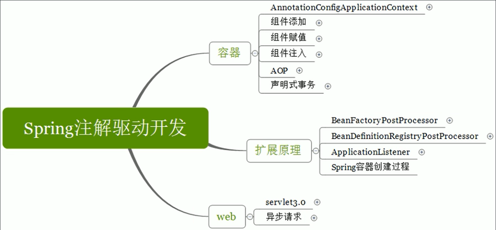
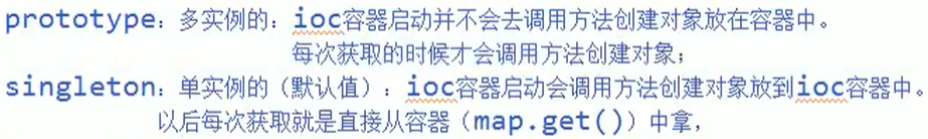
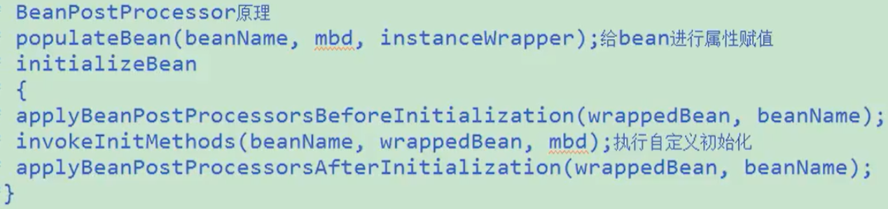
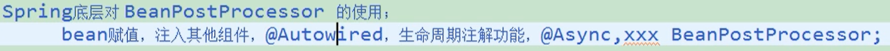
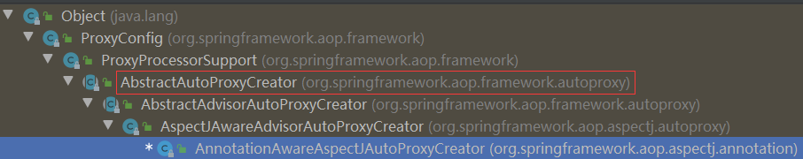
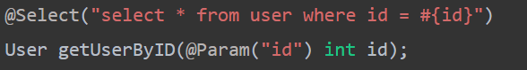
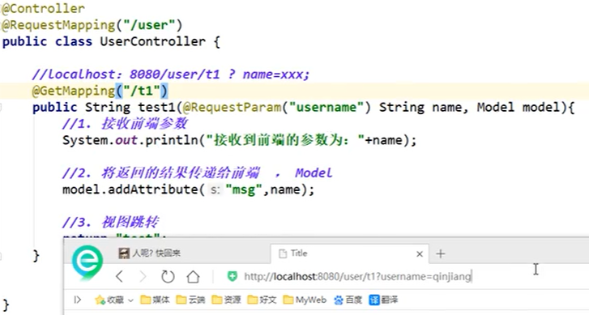
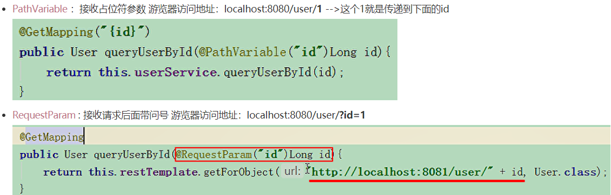

# Spring注解

- [参考文档](https://mp.weixin.qq.com/s?__biz=MzU2NDg0OTgyMA==&mid=2247486387&idx=2&sn=1c9659643ffbd33c09f3d5952333b952&chksm=fc45f640cb327f567a2dc0fae6cde8dbc65d62ac266177f1859a9581e19897a59d5653246b11&mpshare=1&scene=23&srcid=&sharer_sharetime=1589184999072&sharer_shareid=aa55b5520af7873f02181e7e14a32e3e#rd)	


## 注解驱动开发图




## MVC三层

- @Controller
- @Service
- @Repository   dao层注解
    - @MapperScan：通用mapper扫描
- @Component  搞不清楚哪一层


## 组件注册


### @Configuration

@Configuration，告诉spring，该类是一个配置类

配置类（JavaConfig ） == 配置文件（Config.xml） 

```java
@Configuration	// 告诉Spring这是一个配置类
public class JavaConfig { ... }
```


### @bean

@bean，给容器注册一个Bean

类型： 返回值的类型；id：默认用方法名

```java
	@Bean
    public Person person(){
        return new Person("will", 23);
    }
```


### @ComponentScan

@ComponentScan，包扫描，可以指定 具体扫描的包

相当于，xml配置文件中的 

```xml
<!--扫描 @Controller、@Service、@Repository、@Component --> 
<context:component-scan base-package="com.will"></context:component-scan>
```

```java
@ComponentScan(value = "com.will")
public class JavaConfig { ... }
```

- value：指定要扫描的包
- includeFilters：指定扫描的时候，只包含？？需要哪些组件，是一个Filter数组 ，
- excludeFilters：指定扫描的时候，按什么规则排除哪些组件，也是一个Filter数组

```java
@Configuration
@ComponentScan(value = "com.will", includeFilters = {
        @ComponentScan.Filter(type = FilterType.ANNOTATION, classes = {Controller.class, Service.class})  
}, useDefaultFilters = false)	// 需要将useDefaultFilters 设置为false
public class JavaConfig {
    ...
}
```

```java
@Configuration
@ComponentScan(value = "com.will", excludeFilters = {
        @ComponentScan.Filter(type = FilterType.ANNOTATION, classes = {Controller.class, Service.class})
})
public class JavaConfig {
    ...
}
```

```java
@Repeatable(ComponentScans.class) // 在1.8中，带有重复注解，可以多写几个扫描策略
public @interface ComponentScan { ... }
```

- 也可以使用 @ComponentScans() 来配置多个扫描策略


### @Scope

@Scope，指定作用范围

默认是单例模式（singleton），可以设置为原型模式（prototype）




### @Lazy

@Lazy，懒加载


### @Conditional

@Conditional，按照一定的条件进行判断，满足条件才向容器注册bean

(1) 实现条件类

```java
public class LinuxCondition implements Condition {
    @Override
    public boolean matches(ConditionContext context, AnnotatedTypeMetadata metadata) {
        // 获取容器当前环境
        Environment environment = context.getEnvironment();
        // 可以动态的获取环境变量
        String osName = environment.getProperty("os.name");
        // 能获取到IOC使用的beanFactory
        ConfigurableListableBeanFactory beanFactory = context.getBeanFactory();
        // 获取bean定义的注册类，增删改查bean的定义
        BeanDefinitionRegistry registry = context.getRegistry();

        if(osName.contains("Linux")) return true;
        return false;
    }
}
```

(2) 在方法/ 类上，加条件注解

```java
@Conditional({LinuxCondition.class}) // 可以加多个注解
```

```java
public @interface Conditional {
	Class<? extends Condition>[] value();
}
```

- 加在类上的时候，满足当前条件，这个类中配置的所有bean注册才能生效


### @Import

给容器中注册组件：

(1) 包扫描 + 组件标注注解 (@Controller、@Service、@Repository、@Component) 【自己写的】

(2) @Bean 【导入的第三方包里面的组件】

(3) @Import 【快速给容器导入一个组件】

- 1)、@Import 直接导入 Class<?>[] 数组，容器自动注册这个组件，id默认是全类名
- 2)、ImportSelector：返回需要导入的组件的全类名数组
- 3)、ImportBeanDefinitionRegistrar

```java
@Import({User.class, Student.class, MyImportSelector.class, MyImportBeanDefinitionRegistrar.class})
public class JavaConfig { ... }
```

```java
// ImportSelector ？？Springboot自动装配的核心类？？
public class MyImportSelector implements ImportSelector {
    @Override
    public String[] selectImports(AnnotationMetadata importingClassMetadata) {
        // AnnotationMetadata, 可以获取当前标注@Import注解的类的全部注解信息
        String[] names = importingClassMetadata.getMemberClassNames();
        // 返回值，就是导入到容器中的组件全类名
        return new String[]{"com.will.pojo.Dog", "com.will.pojo.Cat"};
    }
}
```

```java
public class MyImportBeanDefinitionRegistrar implements ImportBeanDefinitionRegistrar {

    /**
     * @param importingClassMetadata 获取当前类的所有注解信息
     * @param registry BeanDefinition注册类，将bean添加到容器中
     */
    public void registerBeanDefinitions(AnnotationMetadata importingClassMetadata, BeanDefinitionRegistry registry) {
        // 指定bean的定义信息，也就是bean的类型，也可以指定作用域
        RootBeanDefinition beanDefinition = new RootBeanDefinition(Color.class);
        // 通过调用 BeanDefinitionRegistry.registerBeanDefinition手工注册进来
        // 第一个参数，指定bean名
        registry.registerBeanDefinition("color", beanDefinition);
    }
}
```


### FactoryBean 

给容器中注册组件：

(4)、使用Spring 提供的 FactoryBean 【创建复杂对象】

```java
	@Bean
    public PersonFactoryBean personFactoryBean(){
        return new PersonFactoryBean();
    }
```

```java
public class PersonFactoryBean implements FactoryBean {
    @Override
    public Object getObject() throws Exception {
        return new Person();
    }

    @Override
    public Class<?> getObjectType() {
        return Person.class;
    }
}
```

> IOC容器中注册的是 PersonFactoryBean组件，但bean的类型是 com.will.pojo.Person
>
> 默认获取到的是 FactoryBean调用getObject 创建的对象

**但如果**想获取 FactoryBean本身：

```java
// 加 & 【？？取地址符】
context.getBean("&personFactoryBean");
```

```java
public interface FactoryBean<T> {

	/**
	 * Used to dereference a {@link FactoryBean} instance and distinguish it from
	 * beans <i>created</i> by the FactoryBean. For example, if the bean named
	 * {@code myJndiObject} is a FactoryBean, getting {@code &myJndiObject}
	 * will return the factory, not the instance returned by the factory.
	 */
	String FACTORY_BEAN_PREFIX = "&";
}
```


## 生命周期

bean的生命周期：

1. bean创建：构造方法

2. BeanPostProcessor.postProcessBeforeInitialization，该方法初始化前调用

3. 初始化：bean创建并属性赋值完成后，开始初始化

4. BeanPostProcessor.postProcessAfterInitialization，该方法初始化后调用

5. 销毁：

   - 单实例：容器关闭的时候

   - 多实例：容器不会管理这个bean，可以手动销毁

   

> 我们可以自定义**初始化**和**销毁**方法，
>
> 容器在bean进行到当前生命周期的时候 **来调用自定义**的初始化和销毁方法


### 指定初始化和销毁


#### 1. @Bean里面指定

```java
    @Scope("prototype") // 原型模式，多实例
	@Bean(initMethod = "init", destroyMethod = "destroy")
	// The method must have no arguments but may throw any exception. 
    public Car car() {
        return new Car();
    }
```

```java
public class Car {
    public Car() {
        System.out.println("car constructor...");
    }
    public void init() {
        System.out.println("car init...");
    }
    public void destroy() {
        System.out.println("car destroy...");
    }
}
```


#### 2. InitializingBean和DisposableBean接口

```java
@ComponentScan(value = "com.will.pojo")
```

```java
@Component
public class Cat implements InitializingBean, DisposableBean {
    public Cat() {
        System.out.println("cat`s construct...");
    }

    @Override
    public void destroy() throws Exception {
        System.out.println("cat`s destroy...");
    }

    @Override
    public void afterPropertiesSet() throws Exception {
        System.out.println("cat`s initial...");
    }
}
```


#### 补充: @PostConstruct和@PreDestroy

```java
@Component
public class Student {
    public Student() {
        System.out.println("student`s construct...");
    }
    
    @PostConstruct         // 对象创建并赋值之后
    public void init() {
        System.out.println("student`s initial...");
    }

    @PreDestroy           // 对象销毁之前
    public void destroy() {
        System.out.println("student`s destroy...");
    }
}
```


### BeanPostProcessor

> bean的后置处理器，在bean**初始化前后**进行一些处理工作

```java
@Component
public class MyBeanPostProcessor implements BeanPostProcessor {

    
    public Object postProcessBeforeInitialization(Object bean, String beanName) throws BeansException {
        System.out.println("postProcessBeforeInitialization" + bean + "----" +beanName);
        return bean;
    }

    public void init() {
        System.out.println("here is initial");
    }
    public Object postProcessAfterInitialization(Object bean, String beanName) throws BeansException {
        System.out.println("postProcessAfterInitialization" + bean + "----" +beanName);
        return bean;
    }
}
```


源码方法：【自己Debug试试】




BeanPostProcessor在Spring底层的使用：



```java
// ApplicationContextAware，将IOC容器注入Student类中
@Component
public class Student implements ApplicationContextAware {
    
    private ApplicationContext applicationContext;

    public Student() {
        System.out.println("student`s construct...");
    }

    @PostConstruct         // 对象创建并赋值之后
    public void init() {
        System.out.println("student`s initial...");
    }

    @PreDestroy           // 对象销毁之前
    public void destroy() {
        System.out.println("student`s destroy...");
    }

    @Override
    public void setApplicationContext(ApplicationContext applicationContext) throws BeansException {
        this.applicationContext = applicationContext;
    }
}
```

``` java
// BeanValidationPostProcessor 对象创建并赋值完，可以做数据校验
```

```java
// AutowiredAnnotationBeanPostProcessor，处理自动装配的注解 @Autowired
```


## 属性赋值


### @Value

1. 基本数值
2. 可以写SpEL；#{}

```java
public class Person {
    @Value("will")
    private String name;
    @Value("#{27 - 4}")
    private Integer age;
}
```


3. 可以写 ${}；取出**外部配置文件**中的值，(在运行环境变量里面的值) 

```java
// 读取外部配置文件中的K/V，保存到运行的环境变量中
@PropertySource(value = {"classpath:/person.properties"})
public class JavaConfig { ... }
```

```java
public class Person {
    @Value("${Person.nickName}")
    private String nickName;
}
```

也可以从 **环境变量** 里面取

```java
AnnotationConfigApplicationContext context = new AnnotationConfigApplicationContext(JavaConfig.class);
ConfigurableEnvironment environment = context.getEnvironment();
String nickName = environment.getProperty("Person.nickName");
```


## 自动装配


### @Autowired

1. 默认优先按照 类型去容器中找对应的组件
2. 如果找到多个相同类型的组件，再将属性的名称**作为组件的id**去容器中查找  [实例演示08:00](https://www.bilibili.com/video/BV1gW411W7wy?p=20)  
3. 自动装配 默认一定要将属性赋值好，没有就会报错
4. 也可以使用 @Autowired(required = false)，没有就算了


```java
@Target({ElementType.CONSTRUCTOR, ElementType.METHOD, ElementType.PARAMETER, ElementType.FIELD, ElementType.ANNOTATION_TYPE})
public @interface Autowired {
    boolean required() default true; }
```

[@Autowired 可以写在构造器、参数、方法、属性上](https://www.bilibili.com/video/BV1gW411W7wy?t=174&p=22)	

- 组件的值都是从容器中获取
- 标在方法位置：@Bean + 方法参数；参数位置的组件能够从容器自动获取
- 标在构造器上：如果组件只有一个有参构造器，*该有参构造器的@Autowired可以省略*，参数组件从容器中获取


### @Qualifier

@Qualifier，指定使用哪个组件的id，**而不是**使用属性名去匹配 

```java
@Controller
public class BookController {
    @Qualifier("bookService")
    @Autowired
    private BookService bookService;
}
```


### @Primary

@Primary：让Spring进行自动装配的时候，默认使用首选的bean


### @Resource

> JSR250，Java规范的注解

```java
@Controller
public class BookController {
    @Resource
    private BookService bookService;
}
```

- 和 @Autowired一样 实现自动装配功能，默认是按照组件名称进行装配的
- 也可以 使用 @Resource(name = "bookService") 来进行指定


### @Inject

> JSR330，Java规范的注解
>

需要导入javax.inject 的包，和Autowired的功能一样。没有required = false 的功能


### Aware接口


 *A marker superinterface indicating that a bean is eligible to be notified by the Spring container of a particular framework object through a callback-style method. The actual method signature is determined by individual subinterfaces but should typically consist of just one void-returning method that accepts a single argument.*

自己写的组件，想要使用Spring容器底层的一些组件：

- **实现**对应的 XXXAware接口；
- IOC创建对象的时候，会调用接口中的方法 *注入* 相关的**底层组件**

```java
@Component
public class Color implements ApplicationContextAware, BeanNameAware, EmbeddedValueResolverAware {

    // 可以定义属性，将IOC容器保存起来
    private ApplicationContext applicationContext;

    @Override
    public void setBeanName(String name) {
        System.out.println("当前bean的名字 :" + name);
    }

    @Override
    public void setApplicationContext(ApplicationContext applicationContext) throws BeansException {
        System.out.println("传进来的IOC容器 :" + applicationContext);
        this.applicationContext = applicationContext;
    }

    @Override
    public void setEmbeddedValueResolver(StringValueResolver resolver) {
        // ${}，可以取出环境变量/配置文件中的值
        // #{}, Spring的表达式
        String stringValue = resolver.resolveStringValue("I`m ${os.name} os, 27 - 4 = #{27 - 4}");
        System.out.println("解析的字符串" + stringValue);
    }
}
```

> XXXAware 的功能是由 XXXProcessor 来实现的
>
> 列如： ApplicationContextAware ==> ApplicationContextAwareProcessor
>
> 原理： 在IOC创建完 bean组件后，发现bean实现了相关的 XXXAware接口，后置处理器(Processor)把相关的组      			件传入bean中
>
> [debug源码讲解  09:00 ](https://www.bilibili.com/video/BV1gW411W7wy?p=23)	


### @Profile

```java
public @interface Profile {
	/**
	 * The set of profiles for which the annotated component should be registered.
	 * 可以根据环境，动态的激活和切换 使用那些组件
	 */
	String[] value();
}
```

环境可分为：开发环境 / 测试环境 / 生产环境

切换环境：

1. 命令行动态参数：Edit Configurations => VM options => -Dspring.profiles.active=XXX

2. 代码中设置环境：

   ```java
           // 1. 创建一个IOC容器
           AnnotationConfigApplicationContext context = new AnnotationConfigApplicationContext();
           // 2. 设置要激活的环境
           context.getEnvironment().setActiveProfiles("test", "dev");
           // 3. 注册主配置类
           context.register(MainConfigOfProfile.class);
           // 4. 刷新IOC容器
           context.refresh();
   ```

   

```java
@Profile("default")
//   相当于“默认不指定”，任何环境下bean都可以注册到IOC容器中
```

```java
@Configuration
@PropertySource("classpath:/dbconfig.properties")
public class MainConfigOfProfile implements EmbeddedValueResolverAware {

    @Value("${db.user}")
    private String User;

    private String Driver;

    // 指定了组件在哪个环境情况下才注入到IOC容器中
    @Profile("test")
    @Bean("testDataSource")
    public DataSource dataSourceTest(@Value("${db.password}")String pwd) throws PropertyVetoException {
        ComboPooledDataSource dataSource = new ComboPooledDataSource();
        dataSource.setUser(User);
        dataSource.setPassword(pwd);
        dataSource.setJdbcUrl("jdbc:mysal://localhost:3306/test");
        dataSource.setDriverClass(Driver);
        return dataSource;
    }

    @Profile("dev")
    @Bean("devDataSource")
    public DataSource dataSourceDev(@Value("${db.password}")String pwd) throws PropertyVetoException {
        ComboPooledDataSource dataSource = new ComboPooledDataSource();
        dataSource.setUser(User);
        dataSource.setPassword(pwd);
        dataSource.setJdbcUrl("jdbc:mysal://localhost:3306/develop");
        dataSource.setDriverClass(Driver);
        return dataSource;
    }

    @Profile("prod")
    @Bean("prodDataSource")
    public DataSource dataSourceProd(@Value("${db.password}")String pwd) throws PropertyVetoException {
        ComboPooledDataSource dataSource = new ComboPooledDataSource();
        dataSource.setUser(User);
        dataSource.setPassword(pwd);
        dataSource.setJdbcUrl("jdbc:mysal://localhost:3306/product");
        dataSource.setDriverClass(Driver);
        return dataSource;
    }

    @Override
    public void setEmbeddedValueResolver(StringValueResolver resolver) {
        this.Driver = resolver.resolveStringValue("${db.driverClass}");
    }
}
```


## AOP原理


### AOP功能测试

[视频讲解](https://www.bilibili.com/video/BV1gW411W7wy?p=27)	

AOP：在程序运行时，**动态的将部分代码切入到指定位置**，进行运行的编程方式。【动态代理】

1. 导入aop模块

   ```xml
   		<dependency>
               <groupId>org.springframework</groupId>
               <artifactId>spring-aspects</artifactId>
           </dependency>
   ```

2. 定义一个业务类

   ```java
   public class MathCalculator {
       public int div(int i, int j){
           System.out.println("=====div运行====");
           return i/j;
       }
   }
   ```

3. 定义一个日志切面类，并标注方法何时运行

   ```java
   @Aspect
   public class LogAspect {
   
       // 抽取出来的公共切入点表达式
       @Pointcut("execution(public int com.will.aop.MathCalculator.*(..))")
       public void pointCut(){}
   
       @Before("pointCut()")
       public void logStart(JoinPoint joinPoint){
           Object[] args = joinPoint.getArgs();
           String name = joinPoint.getSignature().getName();
           System.out.println("在"+name+"方法 运行之前运行, "+name+"参数列表为："+ Arrays.asList(args));
       }
   
       @After("pointCut()")
       public void logEnd(){
           System.out.println("=======目标方法运行之后运行，无论方法正常结束还是异常结束=======");
       }
   
       @AfterReturning(value = "pointCut()", returning = "result")
       public void logReturn(JoinPoint joinPoint, Object result){
           String name = joinPoint.getSignature().getName();
           System.out.println("在"+name+"方法正常返回之后运行，"+name+"运行结果为："+ result);
       }
   
       @AfterThrowing(value = "pointCut()", throwing = "e")
       public void logException(JoinPoint joinPoint, Exception e){
           String name = joinPoint.getSignature().getName();
           System.out.println("在"+name+"方法出现异常之后运行，异常为："+ e);
       }
   
       // 在环绕增强中，可以给定一个参数，代表我们要获取处理切入的点
       @Around("pointCut()")
       public void logAround(ProceedingJoinPoint joinPoint) throws Throwable {
           System.out.println("=======环绕前=======");
           Object proceed = joinPoint.proceed();
           System.out.println("=======环绕后=======");
       }
   }
   ```

   - joinPoint 参数必须在参数列表的第一位
   - execution表达式：`*(..)` 表示 所有方法`*` 的所有参数类型`(..)` 

   

4. 将切面类 和业务逻辑类 都加入到容器中

   ```java
   @Configuration
   @EnableAspectJAutoProxy // 开启基于注解的AOP模式
   public class MainConfigOfAOP {
       @Bean
       public MathCalculator mathCalculator(){
           return new MathCalculator();
       }
       
       @Bean
       public LogAspect logAspect(){
           return new LogAspect();
       }
   }
   ```


### @EnableAspectJAutoProxy

> @EnableAspectJAutoProxy ，开启AOP切面功能

```java
@Import(AspectJAutoProxyRegistrar.class) 	// 快速给容器导入 AspectJAutoProxyRegistrar组件
public @interface EnableAspectJAutoProxy {
	boolean proxyTargetClass() default false;
	boolean exposeProxy() default false;
}
```

```java
class AspectJAutoProxyRegistrar implements ImportBeanDefinitionRegistrar {
	@Override
	public void registerBeanDefinitions(
			AnnotationMetadata importingClassMetadata, BeanDefinitionRegistry registry) 
    {
		AopConfigUtils.registerAspectJAnnotationAutoProxyCreatorIfNecessary(registry);
	AnnotationAttributes enableAspectJAutoProxy =			AnnotationConfigUtils.attributesFor(importingClassMetadata,EnableAspectJAutoProxy.class);
		if (enableAspectJAutoProxy != null) {
			if (enableAspectJAutoProxy.getBoolean("proxyTargetClass")) {
				AopConfigUtils.forceAutoProxyCreatorToUseClassProxying(registry);
			}
			if (enableAspectJAutoProxy.getBoolean("exposeProxy")) {
				AopConfigUtils.forceAutoProxyCreatorToExposeProxy(registry);
			}
		}
	}

}
```

- AspectJAutoProxyRegistrar 给IOC容器注册了一个 bean组件
-  internalAutoProxyCreator = AnnotationAwareAspectJAutoProxyCreator


### AnnotationAwareAspectJAutoProxyCreator

[源码Debug](https://www.bilibili.com/video/BV1gW411W7wy?p=30) 



```java
public abstract class AbstractAutoProxyCreator extends ProxyProcessorSupport
		implements SmartInstantiationAwareBeanPostProcessor, BeanFactoryAware {
    // 前置处理器
    public Object postProcessBeforeInstantiation(Class<?> beanClass, String beanName) {
		Object cacheKey = getCacheKey(beanClass, beanName);
		if (!StringUtils.hasLength(beanName) || !this.targetSourcedBeans.contains(beanName)) {
			if (this.advisedBeans.containsKey(cacheKey)) {
				return null;
			}
			if (isInfrastructureClass(beanClass) || shouldSkip(beanClass, beanName)) {
				this.advisedBeans.put(cacheKey, Boolean.FALSE);
				return null;
			}
		}
    // 后置处理器
    public Object postProcessAfterInitialization(@Nullable Object bean, String beanName) {
		if (bean != null) {
			Object cacheKey = getCacheKey(bean.getClass(), beanName);
			if (this.earlyProxyReferences.remove(cacheKey) != bean) {
				return wrapIfNecessary(bean, beanName, cacheKey);
			}
		}
		return bean;
	}
    // 自动装配 BeanFactory
    public void setBeanFactory(BeanFactory beanFactory) {
		this.beanFactory = beanFactory;
	}
}
```

- *后置处理器类BeanPostProcessor*  和 *自动装配 BeanFactory*  


```java
public abstract class AbstractAdvisorAutoProxyCreator extends AbstractAutoProxyCreator {

	@Override 	// 初始化了beanFactory
	public void setBeanFactory(BeanFactory beanFactory) {
		super.setBeanFactory(beanFactory);
		if (!(beanFactory instanceof ConfigurableListableBeanFactory)) {
			throw new IllegalArgumentException(
			"AdvisorAutoProxyCreator requires a ConfigurableListableBeanFactory: " + beanFactory);
		}
		initBeanFactory((ConfigurableListableBeanFactory) beanFactory);
	}
    protected void initBeanFactory(ConfigurableListableBeanFactory beanFactory) {
		this.advisorRetrievalHelper = new BeanFactoryAdvisorRetrievalHelperAdapter(beanFactory);
	}
```


```java
public class AnnotationAwareAspectJAutoProxyCreator extends AspectJAwareAdvisorAutoProxyCreator {
	@Override // 又重新定义了beanFactory的初始化
	protected void initBeanFactory(ConfigurableListableBeanFactory beanFactory) {
		super.initBeanFactory(beanFactory);
		if (this.aspectJAdvisorFactory == null) {
			this.aspectJAdvisorFactory = new ReflectiveAspectJAdvisorFactory(beanFactory);
		}
		this.aspectJAdvisorsBuilder =
				new BeanFactoryAspectJAdvisorsBuilderAdapter(beanFactory, this.aspectJAdvisorFactory);
	}
}
```


## 流程

1. 传入配置类，创建IOC容器

   ```java
   new AnnotationConfigApplicationContext(MainConfigOfProfile.class);
   ```

2. 注册配置类，refresh()刷新容器【将容器中的所有bean创建出来】

3. 注册bean的后置处理器 来方便拦截bean的创建

   ```java
   // Register bean processors that intercept bean creation.
   registerBeanPostProcessors(beanFactory);
   ```

   1. 先获取IOC容器已经定义好了，需要创建对象 的所有BeanPostProcessor

      ```java
      		String[] postProcessorNames = beanFactory.getBeanNamesForType(BeanPostProcessor.class, true, false);
      ```

      【容器中有默认PostProcessor的定义，还有传入的配置类中可能也有定义】

   2. 给容器中加入别的 BeanPostProcessor

      ```java
      		beanFactory.addBeanPostProcessor(new BeanPostProcessorChecker(beanFactory, beanProcessorTargetCount));
      ```

   3. 按优先级顺序(PriorityOrdered / Ordered / and the rest) 注册实现 BeanPostProcessor

   4. 把BeanPostProcessor 注册到BeanFactory中

      ```java
      beanFactory.addBeanPostProcessor(postProcessor);
      ```

      


如何创建 AnnotationAwareAspectJAutoProxyCreator 对象？？？？

```java
AbstractAutowireCapableBeanFactory类中的 doCreateBean()
```

1. 创建Bean实例

   ```java
   instanceWrapper = createBeanInstance(beanName, mbd, args);
   ```

   

2. 给Bean的各种属性赋值

   ```java
   populateBean(beanName, mbd, instanceWrapper);
   ```

3. 初始化Bean

   1. Aware 接口的赋值

      ```java
      invokeAwareMethods(beanName, bean);
      ```

   2. 后置处理器 初始化**前**的调用 在这儿

      ```java
      wrappedBean = applyBeanPostProcessorsBeforeInitialization(wrappedBean, beanName);
      ```

   3. 执行自定义的 初始化方法

      ```java
      invokeInitMethods(beanName, wrappedBean, mbd);
      ```

   4. 后置处理器 初始化**后**的调用 在这儿


## 请求和响应

- @RequestMapping：请求的映射(对应)的 处理方法
    - @GetMapping    ：是@RequestMapping(method =RequestMethod.GET) 的一个快捷方式
    - @PostMapping
    - @DeleteMapping
      - ​		@PatchMapping

- @RequestBody：接收请求的数据，接收json格式数据对象

- @ResponseBody：响应的数据，以json格式(相当于字符串)响应，`不走视图解析器`

- @RestController：ResponseBody + Controller，被修饰的类 `不会被视图解析器解析` ==> **返回json格式**


## 参数列表接收数据

- @Param：方法存在多个参数，所有的参数前面必须加上 @Param("id")注解
    

- @RequestParam: 表示`从前端`接收请求后面带的问号    如：`localhost:8080/user/t1?username=will`
    

- @PathVariable：接收`占位符`参数   Restful风格  如：`localhost:8080/user/t1`

- PathVariable和RequestParam的对比：


- 提交的表单域和对象的属性名一致 , `参数使用对象`即可    如： http://localhost:8080/user?name=kuangshen&id=1&age=15
```java
@RequestMapping("/user")
public String user(User user){
    System.out.println(user);
    return "hello";
}
```
如果使用对象的话，前端传递的**参数名**和**对象名**必须一致，否则就是null。


## SpringBoot

- @SpringBootApplication:   启动**程序**:
-  @EnableAutoConfiguration：开启SpringBoot的自动配置
- @SpringBootConfiguration
- @ComponentScan
- @EnableConfigurationProperties(属性读取类.class)：启用注解
- @ConfigurationProperties(prefix = "...") ：该注解有一个prefix属性，通过指定的前缀，绑定配置文件中的配置，该注解可以放在类上，也可以放在方法上


 [springboot自动配置原理](https://mp.weixin.qq.com/s/PyBYgfAGREooqWPAuXFNgA)	


## 测试

- @Runwith(SpringRunner.class)：junit集成SpringBoot的固定写法

- @SpringBootTest(classes = ... "指定引导类") ：声明是SpringBoot的测试程序


## Lombak注解

[详细注解文档](https://juejin.cn/post/6911476307528253453) 