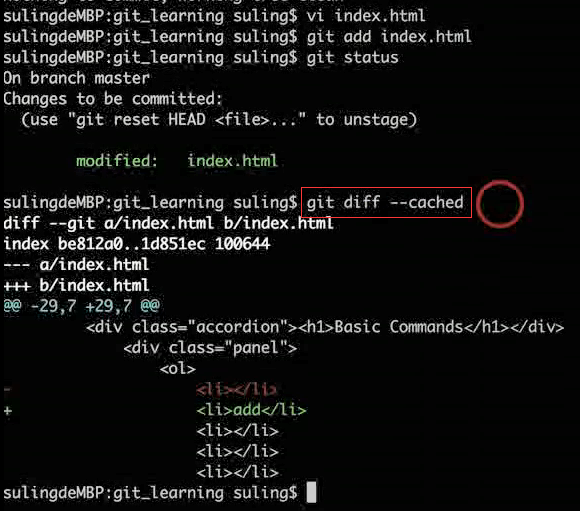
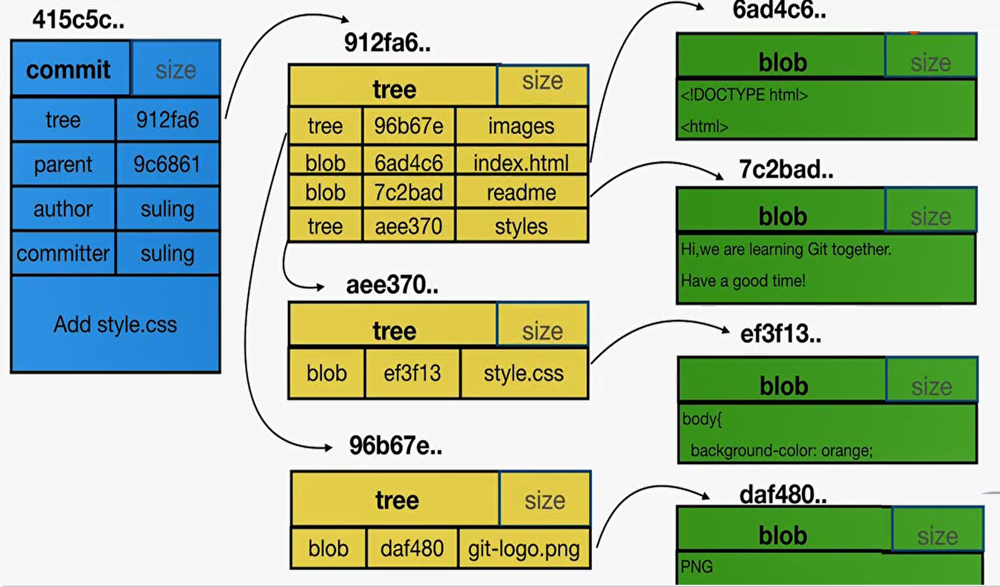

## Git特点


## 配置

```git
git config --global user.name 'your_name'
git config --global user.email 'your_email'
```


## Git结构图


## Git命令


### 建Git仓库

1. 将已有的项目代码纳入Git管理

   ```git
   cd 项目所在的文件夹
   git init
   ```

   

2. 新建的项目直接用Git管理

   ```git
   cd 某个文件夹
   git init your_project	# 会在当前路径下创建和项目名称同名的文件夹
   cd your_project
   ```

初步提交案例：


### 工作区和暂存区


```git
git add -u
# 直接把工作区当中还未 添加到暂存区的文件 全部添加到暂存区
# 不用后面一个一个的写准备添加的文件
```

```git
git commit -am'your_commit_message'    # 直接提交，不到暂存区
```


### 文件重命名

- 笨重的方法：

  ```git
  mv readme readme.md
  git add readme.md
  git rm readme
  ```

- 直接使用git的命令来 重命名

  ```git
  git mv readme readme.md
  git commit -m'Move readme ro readme.md'
  ```

  

复原成原来的样子：

```git
git reset --hard
# 撤销工作目录中所有未提交文件的修改内容
# 暂存区和工作去上所以的变更 都会被清理掉
```


### 版本演变历史

```git
git log --oneline  		# 分支的演进历史
git log --oneline --all # 所有分支的演进历史
git log -n2 --oneline  # n2表示显示最近的两行
```

```git
git branch -v 			# 本地多少分支
```

```git
git log   				# 当前分支的历史
git log --all  			 # 显示所有分支对应commit的信息
git log --all --graph 	 # 图形化的显示所有分支信息
```


### 修改commit的message


```git
git commit --amend  # 修改最新commit的message
```

```git
git rebase -i father_CommitID   # father_CommitID 基于待改变commit的父亲
```


### 整理多个Commit

```git
git rebase -i father_CommitID   # father_CommitID 基于待改变commit的父亲
```

回车，**几个连续commit**，选择策略：


几个间隔commit：将需要合并的CommitID号 放一块 并改动前面的策略

可能会出现：两个孤独的树


### diff 



```git
git diff --cached #暂存区和HEAD
git diff #暂存区和 工作区
git diff -- 文件名(可以是多个)
```

```git
# 比较temp和master两个分支的差异 【可以有commit_id】
git diff temp master
```


### 恢复和撤销

```git
# 撤销暂存区的add，恢复成和HEAD的一样
git reset HEAD  
```


```git
# 撤销部分暂存区的add
git reset HEAD --file_name
```


```git
# 将工作区的文件，恢复为之前add的暂存区
git checkout --file_name
```


```git
# 撤销最近的几次commit
# HEAD重新指向另外commit，同时暂存区和工作区的内容都要回到该commit的状态
git reset --hard point_commit_id
```


### 删除文件

```git
git rm file_name
```


### 存放状态

```git
git stash
```


```git
# 恢复 之前的状态
git stash apply  # stash对应的状态没有清除
git stash pop    # stash对应的状态被清除
```


### 分支


```git
git branch newBranch
```

建分支，相当于说， 想基于这个提交以及它所有的父提交进行新的工作 


```git
git checkout newBranch
```

将Head头指针，切换到新分支


```git
git checkout -b newBranch   # 可以将上面两步，和一起
```


### 合并


 合并两个分支时会产生一个特殊的提交记录 ， 它有两个父节点 

换句话说，就是 把这两个父节点本身及它们所有的祖先都包含进来 


```git
git merge bugFix
# 将bugFix合并到 当前HEAD指向的master分支
```


将bugFix前移：


### 重定基


```git
git rebase bugFix 
# 将bugFix分支的“基准”重定为 当前HEAD指向的分支
```


### 在提交树上移动


 HEAD 是一个对当前检出记录的符号引用 —— 也就是指向你正在其基础上进行工作的提交记录， 总是指向当前分支上最近一次提交记录 。

```git
cat .git/HEAD   # 可以查看HEAD指向
```

```git
git symbolic-ref HEAD  # 如果 HEAD 指向的是一个引用，可以查看它的指向
```


分离的HEAD， 就是让其指向了某个**具体的**提交记录，**而不是**分支名


### 相对引用


- 使用 `^` 向上移动 1 个提交记录

  ```git
  git checkout master^   # master^ 相当于“master 的父节点”
  git checkout master^^  # master^^ 是 master 的第二个父节点
  ```


- 使用 `~` 向上移动多个提交记录，如 `~3`

  ```git
  git checkout master~3   # 一次性后退四步
  ```


### 强制修改分支位置


```git
git branch -f master HEAD~3  # 将 master 分支强制指向 HEAD 的第 3 级父提交
```

注：HEAD头指针并没有指向master


##  .git目录

隐藏文件夹 **.git** 是`版本库` 


**HEAD是一个引用文件**，正工作在哪个分支上，最终指向一个commit


```git
git checkout <branch/tag>  # 切换到指定分支或标签
git diff 两个commit号
git diff HEAD HEAD^1       # ^ 表示head的父亲
```

 **config**存放了本地仓库的配置信息

 **refs**	：


**objects**：	


## .gitignore


## 三种类型



commit、tree、blob(文件对象)

- **一个commit对应一颗树**，树代表了该commit的视图？？，视图存放了快照，快照的集合里面放了当前commit对应的本项目仓库的所有的文件夹以及文件的一个快照
- 快照：某一个时间点，这个文件夹长什么样？？文件是什么样？？
- tree：类比文件夹
- blob跟文件名**没有关系** ，只要文件的内容相同，在git眼里它就是唯一的blob


## 分离头指针


> 分离头指针，变更没有基于任何 branch 去做；
>


- HEAD 没有**绑定** 任何<u>分支和标签</u>： 


- 分支切换的时候，**分离头指针上的 commit** 很容易被当做垃圾清掉

修复方法： 


## 传输协议


区别：


## Linux 环境下安装Git


第一步：安装编译 git 时需要的包 

```shell
yum install -y curl-devel expat-devel gettext-devel openssl-devel zlib-devel 

yum install -y gcc perl-ExtUtils-MakeMaker 
```

第二步：删除已有的 git 

```shell
yum remove git 
```

第三步：Git 官网下载 Git 最新版 tar 包，移动到/usr/src 目录下 

```shell
cd /usr/src 

tar -zxvf git-2.9.3.tar.gz 
```

第四步：编译安装 

```shell
cd git-2.9.3 

make prefix=/usr/local/git all

make prefix=/usr/local/git install 

echo "export PATH=$PATH:/usr/local/git/bin" >> /etc/bashrc 

source /etc/bashrc
```

第五步：检查一下版本号 

```shell
git --version
```


## window下git多账户管理

 [window下git多账户管理](https://juejin.cn/post/6912337687366565895)	