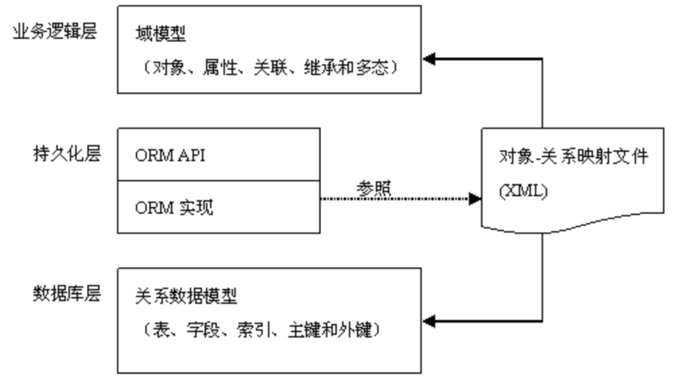
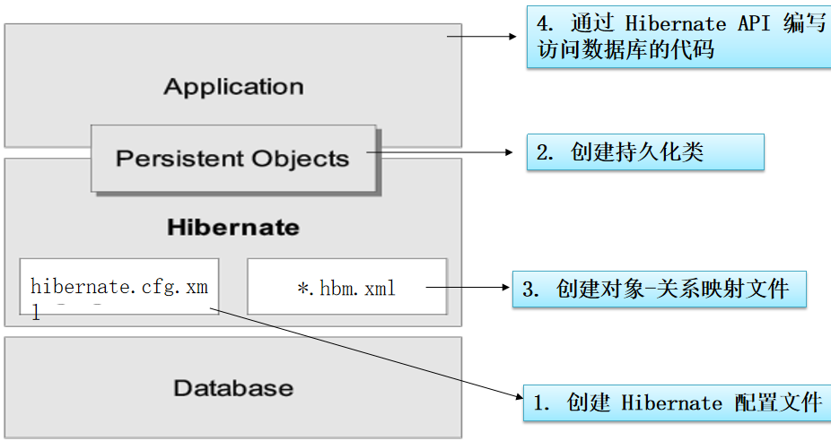
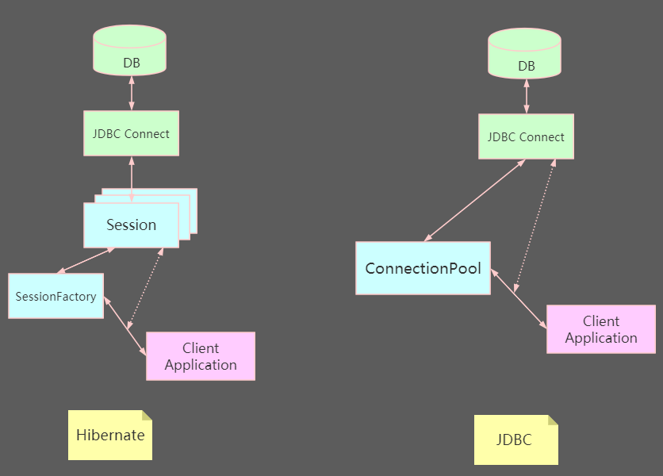
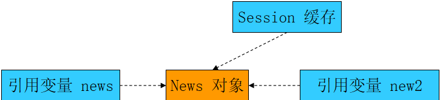

# Hibernate

## 对象的持久化

- 狭义的理解，“持久化”仅仅指把对象永久保存到数据库中

- 广义的理解，“持久化”包括和数据库相关的各种操作：

  - 保存：把对象永久保存到数据库中。

  - 更新：更新数据库中对象(记录)的状态。

  - 删除：从数据库中删除一个对象。

  - 查询：根据特定的查询条件，把符合查询条件的一个或多个对象从数据库加载到内存中。

    - 加载：根据特定的OID，把一个对象从数据库加载到内存中。

    - OID：(Object identifier-OID) 对象标识，为了在系统中能够找到所需对象，需要为每一个对象分配一个唯一的标识号。
    - 在关系数据库中称之为主键。


## ORM

> ORM(Object/Relation Mapping): 对象/关系映射

- ORM的思想：将关系数据库中表中的记录映射成为对象，以对象的形式展现
- 程序员可以把对数据库的操作转化为对对象的操作
- ORM 采用**元数据**来描述对象-关系映射细节
  - 元数据：描述数据的数据
  - 元数据通常采用 XML 格式, 并且存放在专门的**对象-关系映射文件**中


架构图：




> ORM框架，底层仍然是JDBC，是对JDBC的封装


## Hello Hibernate

### 开发步骤图




### 创建 Hibernate 配置文件

```xml
<?xml version="1.0" encoding="UTF-8"?>
<!DOCTYPE hibernate-configuration PUBLIC
		"-//Hibernate/Hibernate Configuration DTD 3.0//EN"
		"http://hibernate.sourceforge.net/hibernate-configuration-3.0.dtd">
<hibernate-configuration>
	<session-factory>
    
		<!-- 配置连接数据库的基本信息 -->
		<property name="connection.username">root</property>
		<property name="connection.password">123456</property>
		<property name="connection.driver_class">com.mysql.jdbc.Driver</property>
		<property name="connection.url">jdbc:mysql:///hibernate5</property>
		
        
	<!-- 配置 hibernate 的基本信息： -->
		<!-- hibernate 所使用的数据库方言 -->
		<property name="dialect">org.hibernate.dialect.MySQLInnoDBDialect</property>	
		
		<!-- 执行操作时是否在控制台打印 SQL -->
		<property name="show_sql">true</property>
	
		<!-- 是否对 SQL 进行格式化 -->
		<property name="format_sql">true</property>
	
		<!-- 指定自动生成数据表的策略 :共有四个取值-->
		<property name="hbm2ddl.auto">update</property>
		
		<!-- 指定关联的 .hbm.xml 文件 , 注意是目录结构-->
		<mapping resource="com/will/hibernate/helloworld/News.hbm.xml"/>
	
	</session-factory>

</hibernate-configuration>

```

#### 两个配置项

- hbm2ddl.auto ：该属性可帮助程序员实现正向工程, 即由 java 代码生成数据库脚本, 进而生成具体的表结构
  - create : 会根据 .hbm.xml  文件来生成数据表, 但是每次运行都会删除上一次的表 ,重新生成表, 哪怕二次没有任何改变 
  - create-drop : 会根据 .hbm.xml 文件生成表,但是SessionFactory一关闭, 表就自动删除 
  - update : **最常用的属性值**，也会根据 .hbm.xml 文件生成表, 但若 .hbm.xml  文件和数据库中对应的数据表的表结构不同, Hiberante  将更新数据表结构，但不会删除已有的行和列 
  - validate : 会和数据库中的表进行比较, 若 .hbm.xml 文件中的列在数据表中不存在，则抛出异常

- format_sql：是否将 SQL 转化为格式良好的 SQL . 取值 true | false


### 创建持久化类

> 需要提供一个无参的构造器

```java
public class News {
	
	private Integer id; //field
	private String title;
	private String author;
	
	private String desc;
	
	//使用 title + "," + content 可以来描述当前的 News 记录. 
	//即 title + "," + content 可以作为 News 的 desc 属性值
	
	private String content;
	
	private Blob picture;
	
	public Blob getPicture() {
		return picture;
	}

	public void setPicture(Blob picture) {
		this.picture = picture;
	}

	public String getContent() {
		return content;
	}

	public void setContent(String content) {
		this.content = content;
	}
	
	public String getDesc() {
		return desc;
	}

	public void setDesc(String desc) {
		this.desc = desc;
	}

	private Date date;

	public Integer getId() { //property
		return id;
	}

	public void setId(Integer id) {
		this.id = id;
	}

	public String getTitle() {
		return title;
	}

	public void setTitle(String title) {
		this.title = title;
	}

	public String getAuthor() {
		return author;
	}

	public void setAuthor(String author) {
		this.author = author;
	}

	public Date getDate() {
		return date;
	}

	public void setDate(Date date) {
		this.date = date;
	}

	public News(String title, String author, Date date) {
		super();
		this.title = title;
		this.author = author;
		this.date = date;
	}
	
	public News() {
		
	}

	@Override
	public String toString() {
		return "News [id=" + id + ", title=" + title + ", author=" + author
				+ ", date=" + date + "]";
	}
	
}
```


### 创建对象-关系映射文件

> 映射文件的扩展名为 `.hbm.xml` 

```xml
<?xml version="1.0"?>
<!DOCTYPE hibernate-mapping PUBLIC "-//Hibernate/Hibernate Mapping DTD 3.0//EN"
"http://hibernate.sourceforge.net/hibernate-mapping-3.0.dtd">

<!-- 给的全类名，一般使用了反射-->
<hibernate-mapping package="com.will.hibernate.helloworld">

    <class name="News" table="NEWS" dynamic-insert="true">
    	
        <id name="id" type="java.lang.Integer">   <!--name：指类里面的属性-->
            <column name="ID" /> 				  <!--column：指数据表的列名-->
            <!-- 指定主键的生成方式, native: 使用数据库本地方式 -->
            <generator class="native" />
        </id>
    
        <property name="title" not-null="true" unique="true"
        	index="news_index" length="50"
        	type="java.lang.String" column="TITLE" >
        </property>
        
        <property name="author" type="java.lang.String"
        	index="news_index">
            <column name="AUTHOR" />
        </property>
        
        <property name="date" type="date">
            <column name="DATE" />
        </property>
        
        <property name="desc" 
        	formula="(SELECT concat(title, ',', author) FROM NEWS n WHERE n.id = id)"></property>
		
		<property name="content">
			<column name="CONTENT" sql-type="text"></column>
		</property>
		
		<property name="picture" column="PICTURE" type="blob"></property>
		
    </class>
    
</hibernate-mapping>

```


### HibernateTest

```java
public class HibernateTest {

	@Test
	public void test() {
		
		System.out.println("test...");
		
		//1. 创建一个 SessionFactory 对象
		SessionFactory sessionFactory = null;
		
		//1). 创建 Configuration 对象: 对应 hibernate 的基本配置信息和 对象关系映射信息
		Configuration configuration = new Configuration().configure();
		
		// 4.0 之前这样创建
		// sessionFactory = configuration.buildSessionFactory();
		
		//2). 创建一个 ServiceRegistry 对象: hibernate 4.x 新添加的对象
		//hibernate 的任何配置和服务都需要在该对象中注册后才能有效.
		ServiceRegistry serviceRegistry = 
				new ServiceRegistryBuilder().applySettings(configuration.getProperties())
				                            .buildServiceRegistry();
		
		//3).
		sessionFactory = configuration.buildSessionFactory(serviceRegistry);
		
		//2. 创建一个 Session 对象
		Session session = sessionFactory.openSession();
		
		//3. 开启事务
		Transaction transaction = session.beginTransaction();
		
		//4. 执行保存操作
		News news = new News("Java12345", "ATGUIGU", new Date(new java.util.Date().getTime()));
		session.save(news);
		
		//5. 提交事务 
		transaction.commit();
		
		//6. 关闭 Session
		session.close();
		
		//7. 关闭 SessionFactory 对象
		sessionFactory.close();
	}
	
}
```

## Configuration 

Configuration 类负责管理 Hibernate 的配置信息，包括数据库的URL、用户名、密码、JDBC驱动类，数据库Dialect,数据库连接池等（对应 hibernate.cfg.xml 文件）。

创建 Configuration 有两种方式：

- 属性文件（hibernate.properties）

```java
Configuration cfg = new Configuration();		
```

- Xml文件（hibernate.cfg.xml）

```java
Configuration cfg = new Configuration().configure(); 
```

- Configuration 的 configure 方法还支持带参数的访问：

  ```java
  File file = new File(“simpleit.xml”);
  Configuration cfg = new Configuration().configure(file);
  ```


## SessionFactory 

> SessionFactory是生成Session的工厂

Hibernate4 新增了一个 **ServiceRegistry** 接口，所有基于 Hibernate 的配置或者服务都必须统一向这个 ServiceRegistry  注册后才能生效

```java
//1). 创建 Configuration 对象
Configuration configuration = new Configuration().configure();
//2). 创建 ServiceRegistry 对象
ServiceRegistry serviceRegistry = 
			new ServiceRegistryBuilder().applySettings(configuration.getProperties())
				                         .buildServiceRegistry();
//3). 创建 SessionFactory  对象
SessionFactory sessionFactory = configuration.buildSessionFactory(serviceRegistry);
```

- 构造 SessionFactory 很消耗资源，一般情况下一个应用中只初始化一个 SessionFactory 对象。


## Session


### Session架构图




- Session 是应用程序与数据库之间交互操作的一个**单线程对象**，是 Hibernate 运作的中心
- 所有持久化对象**必须在** session 的管理下才可以进行持久化操作
- session 对象具有一个**一级缓存**，显式执行 flush 之前，所有的持久层操作的数据都缓存在 session 对象处
- 相当于 JDBC 中的 Connection


Session 类的方法：

- 取得持久化对象的方法： get() load()
- 持久化对象都得保存，更新和删除：save(),update(),saveOrUpdate(),delete()
- 开启事务: beginTransaction()
- 管理 Session 的方法：isOpen(),flush(), clear(), evict(), close()等


> 持久化类与 Session 关联起来后就具有了持久化的能力。


### Session概述

1. Session 接口是 Hibernate 向应用程序提供的操纵数据库的最主要的接口，提供了基本的保存, 更新, 删除和加载 Java 对象的方法

2. Session 具有一个**一级缓存**, 位于缓存中的对象称为<u>持久化对象</u>, 它和数据库中的相关记录对应

3. Session 能够在某些时间点, 按照缓存中对象的变化来执行相关的 SQL 语句, 来同步更新数据库, 这一过程被称为刷新缓存(flush)

4. 站在持久化的角度, Hibernate 把对象分为 4 种状态: 持久化状态, 临时状态, 游离状态, 删除状态.

5. Session 的特定方法能使对象从一个状态转换到另一个状态.


### Session缓存

> Session 缓存的构成：在 Session 接口的实现中包含*一系列的 Java 集合*, 这些 Java 集合构成的

```java
// 会向数据库发送几条 SQL ？？		
// 一条
public void testSessionCache(){
		
		News news = (News) session.get(News.class, 1);
		System.out.println(news); 
		
		News news2 = (News) session.get(News.class, 1);
		System.out.println(news2);
	}
```

 只要 Session 实例**没有结束生命周期**, 且**没有清理缓存**，则存放在它缓存中的对象也不会结束生命周期




- Session 缓存可减少 Hibernate 应用程序访问数据库的频率


### flush 刷新

> flush:  Session 按照缓存中对象的属性变化来同步更新数据库


默认情况下 Session 在以下时间点刷新缓存：

- 显式调用 Session 的 flush() 方法

- 当应用程序调用 Transaction 的 commit（）方法的时，**先调用** session 的 flush 方法， 再向数据库提交事务
- 当应用程序执行一些查询(HQL, Criteria)操作时，如果缓存中持久化对象的属性已经发生了变化，会先 flush 缓存，以保证查询结果能够反映<u>持久化对象的最新状态</u>


**注意:** 在`未提交事务或显式的调用` session.flush() 方法之前, **也有可能**会进行 flush() 操作

- 若记录的 ID 是由底层数据库使用自增的方式生成的, 则在调用 save() 方法时, 就会立即发送 INSERT 语句. 因为 save 方法后, 必须保证对象的 ID 是存在的!


commit() 和 flush() 方法的区别：

- flush() 方法有可能会发送 SQL 语句, 但不会提交事务, 数据库记录**也就不会**发生改变. 
- commit 方法先调用flush() 方法，然后提交事务. 意味着提交事务意味着对数据库操作永久保存下来。


## Transaction

> 代表一次原子操作，它具有数据库事务的概念。
>
> 所有持久层都应该在事务管理下进行，**即使是**只读操作。


```java
Transaction tx = session.beginTransaction();
```

常用方法:

- commit():提交相关联的session实例
- rollback():撤销事务操作
- wasCommitted():检查事务是否提交


