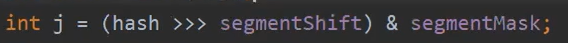
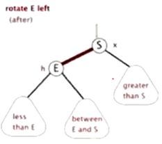
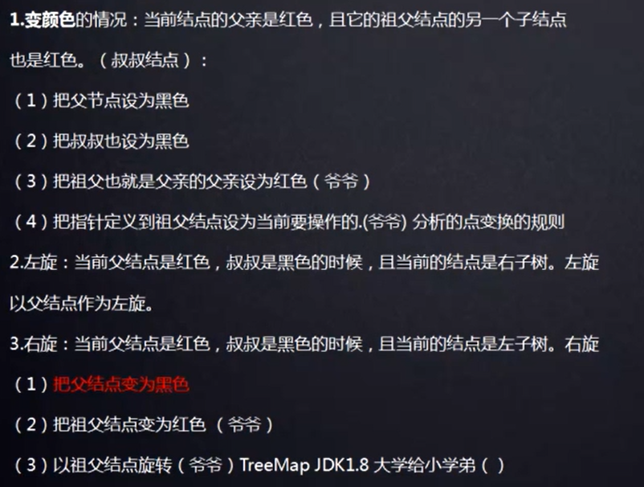
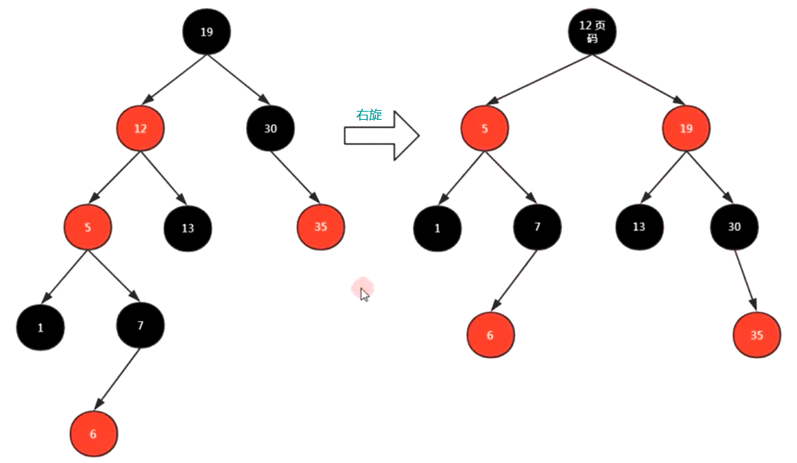

# Map


## Collection和Map的关系

`Collection`存放一个一个对象的

Map 存放`Entry键值对`的	


- key必须是唯一的，map里面只能存放一个key为null的Entry，但是可以存放多个value为null的Entry


## hash函数

### 定义
1. input unlimit, out limit
2. same input, same out
3. diffent input, maybe same out
4. 离散性：接近平均分布

hash函数 增删改查默认为**O(1)**，常数项比较大
### 哈希函数底层:
- 哈希值的各个`位部分` 多次异或运算，所拼接组成的16进制数 
- 哈希值的每个`位置码` 都可以理解为一个哈希值【桶】，相对于其他都是独立的

### 散乱性【重点】
- `散乱性`：打乱样本规律 ==> 输入量起来之后，输出量是**均匀**的
- 推导：均匀的输出，**取模之后 ** *任然是均匀的*

### 实现方法
哈希函数 有多种实现的hash算法：（数学上 极大的`打乱样本规律`）
1. mb5（0~2^64-1） 
2. ssha1 (0~2^128-1)


> 面试题：需要一千个相对独立的哈希函数？？
>

解：


- 改变哈希值 的**码组合** ：16进制的 `每个位置` 相对于其他都是独立


### 哈希应用

1. 大数据面试题：
    

    
    
    
    
    
2. 布隆过滤器

    


## HashMap 

### 结构图

- **数组**元素是*链表*
- **链表**里面是*节点*


- 除了添加以外 `查询删除`的效率都比链表快，效率高 不用多比


### 计算下标

```java
tab[i = (n - 1) & hash]); 
// tab:数组；
// n:数组长度；
// hash: (h = key.hashCode()) ^ (h >>> 16), 使h的高位参与计算，可以影响到最后的下标值==>hash值更加散列
```

列如`index=16` 需要满足两个条件：

1. 下标范围：[0, 15]
2. 平均，离散性


`15的低四位全是1` ：

- 满足条件1，由h低四位的**取值范围** 来决定下标位置	
- 满足条件2，由h的**随机性** 来满足离散性


> 这就是为什么，capacity - MUST be a power of two，数组长度必须是2的幂次方 的数字
>
> 用&计算时候，满足这里的两个条件


### 扩容

> 扩容是为了，让链表变短，遍历效率更快
>
> hashmap 初始容量：`16`；扩容因子：`0.75`（put数据时发生碰撞的概率是75%）[参考链接](https://www.cnblogs.com/aspirant/p/11470928.html) 

当哈希表中的 **条目数 size**  超出了 

```java
if (size >= threshold){}
// threshold = 加载因子x当前容量
// 对该哈希表进行扩容、rehash操作（即重建内部数据结构）
newCapacity = 2 * oldCapacity;
// 扩容后的哈希表：将具有两倍的原容量 
```


[1.7扩容源码分析 20:20](https://www.bilibili.com/video/BV1ZC4y1h7yb?p=2) ：有一个判断是否需要重新hash，【1.8没有】


**扩容后，元素对应的位置只有两个：** 


1. 同一个位置
2. 同一个位置 + 原数组长度


### modCount

> 表示修改，快速失败的容错机制
>
> 这种机制的原因：
>
> - 两个线程，可能一个在遍历，另一个在移除，很有可能会出现修改次数不一样

每当 put / remove 时候，都会++


异常： 


- 1.7的头插法，key=2 在前面；remove("1")，不报错；remove("2")，报错


### 线程不安全


多个线程进行扩容，[会形成循环链表 41:00](https://www.bilibili.com/video/BV1ZC4y1h7yb?p=2)	


原因：扩容的时候，使用头插法，导致数据的顺序发生了变化


### 红黑树

某个*链表长度大于8* 并且*数组总容量长度大于64* 这个时候链表就转成`红黑树`


### put方法

 

 - put 时,如果 hash 表中`没定位到`,就在链表后加一个 Entry；如果定位到了,则**更换** Entry 中的 value,并返回旧 value

 - JDK8以前是头插法，JDK8后是尾插法

   

   > 为什么要从头插法改成尾插法？？   [参考链接](https://blog.csdn.net/weixin_45097458/article/details/103179093)

   死链

   扩容后，被打乱


### 四种遍历方法


```java
public static void main(String[] args) {
  Map<String,String> map=new HashMap<String,String>();
        map.put("1", "value1");
        map.put("2", "value2");
        map.put("3", "value3");
        map.put("4", "value4");
        
        //第一种：普通使用，二次取值
        System.out.println("\n通过Map.keySet遍历key和value：");  
        for(Object key:map.keySet())
        {
         System.out.println("Key: "+key+" Value: "+map.get(key));
        }
        
        //第二种
        System.out.println("\n通过Map.entrySet使用iterator遍历key和value: ");  
        Iterator map1it=map.entrySet().iterator();
        while(map1it.hasNext())
        {
　　　　　　// 一定是  Map.Entry
         Map.Entry<String, String> entry=(Entry<String, String>) map1it.next();
         System.out.println("Key: "+entry.getKey()+" Value: "+entry.getValue());
        }
        
        //第三种：推荐，尤其是容量大时  
        System.out.println("\n通过Map.entrySet遍历key和value");  
        for(Map.Entry<String, String> entry: map.entrySet())
        {
         System.out.println("Key: "+ entry.getKey()+ " Value: "+entry.getValue());
        }
        
        //第四种  
        System.out.println("\n通过Map.values()遍历所有的value，但不能遍历key");  
        for(String v:map.values())
        {
         System.out.println("The value is "+v);
        }
 }
```


## HashMap / Hashtable


|          |    hashMap    |    hashTable    |
| :------: | :-----------: | :-------------: |
|   key    | 允许key为null | 不允许key为null |
| 线程安全 |  非线程安全   |    线程安全     |


1. hashmap允许key为null，但只能有一个null（两个null，相当于key重复）; Hashtable不允许key为null
  
2. Hashtable 是HashMap 的线程安全写法
    


## concurrentHashMap
[参考文档](https://www.cnblogs.com/lijiasnong/p/9963808.html)

* JDK1.7版本的ReentrantLock+Segment+HashEntry
* JDK1.8版本中synchronized+CAS+HashEntry+红黑树


### 1.7版本

[视频解说 90:30](https://www.bilibili.com/video/BV1ZC4y1h7yb?p=2) 

#### 分段锁

> 设计的概念


三层结构：

- ConcurrentHashmap
  - Segment[ ]  table		   【Segment长度 初始化完就不改变了】
    - HashEntry[ ]  tab	【和HashMap里面的 Entry对象是一样的】 


#### 参数对应关系


- DEFAULT_INITIAL_CAPACITY：HashEntry 的个数
- DEFAULT_CONCURRENCY_LEVEL：Segment 的个数


initialCapacity / ssize  = 每个Segment包含多少个HashEntry

- MIN_SEGMENT_TABLE_CAPACITY = 2;   ==每个Segment至少有两个HashEntry== 
- cap 和 ssize 都必须为2的幂次方，为了计算 两个层次的 数组的下标


列如：

如果 initialCapacity 为33时，每个Segment包含`4`个HashEntry


#### 局部扩容

> 扩容：只和Segment对象有关

会判断**当前**Segment的阈值是多少(cap * loadFactor)


- 一开始就将s0写入ss，为了当其他Segment为null时，new segment()不用重新计算


#### put

[视频解析](https://www.bilibili.com/video/BV1ZC4y1h7yb?p=3)	

put入对应的segment：


**偏移量** 的推导过程：


两个维度 的数组位置 的计算：




put入对应的 HashEntry：


#### Unsafe


CAS通常和while循环一起使用


### 1.8版本


## 红黑树


> **log^n^** 的推导：
>
> 2^x^ = n   ==>   x = log^n^ 
>
> x表示层级，n表示该层多少节点

> 数据结构的推导：
>
> 链表 => 二叉树 => 二叉查找树 => **平衡**二叉查找树【AVL树】 => `自`**平衡**二叉查找树【红黑树】=> N叉查找树【B树, mysql】


### BST【二叉查找树】


贪心算法 ==> 赫夫曼树？？任然不是平衡二叉树


### AVL树 [平衡二叉树]

问题：


> AVL：基于二叉查找树，**防止退化**成链表
>
> 左右子树**高度之差**不超过1

### 红黑树

> 红黑树的底层数据结构：二叉查找树，特殊的二叉查找树，`自平衡的`二叉查找树


实列图：


- 所有叶子节点都是黑色，40/48后面 还有null节点，是黑色


### 变换规则

> 所有插入的点默认是`红色`
>

1. 改变颜色
2. 左旋：即将上位
   1. 
   2. 
   3. 
   4. 
3. 右旋
   1. 
   2. 
   3. 
   4. 


### 变换实例







### TreeMap

> TreeMap 的实现就是红黑树数据结构，也就是一棵自平衡的二叉查找树	
>
> [通过分析 JDK 源代码研究 TreeMap 红黑树算法实现](https://www.ibm.com/developerworks/cn/java/j-lo-tree/index.html#major1)

```java
static final class Entry<K,V> implements Map.Entry<K,V> {
    K key;	// key相同时，新值替换旧值
    V value;
    Entry<K,V> left;
    Entry<K,V> right;
    Entry<K,V> parent;	// 父节点
    boolean color = BLACK;	// 颜色，默认为黑色
    /**
     * Make a new cell with given key, value, and parent【需要关联父节点】, and with
     * {@code null} child links【子节点为null】, and BLACK color【默认为黑色】.
     */
    Entry(K key, V value, Entry<K,V> parent) {
        this.key = key;
        this.value = value;
        this.parent = parent;
    }
```


### 总结

