# 数据结构和算法

- 计算机解决问题其实没有任何奇技淫巧，它唯一的解决办法就是穷举，**穷举所有可能性**。

  

- 算法设计先思考“如何穷举”————>再追求“`如何聪明地穷举`”

  

- 知道怎么算（P）；不知道怎么算（NP），但知道怎么试


> 穷举的方法：迭代 / 递归；基本操作：增删改查


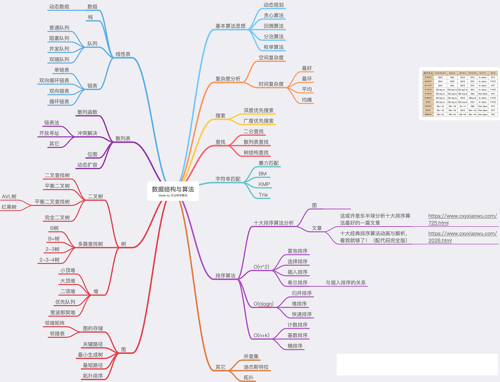


## 数据结构


### 线性结构

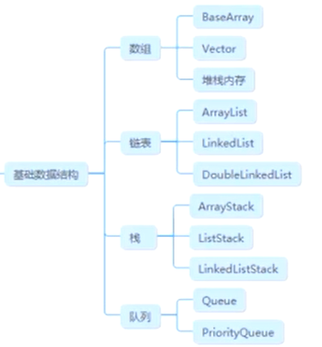

 数组：
 链表：
 堆(PriorityQueue)：add （优先级队列）
 栈(Stack)：push【ArrayDeque 可以作为栈来使用，效率要高于 Stack。】
 队列(LinkedList)：offer/Push/removeLast/addFirst
 哈希表（HashMap）：put


#### 数组

**数组**由于是`紧凑连续存储`，可以随机访问，通过索引快速找到对应元素，而且相对节约存储空间。

但正因为连续存储，内存空间必须一次性分配够；

所以说数组如果要扩容，需要重新分配一块更大的空间，<u>*再把数据全部复制过去*</u>，时间复杂度 O(N)；

而且你如果想在数组中间进行插入和删除，每次**必须搬移**后面的所有数据以保持连续，时间复杂度 O(N)。


```java
// 数组遍历框架，典型的线性迭代结构：
void traverse(int[] arr) {
    for (int i = 0; i < arr.length; i++) {
        // 迭代访问 arr[i]
    }
}
```


#### 链表

```java
public class ListNode {
      int val;
      ListNode next;
      ListNode(int x) { val = x; }
 }
```

```java
// 链表遍历框架，兼具迭代和递归结构：

void traverse(ListNode head) {
    for (ListNode p = head; p != null; p = p.next) {
        // 迭代访问 p.val
    }
}

void traverse(ListNode head) {
    // 递归访问 head.val
    traverse(head.next)
}
```


约瑟夫问题（丢手帕）

[环形链表](https://leetcode-cn.com/problems/linked-list-cycle/) 

```java
// 快慢指针找中间节点
public ListNode findMidNode(ListNode head) {
    if (head == null) return head;
    ListNode fast = head;
    ListNode slow = head;
    while (fast != null && fast.next != null) {
        fast = fast.next.next;
        slow = slow.next;
    }
    return slow;
}
```


```java
// 反转一个单链表反转一个单链表
// 方法一：递归，从后往前
class Solution {
    public ListNode reverseList(ListNode head) {
        if(head == null || head.next == null){
            return head;
        }
        ListNode headNode = reverseList(head.next); // 递归到最深的元素
        head.next.next = head;			// head.next：表示该层的节点；并将next指向父节点(上一层)
        head.next = null;				// 上一层的next指向null
        return headNode;
    }
}
// 方法二：遍历法，从前
class Solution {
    public ListNode reverseList(ListNode head) {
        ListNode preNode = null;
        ListNode curNode = head;
        while(curNode != null){
            ListNode nextNode = curNode.next;
            curNode.next = preNode;
            preNode = curNode;
            curNode = nextNode;
        }
        return preNode;
    }
}
```


#### 堆

- Java中用优先级队列 `PriorityQueue` ，默认为**小**根堆

- 底层结构**完全二叉树**：满二叉树、或者<u>*新的一层从左往右依次补齐形成的树*</u>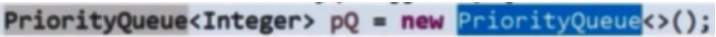

- 根据**比较器**形成小根堆/大根堆：
  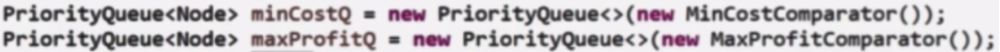


> 堆可以用数组来实现（**脑补**出来一颗树）：
> 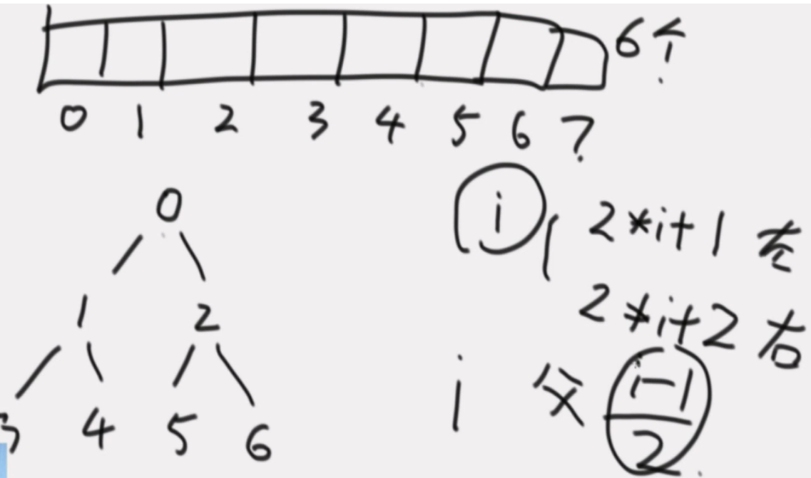

* 大根堆：在完全二叉树中，任何一颗子树的最大值 都是这颗子树的头部
* 小根堆：在完全二叉树中，任何一颗子树的最小值 都是这颗子树的头部
* 一个节点左孩子：2 x i + 1，右孩子：2 x i + 2,父节点：(i-1)/2


堆可以搞定几乎一切的`贪心结构`：

> 堆可以通过一种标准（`完全二叉树`），把这个结构调得特别快，调整的代价*只和层数* 有关系


#### 栈

> `Stack`：push
中缀转后缀

[Java为什么不推荐使用 Stack 呢？](https://www.cnblogs.com/cosmos-wong/p/11845934.html)

ArrayDeque 可以作为栈来使用，效率要高于 Stack。注意，ArrayDeque 不支持为 null 的元素。


[ 84. 柱状图中最大的矩形](https://leetcode-cn.com/problems/largest-rectangle-in-histogram/)

#### 队列

 队列(LinkedList)：

- offer
- Push
- removeLast
- addFirst

ArrayDeque 也可以作为队列来使用，效率相较于基于双向链表的 LinkedList 也要更好一些。注意，ArrayDeque 不支持为 null 的元素。


#### 哈希表

- 涉及**统计出现的次数**，可以考虑用哈希表


- 一个负数 % k ,所得余数必然在 （-k, 0）之间， 然后 +k 必然是正数


### 非线性结构


#### 二维数组


#### 稀疏数组
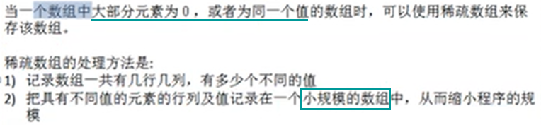

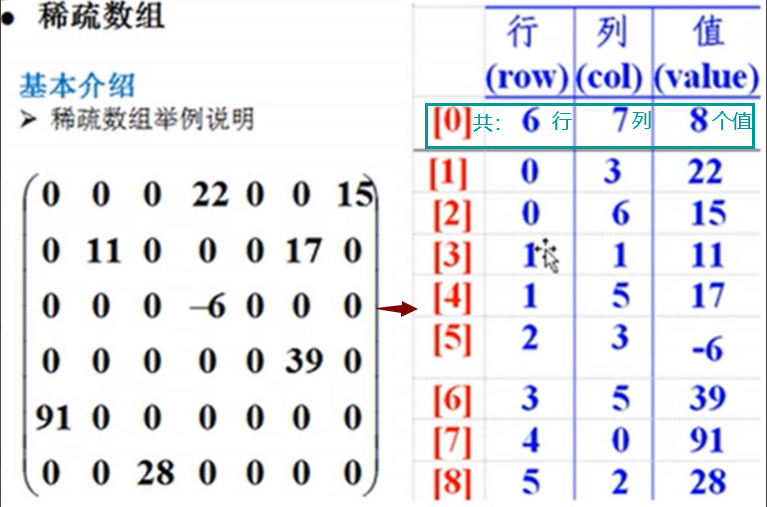

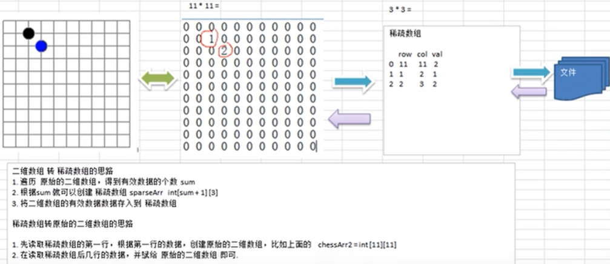

#### 多维数组


#### 广义表


#### 树结构

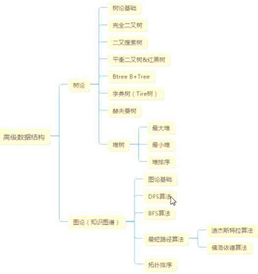

##### Btree

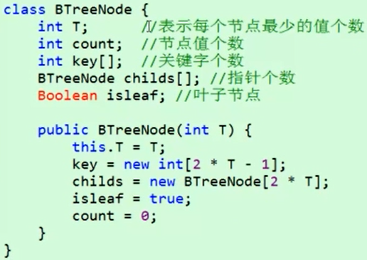

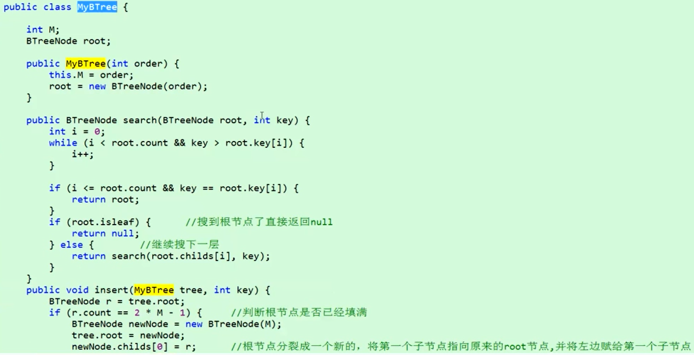

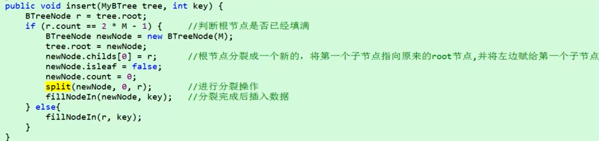

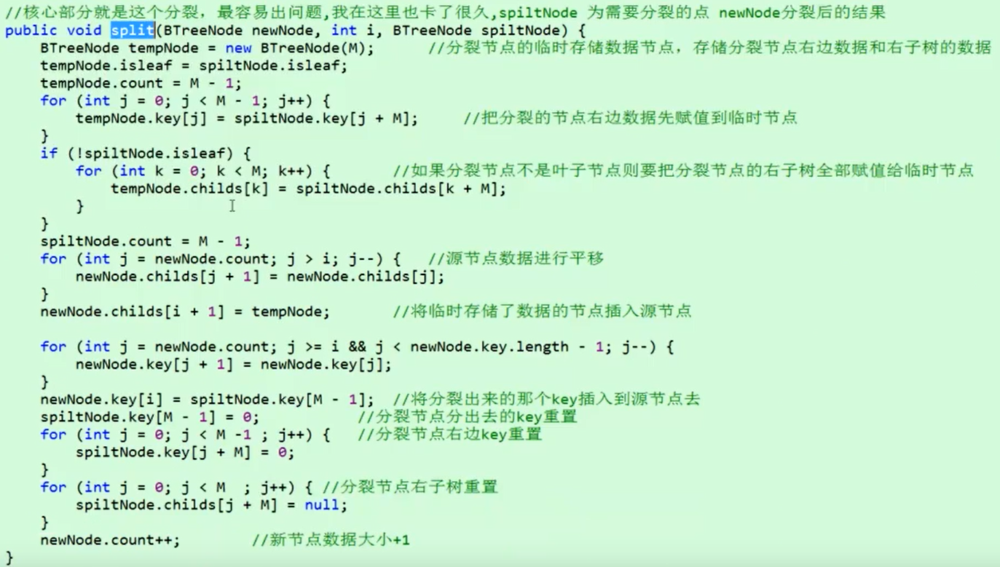

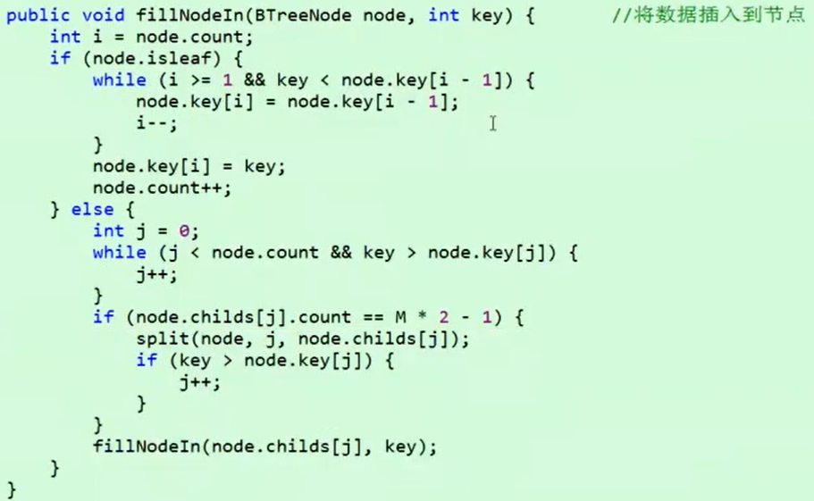

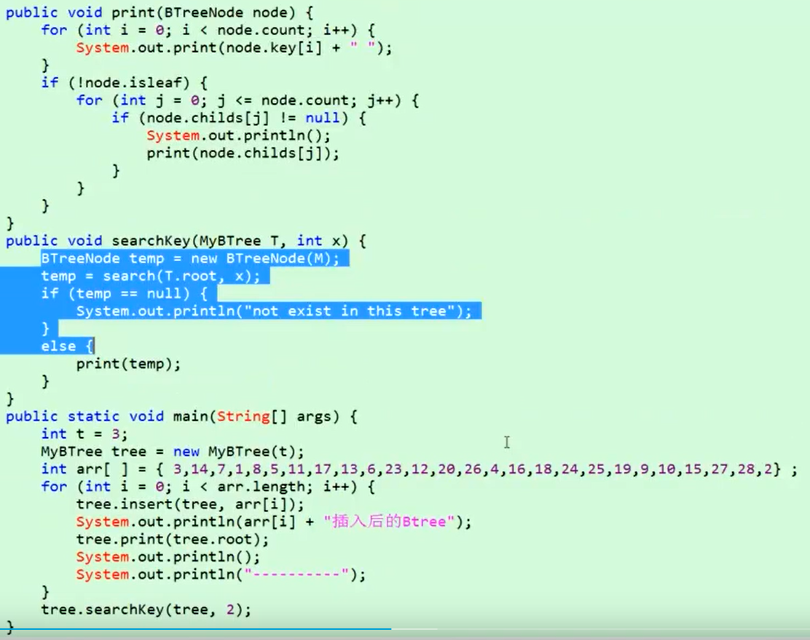


#### 图结构


#### 查找算法

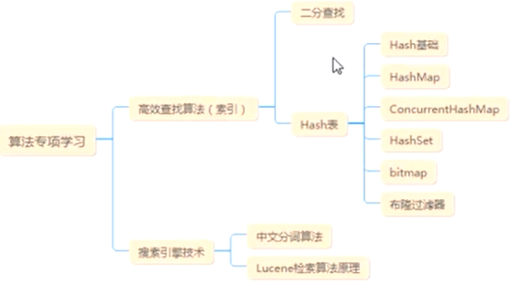


## 算法

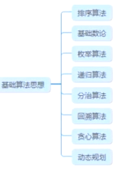

### 递归

 递归 ： 先想出口条件

[爬楼梯的多种解法](https://leetcode-cn.com/explore/orignial/card/recursion-i/258/memorization/1214/#_3)

### 排序

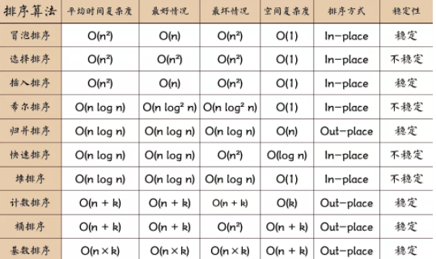

[动画演示](https://www.cxyxiaowu.com/2026.html)

#### 冒泡

两两比较，end减减

```java
public void bubbleSort(int[] arr){
        if(arr == null || arr.length < 2)   return;
        for(int e = arr.length - 1; e > 0; e--){    // 泡泡吐到最后面 
            for(int i = 0; i < e; i++){
                if(arr[i] > arr[i+1]){
                    swap(arr, i, i+1);
                }
            }
        }
    }
    private void swap(int[] arr, int i, int j) {
        arr[i] = arr[i] ^ arr[j];
        arr[j] = arr[i] ^ arr[j];
        arr[i] = arr[i] ^ arr[j];
    }
```


#### 选择

百里挑一，i j 加加

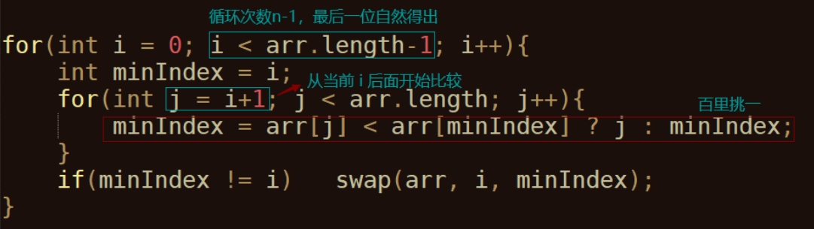

```java
public void SelectionSort(int[] arr){
        if(arr == null || arr.length < 2)   return;
        for(int i = 0; i < arr.length - 1; i++){
            int minIndex = i;
            for(int j = i + 1; j < arr.length; j++){
                minIndex = arr[j] < arr[minIndex] ? j : minIndex;
            }
            if(minIndex != i)   swap(arr, i, minIndex);
        }
    }
    private void swap(int[] arr, int i, int j) {
        arr[i] = arr[i] ^ arr[j];
        arr[j] = arr[i] ^ arr[j];
        arr[i] = arr[i] ^ arr[j];
    }
```


#### 插入

无序区，有序区

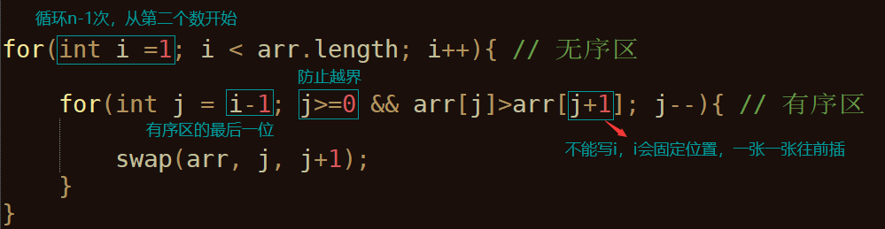


#### 快排


#### 归并


#### 堆排


#### 比较器

- 负数放前，正数放后，0表示相同

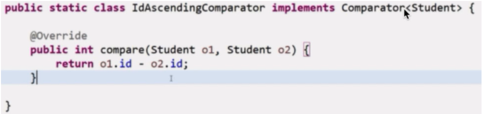

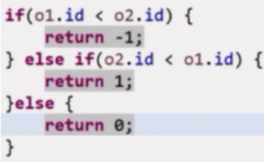

> 负数：o1排前；正数：o2排前；0：相等一样

`arrays.sort( comparator<>() )`

>系统提供了排序的方法，非常方便的使用，都会伴随着比较器的构造
>基于比较的排序是重点，只要告诉底层，这两东西准备怎么去比较大小，排序调度的策略是一样的
>`策略`： 数量小(<=60??)使用插入排序，要求稳定性用归并排序，没有要求使用随机快速排序


### 前缀

前缀树


前缀和：涉及**连续子树组**问题的时候，可以使用前缀和来解决


### 查找


#### 二分查找

二分法还可以用于确定一个`有范围的`整数【所有数字在1~n范围内，长度为n+1的数组】

> 抽屉原理：桌上有十个苹果，要把这十个苹果放到九个抽屉里，无论怎样放，我们会发现至少会有一个抽屉里面放不少于两个苹果。

[287. 寻找重复数](https://leetcode-cn.com/problems/find-the-duplicate-number/)

[面试题03. 数组中重复的数字](https://leetcode-cn.com/problems/shu-zu-zhong-zhong-fu-de-shu-zi-lcof/)


### 字符串

#### 刷题大纲

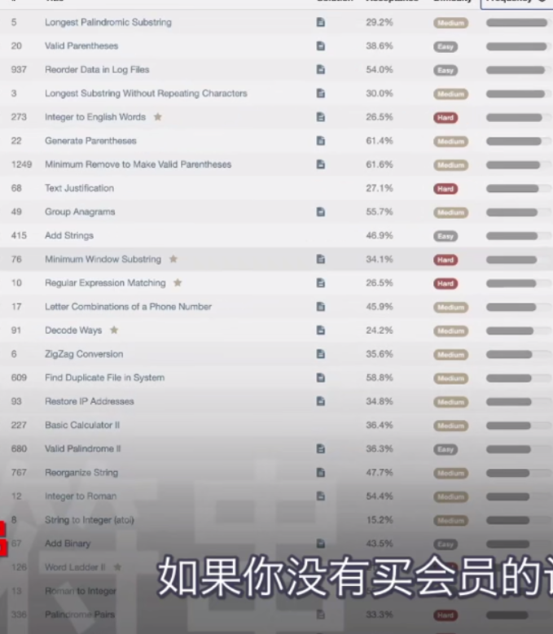

[5. 最长回文子串](https://leetcode-cn.com/problems/longest-palindromic-substring/)   涉及动态规划、Manacher

[20. 有效的括号](https://leetcode-cn.com/problems/valid-parentheses/) 

```java
// 栈的使用
Deque<Character> stack = new ArrayDeque();
stack.addLast(word); stack.removeLast();
```

[937. 重新排列日志文件](https://leetcode-cn.com/problems/reorder-data-in-log-files/) ？？

[3. 无重复字符的最长子串](https://leetcode-cn.com/problems/longest-substring-without-repeating-characters/)	滑动窗口

[273. 整数转换英文表示](https://leetcode-cn.com/problems/integer-to-english-words/)	

[22. 括号生成](https://leetcode-cn.com/problems/generate-parentheses/)	深度优先遍历/广度优先遍历

[1249. 移除无效的括号](https://leetcode-cn.com/problems/minimum-remove-to-make-valid-parentheses/)	栈 、标记数组

[68. 文本左右对齐](https://leetcode-cn.com/problems/text-justification/)	??

[49. 字母异位词分组](https://leetcode-cn.com/problems/group-anagrams/)	各种**常用工具类** (Arrays / ArrayList / HashMap / String )的 使用细节

[415. 字符串相加](https://leetcode-cn.com/problems/add-strings/)	抠边界！！

[76. 最小覆盖子串](https://leetcode-cn.com/problems/minimum-window-substring/)	滑动窗口


#### 回文字符串

1. 双指针，两边夹
2. 中心扩散法：遍历每一个索引，以这个索引为中心，利用“回文串”中心对称的特点，往两边扩散，看最多能扩散多远


##### Manacher

**i在R内部的第一种可能性：**i的回文半径 和 i'的回文半价相同

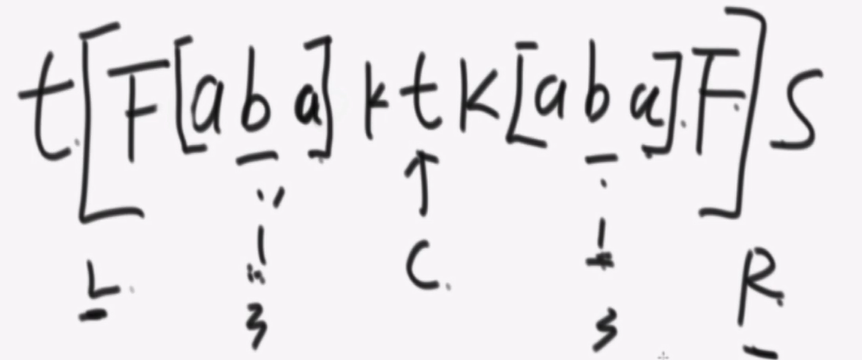

**i在R内部的第二种可能性：** i的回文半径 **i到R**

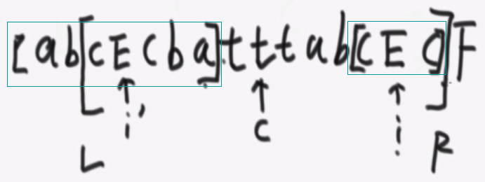

**i 在R内部的第三种可能性：** i' 回文的最左字符<u>刚好和</u>C回文的最左字符 **压线**，不确定i的回文半径，往外能不能扩大`得试`

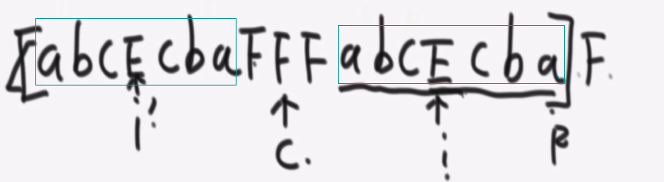

**i在R外部的可能性：** 暴力扩，**i**的回文半径为1，~~是它自己？？~~ ，为了向外扩


##### 验证回文字符串 Ⅱ

[给定一个非空字符串 `s`，**最多**删除一个字符。判断是否能成为回文字符串。](https://leetcode-cn.com/problems/valid-palindrome-ii/)


### 滑动窗口

> 和双指针一样，为了优化暴力解


[76. 最小覆盖子串](https://leetcode-cn.com/problems/minimum-window-substring/) 

[3. 无重复字符的最长子串](https://leetcode-cn.com/problems/longest-substring-without-repeating-characters/)	

[30. 串联所有单词的子串](https://leetcode-cn.com/problems/substring-with-concatenation-of-all-words/)

[159. 至多包含两个不同字符的最长子串](https://leetcode-cn.com/problems/longest-substring-with-at-most-two-distinct-characters/)

[209. 长度最小的子数组](https://leetcode-cn.com/problems/minimum-size-subarray-sum/)

[239. 滑动窗口最大值](https://leetcode-cn.com/problems/sliding-window-maximum/)	

[424. 替换后的最长重复字符](https://leetcode-cn.com/problems/longest-repeating-character-replacement/)	

[438. 找到字符串中所有字母异位词](https://leetcode-cn.com/problems/find-all-anagrams-in-a-string/)	？？

[567. 字符串的排列](https://leetcode-cn.com/problems/permutation-in-string/)

[632. 最小区间](https://leetcode-cn.com/problems/smallest-range/)

[727. 最小窗口子序列](https://leetcode-cn.com/problems/minimum-window-subsequence/)	

> [滑动窗口的优秀总结](https://mp.weixin.qq.com/s?__biz=MzAxODQxMDM0Mw==&mid=2247485141&idx=1&sn=0e4583ad935e76e9a3f6793792e60734&chksm=9bd7f8ddaca071cbb7570b2433290e5e2628d20473022a5517271de6d6e50783961bebc3dd3b&mpshare=1&scene=23&srcid=0629kJBS1V0HF6mmuhGN4YtL&sharer_sharetime=1593391152659&sharer_shareid=aa55b5520af7873f02181e7e14a32e3e#rd)	


### 二叉树

```java
public class TreeNode{
    public int val;
    public TreeNode left, right;
    public TreeNode(int val){
        this.val =  val;
    }
}
```

```java
void traverse (TreeNode root) {
    // 前序遍历
    traverse(root.left);
    // 中序遍历
    traverse(root.right);
    // 后续遍历
}
```

DFS 调用了系统栈

```java
public void dfs(TreeNode root) {
    if (root == null) {  // 出口
        return;
    }
    dfs(root.left);
    dfs(root.right);
}
```

BFS 必须**手动记录**遍历的TreeNode 

```java
public void bfs(TreeNode root) {
    Queue<TreeNode> queue = new ArrayDeque<>(); // 记录 先进先出
    if (root != null) {
        queue.addLast(root);
    }
    while (!queue.isEmpty()) {
        TreeNode node = queue.poll();
        if (node.left != null) {
            queue.add(node.left);
        }
        if (node.right != null) {
            queue.add(node.right);
        }
    }
}
```


 [102. 二叉树的层序遍历](https://leetcode-cn.com/problems/binary-tree-level-order-traversal/)	双循环，使用n来区分每层；？？ 改成单循环

 [107. 二叉树的层次遍历 II](https://leetcode-cn.com/problems/binary-tree-level-order-traversal-ii/)	

1. 自底向上的层次遍历
2. 从res 添加 level的顺序 动手脚

 [103. 二叉树的锯齿形层次遍历](https://leetcode-cn.com/problems/binary-tree-zigzag-level-order-traversal/)	

1. 标识符来控制方向
2. TreeNode加入level链表 or 临时保存节点的queue
3.  LinkedList  不仅实现了List 还有Deque ;  而ArrayList  只实现了List

 [105. 从前序与中序遍历序列构造二叉树](https://leetcode-cn.com/problems/construct-binary-tree-from-preorder-and-inorder-traversal/)   

 [106. 从中序与后序遍历序列构造二叉树](https://leetcode-cn.com/problems/construct-binary-tree-from-inorder-and-postorder-traversal/)	

- 前序or后序 **必须带上中序** 才能构造出二叉树
- 前序 **从左到右** 依次遍历数组元素，先递归左子树
- 后序 **从右到左** 依次遍历数组元素，先递归右子树

 [108. 将有序数组转换为二叉搜索树](https://leetcode-cn.com/problems/convert-sorted-array-to-binary-search-tree/)    

 [109. 有序链表转换二叉搜索树](https://leetcode-cn.com/problems/convert-sorted-list-to-binary-search-tree/)    

​	二叉搜索树（Binary Search Tree）是指一棵空树或具有如下性质的二叉树：

	1. 若任意节点的左子树不空，则"左子树"上所有节点的值均"小于"它的根节点的值
	2. 若任意节点的右子树不空，则"右子树"上所有节点的值均"大于"它的根节点的值
	3. 任意节点的左、右子树也分别为二叉搜索树
	4. 没有键值相等的节点
==二叉搜索树的中序遍历 是有序的== 


 [112. 路径总和](https://leetcode-cn.com/problems/path-sum/)	很优雅的，进行递归

 [113. 路径总和 II](https://leetcode-cn.com/problems/path-sum-ii/)	 路径的记录：从前往后、从后往前

 [124. 二叉树中的最大路径和](https://leetcode-cn.com/problems/binary-tree-maximum-path-sum/)	


### 深度优先搜索

#### 刷题大纲

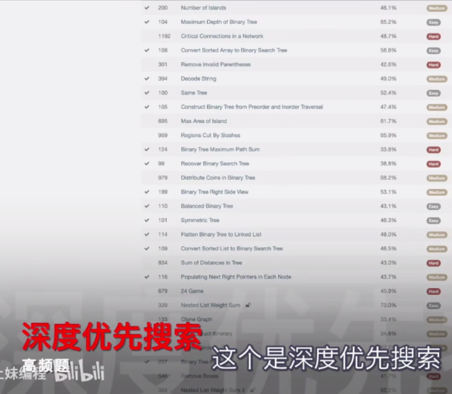

[200. 岛屿数量](https://leetcode-cn.com/problems/number-of-islands/)	


### 基本算法思想


#### 动态规划

> 说白了就是空间换时间，将计算结果暂存起来，避免重复计算
>
> 作用和工程中用 `redis` 做缓存有异曲同工之妙


[动态规划练习题](https://leetcode-cn.com/tag/dynamic-programming/)


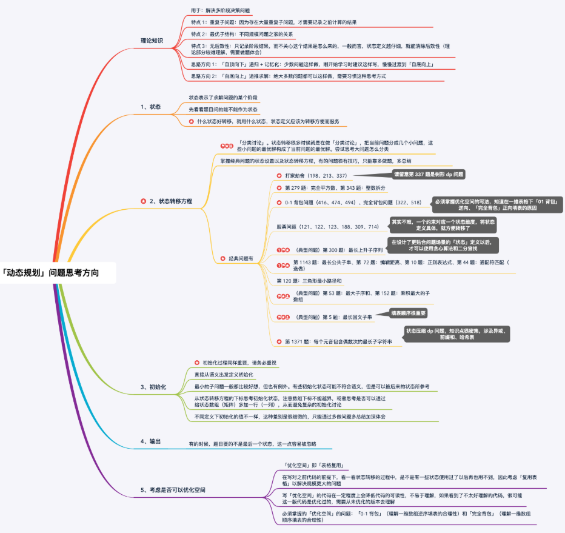

> **动态规划**的规划，就是`填表格`的意思，所以动态规划也叫 “表格法”，它就是 “空间换时间” 思想的体现

填表顺序： 是否满足“无后效性”

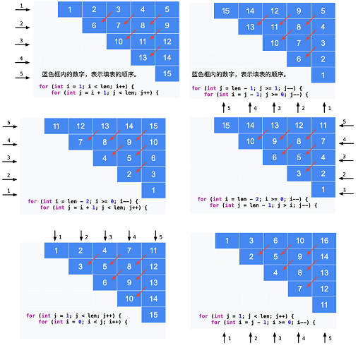

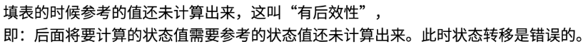


> 自顶向下：递归+记忆法，**直接对问题求解**，*遇到的新问题，记录一下，再遇到的时候直接读取*
>
> 自底向上：动态，发现这个问题 “**最初的样子**”， *从一个最基本的问题出发，逐步计算中间过程，最后得到要求问题的解*


