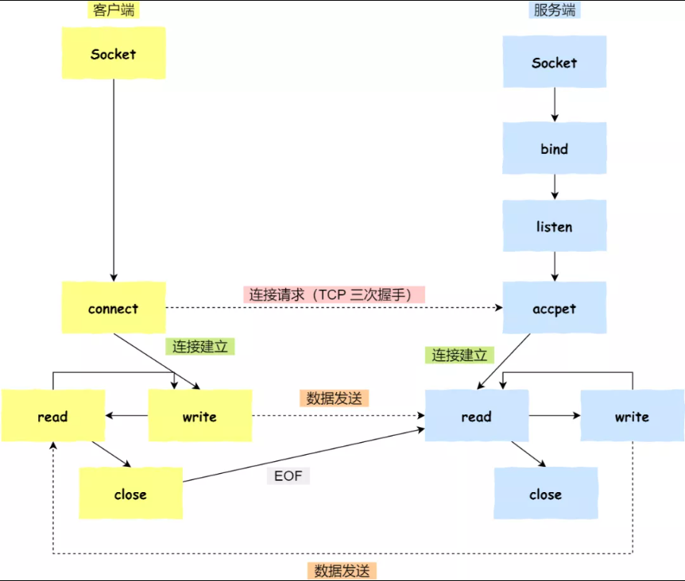

# 计算机网络


[计算机网络自学指南](https://www.cnblogs.com/cxuanBlog/p/14414681.html) 


## 扩展阅读


1. [源文](https://mp.weixin.qq.com/s?__biz=MzAxODQxMDM0Mw==&mid=2247485167&idx=2&sn=19facbf79be561aee497e36d61d4c3a3&chksm=9bd7f8e7aca071f1d0330bf4aa8850e6ac050da7aad2af5a1b609e6a9c330b5b9c710ca6ddde&mpshare=1&scene=1&srcid=0529pYGrZnTzSufPO2bISMWV&sharer_sharetime=1590717459269&sharer_shareid=aa55b5520af7873f02181e7e14a32e3e&key=46b99478acbf5f3d214b202a14af1235057ba6d16d7ba4eb02aa02b84ceec1c68e299015ab91299da86151c7aeee2e8ed0196def3a2428bc796d4c43006af95127ce6e625ab0c5887d13008458437aae&ascene=1&uin=MTY5ODU1NzUxMA%3D%3D&devicetype=Windows+10&version=62080079&lang=zh_CN&exportkey=A7V8fFUDdhTqs7n1zkEMNaA%3D&pass_ticket=3iMN3z2RJYUEHuNVgRz0u%2BJMTX%2FVLABL%2FbpDx2ePpL0Hq9Id11ZOlzQ3RCLH%2Bb6v)	

   

2. [结合硬件的讲解](https://www.bilibili.com/video/BV1ri4y1s7VF?p=4)    
   
   1. TCP协议：由操作系统来实现，（操作系统上的应用程序可以方便的直接使用）
   2. HTTP协议：游览器实现，通常只发送数据，组织和生成数据；
   3. Tomcat主要是接收数据，解析
   
   凡是想要通过TCP连接，去发送数据的话，不能直接去调用操作系统的TCP协议具体方法，如 tcp_connect(数据)

**只能去使用Socket接口**，`Socket是实现TCP连接的一个接口`，提供给应用程序使用的接口


3. [TCP/IP协议族](https://mp.weixin.qq.com/s?__biz=MzI0ODk2NDIyMQ==&mid=2247486408&idx=1&sn=c332ae7ae448f3eb98865003ecade589&chksm=e999fedadeee77cc6281d1b170bd906b58220d6cd83054bc741821f4167f1f18ceee9ba0e449&mpshare=1&scene=1&srcid=1103FmAtLcQUnsZ21IPaBGbb&sharer_sharetime=1604404419156&sharer_shareid=aa55b5520af7873f02181e7e14a32e3e&key=cf590b689448e75509313a38e9aa9200336c6ea4efa2cb531fa2c85cb45f0c0c73d8eb02eb3e5a9452a013abf81a7fc6d47590a8f8725c2548344019901997a901dc8424959acec2d5b71e5060a9b30c9be4cf28e97c7f389853ba2cb3c2d683a95b696eb2d3b6acc3478bb6e364222753936bd758b809adb323ed5fb0264d16&ascene=1&devicetype=Windows+10+x64&version=63000039&lang=zh_CN&exportkey=A6pHbHdMPZNIwyp1STNlZms%3D&pass_ticket=A%2Fw%2BGbWQL1yBsctJCrUjQgDABsPBfTpO7fz%2Fz1edXhJi9I5iVlBZ%2FmmyNvE4hpaz&wx_header=0) 	


4. [网络层的分包和重组](https://mp.weixin.qq.com/s?__biz=MzI0ODk2NDIyMQ==&mid=2247487683&idx=1&sn=e0949e72e039759545450852d8bc0ada&chksm=e999e5d1deee6cc7ab9e42b50329924fee39c45955516b406046605d27928825a0f628d13e7c&scene=21#wechat_redirect)	


5. [DNS协议](https://mp.weixin.qq.com/s?__biz=MzI0ODk2NDIyMQ==&mid=2247487880&idx=1&sn=fd38ce30ae82fa7d08e5f83fabb9d497&chksm=e999e49adeee6d8c1adacbfe27dc59097e4cb9d39c6a04802b0fe61877653330e75721cbde0b&scene=178&cur_album_id=1629017939758596097#rd)：`BIND` 


6. 


## TCP 基本认识


### TCP 头格式


- **序列号**：在建立连接时，*由计算机生成的随机数作为其初始值*，通过 SYN 包传给接收端主机，每发送一次数据，就「累加」一次该「数据字节数」的大小。**用来解决网络包乱序问题。**
- **确认应答号**：指下一次「期望」收到的数据的序列号，发送端收到这个确认应答以后可以认为<u>在这个序号以前的数据</u>都已经被正常接收。**用来解决不丢包的问题。**
- **控制位：**
  - *ACK*：该位为 `1` 时，「确认应答」的字段变为有效，TCP 规定除了最初建立连接时的 `SYN` 包之外该位必须设置为 `1` 。
  - *RST*：该位为 `1` 时，表示 TCP 连接中出现异常必须强制断开连接。
  - *SYC*：该位为 `1` 时，表示希望建立连，并在其「序列号」的字段进行序列号初始值的设定。
  - *FIN*：该位为 `1` 时，表示今后不会再有数据发送，希望断开连接。当通信结束希望断开连接时，通信双方的主机之间就可以相互交换 `FIN` 位置为 1 的 TCP 段。
  - 对于一个端来说，`seq`是累计的发送字节数，`ack`是累计的接收字节数。
  
  


### 分层模型


`IP` 层是「不可靠」的，它不保证网络包的交付、不保证网络包的按序交付、也不保证网络包中的数据的完整性。

如果需要保障网络数据包的可靠性，那么就需要由上层（传输层）的 `TCP` 协议来负责。

 `TCP` 是一个工作在**传输层**的**可靠**数据传输的服务，它能确保接收端接收的网络包是**无损坏、无间隔、非冗余和按序的。**


###  TCP是什么？ ？

TCP 是**面向连接的、可靠的、基于字节流的** 传输层 通信 协议。


- **面向连接**：可以使客户端和服务器端`一对一`连接
  - 不能像 UDP 协议 可以一个主机同时向多个主机发送消息，也就是一对多是无法做到的
- **可靠的**：无论网络链路中出现了怎样的链路变化，TCP 都可以保证一个报文一定能够到达接收端；通过`状态性`和`可控制性`来实现可靠
  - 状态性是指 TCP 会记录信息的发送状态，例如，哪些数据收到了？？哪些数据没收到？？等状态信息都会被记录
  - 可控制性是指 TCP 会根据状态情况控制自己的行为，比如当 TCP 意识到丢包了就会控制重发此包
- **字节流**：以字节流的方式进行数据传输的


[视频讲解 30:00 ](https://www.bilibili.com/video/BV1Af4y117ZK)	


### TCP 连接是什么？？

我们来看看 RFC 793 是如何定义「连接」的：

*Connections:* 

*The reliability and flow control mechanisms described above require that TCPs initialize and maintain certain status information for each data stream.*  

*The combination of this information, including sockets, sequence numbers, and window sizes, is called a connection.*

简单说就是：

**用于保证可靠性和流量控制维护的某些状态信息，这些信息的组合，包括Socket、序列号和窗口大小称为连接。**


所以，建立一个 TCP 连接是需要 客户端 与 服务器端 达成上述三个信息的**共识**。

- **Socket**：由 IP 地址和端口号组成
- **序列号**：用来解决乱序问题等
- **窗口大小**：用来做流量控制


> 这个连接就是所谓的资源


### 如何唯一的确定一个 TCP 连接？？


> TCP 四元组可以唯一的确定一个连接

- 源地址和目的地址的字段（32位）是在 IP 头部中，作用是通过 IP 协议**发送报文给对方主机**
- 源端口和目的端口的字段（16位）是在 TCP 头部中，作用是告诉 TCP 协议**应该把报文发给哪个进程**


### 有一个服务器 IP监听了一个端口，它的 TCP 的最大连接数是多少？


服务器通常固定在某个本地端口上监听，等待客户端的连接请求。

因此，客户端 IP 和 端口是可变的，其理论值计算公式如下:


IPv4：客户端的 IP 数最多为 `2` 的 `32` 次方，客户端的端口数最多为 `2` 的 `16` 次方

所以，服务端**单机**最大 TCP 连接数，约为 `2` 的 `48` 次方


当然，服务端最大并发 TCP 连接数远不能达到理论上限。

- 首先主要是**文件描述符限制**，Socket 都是文件，所以首先要通过 `ulimit` 配置文件描述符的数目；
- 另一个是**内存限制**，每个 TCP 连接都要占用一定内存，操作系统是有限的。


### UDP 


TCP 是**无连接的、简单的、面向数据报的** 传输层 通信 协议

- UDP **不提供**复杂的控制机制，利用 IP 提供面向「无连接」的通信服务


UDP 协议，头部只有 `8` 个字节（ 64 位），UDP 的头部格式如下：


- 目标和源端口：主要是告诉 UDP 协议应该把报文**发给哪个进程**
- 包长度：该字段保存了 UDP 首部的长度**跟**数据的长度之和
- 校验和：校验和是为了提供可靠的 UDP 首部和数据而设计


### TCP 和 UDP 的区别

|                    |                             TCP                              |                           UDP                           |
| :----------------: | :----------------------------------------------------------: | :-----------------------------------------------------: |
|        连接        |       **面向连接**的传输层协议，传输数据前先要建立连接       |                不需要连接，即刻传输数据                 |
|      服务对象      |         **一对一**的两点服务，即一条连接只有两个端点         |            一对一、一对多、多对多的交互通信             |
|       可靠性       | **可靠的**交付数据，数据可以无差错、不丢失、不重复、按需到达 |         尽最大努力交付，**不保证可靠**交付数据          |
| 拥塞控制、流量控制 |      **有**拥塞控制和流量控制机制，保证数据传输的安全性      | **没有**，即使网络非常拥堵了，也不会影响 UDP 的发送速率 |
|      首部开销      | 首部长度较长，会有一定的开销；首部在没有使用「选项」字段时是 `20` 个字节，如果使用了「选项」字段则会变长的 |      首部只有 8 个字节，并且是固定不变的，开销较小      |


### TCP 和 UDP的应用场景

由于 TCP 是面向连接，能保证数据的可靠性交付，因此经常用于：

- `FTP` 文件传输
- `HTTP` / `HTTPS`


由于 UDP 面向无连接，它可以随时发送数据，再加上UDP本身的处理既简单又高效，因此经常用于：

- 包总量较少的通信，如 `DNS` 、`SNMP` 等
- 视频、音频等多媒体通信
- 广播通信


> 为什么 UDP 头部没有「首部长度」字段，而 TCP 头部有「首部长度」字段呢？

原因是 TCP 有**可变长**的「选项」字段，而 UDP 头部长度则是**不会变化**的，无需多一个字段去记录 UDP 的首部长度。


> 为什么 UDP 头部有「包长度」字段，而 TCP 头部则没有「包长度」字段呢？

先说说 TCP 是如何计算负载数据长度：


1. 其中 IP 总长度 和 IP 首部长度，在 IP 首部格式是已知的。
2. TCP 首部长度，则是在 TCP 首部格式已知的，所以就可以求得 TCP 数据的长度。


- 大家这时就奇怪了问：
- “ UDP 也是基于 IP 层的呀，那 UDP 的数据长度也可以通过这个公式计算呀？为何还要有「包长度」呢？”

这么一问，确实感觉 UDP 「包长度」是冗余的

**因为为了网络设备硬件设计和处理方便，首部长度需要是 `4`字节的整数倍。**

如果去掉 UDP 「包长度」字段，那 UDP 首部长度就不是 `4` 字节的整数倍了，所以可能是为了**补全** UDP 首部长度是 `4` 字节的整数倍，才补充了「包长度」字段。


## 建立TCP 连接：控制


### 三次握手

> 区别：三次握手服务器发送SYN，和ACk一起发送；四次挥手服务器发送FIN，先发送ACK再发送FIN
>


- 一开始，客户端和服务端都处于 `CLOSED` 状态。先是服务端主动监听某个端口，处于 `LISTEN` 状态


- 客户端会随机初始化序号（`client_isn`），将此序号置于 TCP 首部的「序号」字段中，同时把 `SYN` 标志位置为 `1` ，表示 `SYN` 报文。

- 接着，把第一个 SYN 报文发送给服务端，表示向服务端发起连接，该报文不包含应用层数据，之后客户端处于 `SYN-SENT` 状态。


- 服务端收到客户端的 `SYN` 报文后，首先服务端也随机初始化自己的序号（`server_isn`），将此序号填入 TCP 首部的「序号」字段中，其次把 TCP 首部的「确认应答号」字段填入 `client_isn + 1`, 接着把 `SYN` 和 `ACK` 标志位置为 `1`。

- 最后把该报文发给客户端，该报文也不包含应用层数据，之后服务端处于 `SYN-RCVD` 状态。


- 客户端收到服务端报文后，还要向服务端回应最后一个应答报文，首先该应答报文 TCP 首部 `ACK` 标志位置为 `1` ，其次「确认应答号」字段填入 `server_isn + 1` ，最后把报文发送给服务端，这次报文可以携带客户到服务器的数据，之后客户端处于 `ESTABLISHED` 状态。
- 服务器收到客户端的应答报文后，也进入 `ESTABLISHED` 状态。


> **第三次握手是可以携带数据的，前两次握手是不可以携带数据的**，这也是面试常问的题


### Linux下建立连接的操作


- 数字开头的目录，这些目录都是进程id号，可以查看每个进程打开了多少个`IO`

```shell
cd /proc/进程id号/fd
```


- shell，就是当前的解释器，当前解释器就是 1298这个进程

- $$，表示环境变量，被替换成了1298，1298就是 当前的bash

  


- 0，是当前解释器的标准输入IO
- 1，是当前解释器的标准输出IO
- 2，是当前解释器的报错输出IO

> 每个程序都有自己的 0/1/2 文件描述符


1 >& 10，如果右边是一个流的引用的话，还要一个&符号；如果只是文件，> 符号就可以了

- 符号>，表示输出；符号<，表示输入

原理：


###  Linux 中查看 TCP 状态


```shell
netstat -napt
```


### 为什么是三次握手？不是两次、四次？


> 因为三次握手才能保证双方具有接收和发送的能力，**简单说就是**，判断双方的输入输出是否都正常

这回答是没问题，但这回答是片面的，并没有说出主要的原因。


**TCP 连接**：用于保证可靠性和流量控制维护的某些状态信息，这些信息的组合，包括**Socket、序列号和窗口大小**称为连接。

- 经过三次握手，双方开辟了服务资源之后，这个连接才算有了


重要的是**为什么三次握手才可以初始化Socket、序列号和窗口大小并建立 TCP 连接????**

- 同步双方的初始序列号，避免历史连接


#### *原因一：避免历史连接*

RFC 793 指出的 TCP 连接使用三次握手的**首要原因**：

*The principle reason for the three-way handshake is to prevent old duplicate connection initiations from causing confusion.*

三次握手的**首要原因是为了防止旧的重复连接初始化 造成混乱**


由于网络拥堵等乱七八糟的原因，可能会使得旧的数据包，先到达目标主机


客户端连续**发送多次** SYN 建立连接的报文，在网络拥堵等情况下：

- 一个「旧 SYN 报文」比「最新的 SYN 」 报文早到达了服务端；
- 此时服务端会返回一个 `SYN + ACK` 报文给客户端；
- ==客户端收到后可以根据自身的上下文，判断这是一个历史连接==（序列号过期或超时），那么客户端就会发送 `RST` 报文给服务端，表示中止这一次连接。


> 如果是两次握手连接，**就不能判断**当前连接是否是历史连接
>
> 三次握手则可以在客户端 准备发送第三次报文时，有足够的上下文来判断当前连接是否是历史连接？？
>
> - 如果是历史连接（序列号过期或超时），则第三次握手发送的报文是 `RST` 报文，以此中止历史连接；
> - 如果不是历史连接，则第三次发送的报文是 `ACK` 报文，通信双方就会成功建立连接；

所以， TCP 使用三次握手建立连接的最主要原因是**防止历史连接初始化了连接。**


#### *原因二：避免资源浪费*

如果只有「两次握手」

1. 当客户端的 `SYN` 请求连接在网络中阻塞，客户端没有接收到 `ACK` 报文，就会重新发送 `SYN`
2. 由于没有第三次握手，服务器不清楚客户端是否收到了自己发送的建立连接的 `ACK` 确认信号
3. 所以每收到一个 `SYN` **就只能先主动**建立一个连接
4. 如果客户端的 `SYN` 阻塞了，重复发送多次 `SYN` 报文
5. 那么服务器在收到请求后就会**建立多个冗余的无效链接，造成不必要的资源浪费**


> 即两次握手会造成消息滞留情况下，服务器重复接受无用的连接请求  `SYN` 报文，而造成重复分配资源


#### *原因三：同步双方初始序列号*

TCP 协议的通信双方， 都必须维护一个「序列号」， 序列号是可靠传输的一个关键因素，它的作用：

- 接收方可以**去除**重复的数据；
- 接收方可以根据数据包的序列号**按序**接收；
- 可以标识发送出去的数据包中， **哪些**是已经被对方收到的；


1. 当客户端发送携带「初始序列号」的 `SYN` 报文的时候，需要服务端回一个 `ACK` 应答报文，表示客户端的 SYN 报文已被服务端成功接收
2. 当服务端发送「初始序列号」给客户端的时候，依然也要得到客户端的应答回应
3. **这样一来一回，才能确保双方的初始序列号能被可靠的同步**


四次握手其实也能够可靠的同步双方的初始化序号，但由于**第二步和第三步可以优化成一步**，所以就成了「三次握手」。

`而两次握手`只保证了一方的初始序列号能被对方成功接收，**没办法保证**双方的初始序列号都能被确认接收。


#### *小结*

TCP 建立连接时，通过三次握手**能防止历史连接的建立，能减少双方不必要的资源开销，能帮助双方同步初始化序列号**。

序列号能够保证数据包不重复、不丢弃和按序传输。

不使用「两次握手」和「四次握手」的原因：

- 「两次握手」：无法防止历史连接的建立，会造成双方资源的浪费，也无法可靠的同步双方序列号
- 「四次握手」：三次握手满足可靠连接的建立，所以不需要使用更多的通信次数


### 客户端和服务端的初始序列号 ISN 为什么不相同？？


因为网络中的报文**会延迟、会复制重发、也有可能丢失**，这样会造成的不同连接之间产生互相影响

所以为了避免互相影响，客户端和服务端的初始序列号是随机且不同的


### 初始序列号 ISN 是如何随机产生的

起始 `ISN` 是基于时钟的，每 4 毫秒 + 1，转一圈要 4.55 个小时。

RFC1948 中提出了一个较好的初始化序列号 ISN 随机生成算法。

*ISN = M + F (localhost, localport, remotehost, remoteport)*

- `M` 是一个计时器，这个计时器每隔 4 毫秒加 1
- `F` 是一个 Hash 算法，根据源 IP、目的 IP、源端口、目的端口生成一个随机数值。要保证 Hash 算法不能被外部轻易推算得出，用 MD5 算法是一个比较好的选择。


### TCP 层为什么需要 MSS

> 既然 IP 层会分片，为什么 TCP 层还需要 MSS 呢？？

- 为了增加重传的效率


- `MTU`：一个网络包的最大长度，以太网中一般为 `1500` 字节；
- `MSS`：除去 IP 和 TCP 头部之后，一个网络包所能容纳的 TCP 数据的最大长度；


> 如果TCP 的整个报文（头部 + 数据）交给 IP 层进行分片，会有什么异常呢？

1. 当 IP 层有一个超过 `MTU` 大小的数据（TCP 头部 + TCP 数据）要发送
2. 那么 IP 层就要进行分片，把数据分片成若干片，保证每一个分片都小于 MTU。
3. 把一份 IP 数据报进行分片以后，由目标主机的 IP 层来进行重新组装
4. 重新组装后，再交给上一层 TCP 传输层

- 这看起来井然有序，但存在隐患，**如果当一个 IP 分片丢失，整个 IP 报文的所有分片都得重传**

因为 IP 层本身没有超时重传机制，它由传输层的 TCP 来负责超时和重传。

当接收方发现 TCP 报文（头部 + 数据）的某一片丢失后，则不会响应 ACK 给对方，那么发送方的 TCP 在超时后，就会重发「整个 TCP 报文（头部 + 数据）」。

> 因此，可以得知由 IP 层进行分片传输，是非常没有效率的
>

**为了达到最佳的传输效能：**

1. TCP 协议在**建立连接的时候**通常要协商双方的 MSS 值
2. 当 TCP 层发现数据超过 MSS 时，则就先会进行分片
3. 当然由它形成的 IP 包的长度也就不会大于 MTU ，自然也就不用 IP 分片了


经过 TCP 层分片后，如果一个 TCP 分片丢失后，**进行重发时也是以 MSS 为单位**，而不用重传所有的分片，大大增加了重传的效率。


### 什么是 SYN 攻击？

前提：TCP 连接建立是需要三次握手


1. 假设攻击者短时间伪造不同 IP 地址的 `SYN` 报文
2. 服务端每接收到一个 `SYN` 报文，就进入`SYN_RCVD` 状态
3. 但服务端发送出去的 `ACK + SYN` 报文，无法得到未知 IP 主机的 `ACK` 应答
4. 久而久之就会**占满服务端的 SYN 接收队列（未连接队列）**，使得服务器不能为正常用户服务


### 如何避免 SYN 攻击？


#### *避免 SYN 攻击方式一*

其中一种解决方式是通过**修改 Linux 内核参数**，<u>控制队列大小</u>和<u>当队列满时应做什么处理</u>。

- 当网卡接收数据包的速度>内核处理的速度时，用一个队列保存这些数据包。控制<u>该队列的最大值</u>如下参数：

```shell
net.core.netdev_max_backlog
```

- SYN_RCVD 状态连接的最大个数：

```shell
net.ipv4.tcp_max_syn_backlog
```

- 超出处理能时，对新的 SYN 直接回 RST，丢弃连接：

```shell
net.ipv4.tcp_abort_on_overflow
```


#### *避免 SYN 攻击方式二*

我们先来看下Linux 内核的 `SYN` （未完成连接建立）队列与 `Accpet` （已完成连接建立）队列是如何工作的？


正常流程：

1. 当服务端接收到客户端的 SYN 报文时，会将其加入到内核的「 SYN 队列」；
2. 接着发送 SYN + ACK 给客户端，等待客户端回应 ACK 报文；
3. 服务端接收到 ACK 报文后，从「 SYN 队列」移除放入到「 Accept 队列」；
4. 应用通过调用 `accpet()` socket 接口，从「 Accept 队列」取出的连接。


- 应用程序过慢：会导致「 Accept 队列」被占满


- 如果不断受到 SYN 攻击，就会导致「 SYN 队列」被占满


`tcp_syncookies` 的方式可以应对 SYN 攻击的方法：

```shell
net.ipv4.tcp_syncookies = 1
```


1. 当 「 SYN 队列」满之后，后续服务器收到 SYN 包，不进入「 SYN 队列」；
2. 计算出一个 `cookie` 值，再以 SYN + ACK 中的「序列号」返回客户端，
3. 服务端接收到客户端的应答报文时，服务器会检查这个 ACK 包的合法性。如果合法，直接放入到「 Accept 队列」。
4. 最后应用通过调用 `accpet()` socket 接口，从「 Accept 队列」取出的连接。


## TCP 连接断开


### TCP 四次挥手过程和状态变迁

双方都可以主动断开连接，断开连接后主机中的「资源」将被释放。


1. 客户端打算关闭连接，此时会发送一个 TCP 首部 `FIN` 标志位被置为 `1` 的报文，也即 `FIN` 报文，之后客户端进入 `FIN_WAIT_1` 状态
2. 服务端收到该报文后，就向客户端发送 `ACK` 应答报文，接着服务端进入 `CLOSED_WAIT` 状态
3. 客户端收到服务端的 `ACK` 应答报文后，之后进入 `FIN_WAIT_2` 状态
4. 等待服务端处理完数据后，也向客户端发送 `FIN` 报文，之后服务端进入 `LAST_ACK` 状态
5. 客户端收到服务端的 `FIN` 报文后，回一个 `ACK` 应答报文，之后进入 `TIME_WAIT` 状态
6. 服务器收到了 `ACK` 应答报文后，就进入了 `CLOSE` 状态，至此服务端已经完成连接的关闭
7. 客户端在经过 `2MSL` 一段时间后，自动进入 `CLOSE` 状态，至此客户端也完成连接的关闭。

可以看到，每个方向都需要**一个 FIN 和一个 ACK**，因此通常被称为**四次挥手**。

> 这里一点需要注意是：**主动关闭连接的，才有 TIME_WAIT 状态**


### 为什么需要四次挥手？？


1. 关闭连接时，客户端向服务端发送 `FIN` 时，**仅仅表示**客户端不再发送数据了但是服务器还能接收数据。
2. 服务器收到客户端的 `FIN` 报文时，先回一个 `ACK` 应答报文
3. ==而服务端可能还有数据需要处理和发送==，**等服务端不再发送数据时**，才发送 `FIN` 报文给客户端来表示同意现在关闭连接

> 从上面过程可知，服务端通常**需要等待 完成数据的发送和处理**，所以服务端的 `ACK` 和 `FIN` 一般都会分开发送，从而比三次握手导致多了一次

**区别：** 

- 三次握手服务器发送SYN，和ACk一起发送；
- 四次挥手服务器发送FIN，先发送ACK再发送FIN。


### 可能发生三次挥手


- 由服务器先 提出挥手，发送FIN报文
- 客户端的FIN报文 和ACK报文 合一块发送了


### 为什么 TIME_WAIT 等待的时间是 2MSL？

`MSL` 是 Maximum Segment Lifetime，**报文最大生存时间**，它是任何报文在网络上存在的最长时间，超过这个时间报文将被丢弃。

因为 TCP 报文基于是 IP 协议的，而 IP 头中有一个 `TTL` 字段，是 IP 数据报可以经过的最大路由数，每经过一个处理他的路由器此值就减 1，当此值为 0 则数据报将被丢弃，同时发送 ICMP 报文通知源主机。

> MSL 与 TTL 的区别：MSL 的单位是时间，而 TTL 是经过路由跳数。所以 **MSL 应该要大于等于 TTL 消耗为 0 的时间**，以确保报文已被自然消亡。

TIME_WAIT 等待 2 倍的 MSL，比较合理的解释是：网络中可能存在来自发送方的数据包，当这些发送方的数据包被接收方处理后又会向对方发送响应，所以**一来一回需要等待 2 倍的时间**。

比如，如果被动关闭方没有收到断开连接的最后的 ACK 报文，就会触发超时重发 Fin 报文，另一方接收到 FIN 后，会重发 ACK 给被动关闭方， 一来一去正好 2 个 MSL。

> `2MSL` 的时间是从**客户端接收到 FIN 后发送 ACK 开始计时的**。如果在 TIME-WAIT 时间内，因为客户端的 ACK 没有传输到服务端，客户端又接收到了服务端重发的 FIN 报文，那么 **2MSL 时间将重新计时**。


- 在 Linux 系统里 `2MSL` 默认是 `60` 秒，那么一个 `MSL` 也就是 `30` 秒。**Linux 系统停留在 TIME_WAIT 的时间为固定的 60 秒**。

其定义在 Linux 内核代码里的名称为 TCP_TIMEWAIT_LEN：

```shell
#define TCP_TIMEWAIT_LEN (60*HZ) /* how long to wait to destroy TIME-WAIT 
                                    state, about 60 seconds  */
```

如果要修改 TIME_WAIT 的时间长度，只能修改 Linux 内核代码里 TCP_TIMEWAIT_LEN 的值，并重新编译 Linux 内核。


### 为什么需要 TIME_WAIT 状态？

**主动发起**关闭连接的一方，才会有 `TIME-WAIT` 状态。

需要 TIME-WAIT 状态，主要是两个原因：

- 防止具有相同「四元组」的「旧」数据包被收到
- 保证最后的 ACK 能让被动关闭方接收，从而帮助其正常关闭


#### *原因一：防止旧连接的数据包*


假设 TIME-WAIT 没有等待时间或时间过短，被延迟的数据包抵达后会发生什么??


1. 如上图黄色框框服务端在关闭连接之前发送的 `SEQ = 301` 报文，被网络延迟了
2. 这时有相同端口的 TCP 连接被复用后，被延迟的 `SEQ = 301` 抵达了客户端，那么客户端是有可能正常接收这个过期的报文，这就会产生数据错乱等严重的问题

所以，TCP 就设计出了这么一个机制，经过 `2MSL` 这个时间，**足以让两个方向上的数据包都被丢弃，使得原来连接的数据包在网络中都自然消失，再出现的数据包一定都是新建立连接所产生的。**


#### *原因二：保证连接正确关闭*

在 RFC 793 指出 TIME-WAIT 另一个重要的作用是：

*TIME-WAIT - represents waiting for enough time to pass to be sure the remote TCP received the acknowledgment of its connection termination request.*

TIME-WAIT 作用是**等待足够的时间以确保最后的 ACK 能让被动关闭方接收，从而帮助其正常关闭**


假设 TIME-WAIT 没有等待时间或时间过短，断开连接会造成什么问题呢？?


1. 如上图红色框框客户端四次挥手的最后一个 `ACK` 报文如果在网络中被丢失了，此时如果客户端 `TIME-WAIT` 过短或没有，则就直接进入了 `CLOSE` 状态了，那么服务端则会一直处在 `LASE-ACK` 状态
2. 当客户端发起建立连接的 `SYN` 请求报文后，服务端会发送 `RST` 报文给客户端，连接建立的过程就会被终止


如果 TIME-WAIT 等待足够长的情况就会遇到两种情况：

- 服务端正常收到四次挥手的最后一个 `ACK` 报文，则服务端正常关闭连接
- 服务端没有收到四次挥手的最后一个 `ACK` 报文时，则会重发 `FIN` 关闭连接报文并等待新的 `ACK` 报文

所以客户端在 `TIME-WAIT` 状态等待 `2MSL` 时间后，就可以**保证双方的连接都可以正常的关闭。**


### TIME_WAIT 过多有什么危害？

如果服务器有处于 TIME-WAIT 状态的 TCP，则说明是由服务器方主动发起的断开请求。

过多的 TIME-WAIT 状态主要的危害有两种：

- 第一是**内存资源**占用；
- 第二是对**端口资源**的占用，一个 TCP 连接至少消耗一个本地端口；


第二个危害是会造成严重的后果的，要知道，端口资源也是有限的，一般可以开启的端口为 `32768～61000`，也可以通过如下参数设置指定

```shell
net.ipv4.ip_local_port_range
```

**如果服务端 TIME_WAIT 状态过多，占满了所有端口资源，则会导致无法创建新连接。**


### 如何优化 TIME_WAIT？


#### *方式一：net.ipv4.tcp_tw_reuse 和 tcp_timestamps*

如下的 Linux 内核参数开启后，则可以**复用处于 TIME_WAIT 的 socket 为新的连接所用**。

```shell
net.ipv4.tcp_tw_reuse = 1
```

使用这个选项，还有一个前提，需要打开对 TCP 时间戳的支持，即

```shell
net.ipv4.tcp_timestamps=1（默认即为 1）
```

这个时间戳的字段是在 TCP 头部的「选项」里，用于记录 TCP 发送方的当前时间戳和从对端接收到的最新时间戳

温馨提醒：`net.ipv4.tcp_tw_reuse`要慎用，因为使用了它就必然要打开时间戳的支持 `net.ipv4.tcp_timestamps`，**当客户端与服务端主机时间不同步时，客户端的发送的消息会被直接拒绝掉**。


#### *方式二：net.ipv4.tcp_max_tw_buckets*

这个值默认为 18000，当系统中处于 TIME_WAIT 的连接**一旦超过这个值时，系统就会将所有的 TIME_WAIT 连接状态重置。**

这个方法过于暴力，而且治标不治本，带来的问题远比解决的问题多，不推荐使用。


#### *方式三：程序中使用 SO_LINGER*

我们可以通过设置 socket 选项，来设置调用 close 关闭连接行为。

```c
struct linger so_linger;
so_linger.l_onoff = 1;
so_linger.l_linger = 0;
setsockopt(s, SOL_SOCKET, SO_LINGER, &so_linger,sizeof(so_linger));
```

如果`l_onoff`为非 0， 且`l_linger`值为 0，那么调用`close`后，会立该发送一个`RST`标志给对端，该 TCP 连接将跳过四次挥手，也就跳过了`TIME_WAIT`状态，直接关闭。

但这为跨越`TIME_WAIT`状态提供了一个可能，不过是一个非常危险的行为，不值得提倡。


### 已经建立了连接，但是客户端突然出现故障了怎么办？


TCP 有一个机制是**保活机制**。这个机制的原理是这样的：

定义一个时间段，在这个时间段内，如果没有任何连接相关的活动，TCP 保活机制会开始作用，每隔一个时间间隔，发送一个探测报文，该探测报文包含的数据非常少，如果连续几个探测报文都没有得到响应，则认为当前的 TCP 连接已经死亡，系统内核将错误信息通知给上层应用程序。


在 Linux 内核可以有对应的参数可以设置保活时间、保活探测的次数、保活探测的时间间隔，以下都为默认值：

```shell
net.ipv4.tcp_keepalive_time=7200 #表示保活时间是 7200 秒（2小时），也就 2 小时内如果没有任何连接相关的活动，则会启动保活机制
net.ipv4.tcp_keepalive_intvl=75  #表示每次检测间隔 75 秒；
net.ipv4.tcp_keepalive_probes=9  #表示检测 9 次无响应，认为对方是不可达的，从而中断本次的连接。
```

也就是说在 Linux 系统中，最少需要经过 2 小时 11 分 15 秒才可以发现一个「死亡」连接。


如果开启了 TCP 保活，需要考虑以下几种情况：

第一种，对端程序是正常工作的。当 TCP 保活的探测报文发送给对端, 对端会正常响应，这样 **TCP 保活时间会被重置**，等待下一个 TCP 保活时间的到来。

第二种，对端程序崩溃并重启。当 TCP 保活的探测报文发送给对端后，对端是可以响应的，但由于没有该连接的有效信息，**会产生一个 RST 报文**，这样很快就会发现 TCP 连接已经被重置。

第三种，是对端程序崩溃，或对端由于其他原因导致报文不可达。当 TCP 保活的探测报文发送给对端后，石沉大海，没有响应，连续几次，达到保活探测次数后，**TCP 会报告该 TCP 连接已经死亡**。


## Socket 编程


### 针对 TCP 应该如何 Socket 编程？



- 服务端和客户端初始化 `socket`，得到文件描述符；
- 服务端调用 `bind`，将绑定在 IP 地址和端口;
- 服务端调用 `listen`，进行监听；
- 服务端调用 `accept`，等待客户端连接；
- 客户端调用 `connect`，向服务器端的地址和端口发起连接请求；
- 服务端 `accept` 返回用于传输的 `socket` 的文件描述符；
- 客户端调用 `write` 写入数据；服务端调用 `read` 读取数据；
- 客户端断开连接时，会调用 `close`，那么服务端 `read` 读取数据的时候，就会读取到了 `EOF`，待处理完数据后，服务端调用 `close`，表示连接关闭。

> 这里需要注意，服务端调用 `accept` 时，连接成功了会返回一个已完成连接的 socket，后续用来传输数据。

所以，监听的 socket 和真正用来传送数据的 socket，是「两个」 socket，一个叫作**监听 socket**，一个叫作**已完成连接 socket**。

成功连接建立之后，双方开始通过 read 和 write 函数来读写数据，就像往一个文件流里面写东西一样。


### listen 时候参数 backlog 的意义？


Linux内核中会维护两个队列：

- 未完成连接队列（SYN 队列）：接收到一个 SYN 建立连接请求，处于 SYN_RCVD 状态；
- 已完成连接队列（Accpet 队列）：已完成 TCP 三次握手过程，处于 ESTABLISHED 状态；


```c
int listen (int socketfd, int backlog)
// 参数一 socketfd 为 socketfd 文件描述符
// 参数二 backlog，这参数在历史有一定的变化
```

在早期 Linux 内核 backlog 是 SYN 队列大小，也就是未完成的队列大小

在 Linux 内核 2.2 之后，backlog 变成 accept 队列，也就是已完成连接建立的队列长度，**所以现在通常认为 backlog 是 accept 队列。**


### accept 发送在三次握手的哪一步？

我们先看看客户端连接服务端时，发送了什么？


1. 客户端的协议栈向服务器端发送了 SYN 包，并告诉服务器端当前发送序列号 client_isn，客户端进入 SYNC_SENT 状态；
2. 服务器端的协议栈收到这个包之后，和客户端进行 ACK 应答，应答的值为 client_isn+1，表示对 SYN 包 client_isn 的确认，同时服务器也发送一个 SYN 包，告诉客户端当前我的发送序列号为 server_isn，服务器端进入 SYNC_RCVD 状态；
3. 客户端协议栈收到 ACK 之后，使得应用程序从 `connect` 调用返回，表示客户端到服务器端的单向连接建立成功，客户端的状态为 ESTABLISHED，同时客户端协议栈也会对服务器端的 SYN 包进行应答，应答数据为 server_isn+1；
4. 应答包到达服务器端后，服务器端协议栈使得 `accept` 阻塞调用返回，这个时候服务器端到客户端的单向连接也建立成功，服务器端也进入 ESTABLISHED 状态。

从上面的描述过程，**客户端 connect 成功返回是在第二次握手，服务端 accept 成功返回是在三次握手成功之后。**


### 客户端调用 close ，连接断开的流程是什么？

我们看看客户端主动调用了 `close`，会发生什么？


1. 客户端调用 `close`，表明客户端没有数据需要发送，则此时会向服务端发送 FIN 报文，进入 FIN_WAIT_1 状态；
2. 服务端接收到了 FIN 报文，TCP 协议栈会为 FIN 包插入一个文件结束符 `EOF` 到接收缓冲区中，应用程序可以通过 `read` 调用来感知这个 FIN 包。这个 `EOF` 会被**放在已排队等候的其他已接收的数据之后**，这就意味着服务端需要处理这种异常情况，因为 EOF 表示在该连接上再无额外数据到达。此时，服务端进入 CLOSE_WAIT 状态；
3. 接着，当处理完数据后，自然就会读到 `EOF`，于是也调用 `close` 关闭它的套接字，这会使得会发出一个 FIN 包，之后处于 LAST_ACK 状态；
4. 客户端接收到服务端的 FIN 包，并发送 ACK 确认包给服务端，此时客户端将进入 TIME_WAIT 状态；
5. 服务端收到 ACK 确认包后，就进入了最后的 CLOSE 状态；
6. 客户端进过 `2MSL` 时间之后，也进入 CLOSED 状态；


## 滑动窗口


 

参考：

​	[TCP-IP详解：滑动窗口（Sliding Window）](https://blog.csdn.net/wdscq1234/article/details/52444277) 


### TCP 流量控制、拥塞控制、可靠性传输


- 使用epoll或者select，是读不到数据的，只能知道哪个socket连接有了；还是得程序(线程)自己去读
- 同步：程序自己读


## Linux验证


- 层与层间，是垂直调用关系，依赖关系

### 传输控制层

[抓包分析12:00](https://www.bilibili.com/video/BV1mA411q7Ry?p=4)	

```shell
# 访问百度
curl www.baidu.com 

# 卸出tcp连接信息【抓包】，
# -nn【所有数据包里面ip和port全变成数值显示】
# -i ech0 【抓的是哪个接口，interface】
# 抓数据包里面port是80端口号的数据包
tcpdump -nn -i eth0 port 80
# -X，将会显示传输数据的详细内容
tcpdump -nn -X -i eth0 port 80
```


- 一旦对方发送报文，自己接收到就得向对方发送确认
- 三次握手+数据传输+四次挥手，是**不可被分割**的最小粒度
- 在高并发、负载均衡会牵扯到 **LVS**，基于传输控制层的负载均衡器，必须保证上面步骤的原子性


### 网络层


[IP地址配置27:50](https://www.bilibili.com/video/BV1mA411q7Ry?p=4)	

```shell
vim /etc/sysconfig/network-scripts/ifcfg-eth0
```

- IP地址、掩码(Genmask)、网关(Gateway)【默认网关，出口，下一跳】
- IP = 网络号 + 主机号
- IP地址 & 掩码 = 网络号

```shell
route -n  # 获取路由表，路由表是为了找到下一跳
```


- 查看 **Target IP** & **Genmask** 是否等于 **Destination**(目标地址)，从而寻找下一跳


```shell
route add -host host_ip gw gateway_ip 
# 添加路由
# gateway_ip，网关下一跳
```


### 链路层

> 在网络层基础上，再套一层信封，套的是下一跳的硬件地址

```shell
arp -a  # 链路层地址、Mac地址
```


验证ARP和TCP/IP :

```shell
arp -d 192.168.150.2 # 删掉该IP地址的Mac地址
tcpdump -nn -i eth0 port 80 or arp # 抓包
```


- 为了抓包时候，有个短暂的ARP请求过程


下一跳【局域网之间】：


- 网络层地址不变
- 链路层地址一直在改变


### VPN

数据包**背着**数据包


## HTTP3


[基于UDP的QUIC：HTTP3](https://juejin.cn/post/6908522467107536903#heading-3)：`Quick UDP Internet Connections` 


## 游览器


[10分钟带你了解互联网是如何运作的！](https://www.bilibili.com/video/BV1Rz4y197Jd/?spm_id_from=333.788.recommend_more_video.-1)  


- 往往把渲染引擎，称作游览器的内核


- 插件进程，负责控制网站使用的的所有插件，列如flush，这里的插件并不是指Chrome市场里安装的扩展

  

- 渲染器进程，用来控制显示tab标签内的所有内容

  - 游览器默认情况下，会为每个标签页都创建一个进程


当在地址栏输入地址时，游览器进程的`UI`进程会铺抓输入内容

- 如果访问的是网址，则`UI`线程会启动一个*网络线程* 来请求`DNS`进行域名解析, 接着开始连接服务器获取数据
- 如果输入是一串关键字, 游览器就会知道你是要搜索, 于是就会使用默认的搜索引擎来查询


参考：

 [【干货】浏览器是如何运作的？](https://www.bilibili.com/video/BV1x54y1B7RE) 

视频参考资料：
[《Inside look at modern web browser1-4》](https://developers.google.com/web/updates/2018/09/inside-browser-part1)

[《How Browsers Work》]( https://www.html5rocks.com/en/tutorials/internals/howbrowserswork)

[《Process Models》](https://www.chromium.org/developers/design-documents/process-models)

[《High Performance Animations》](https://www.html5rocks.com/en/tutorials/speed/high-performance-animations/)

《`webkit`技术内幕》朱永盛著


## 多路复用


select 和 poll都采用线性结构，都会产生阻塞


select

```c
fd_set read_fd_set, write_fd_set, error_fd_set;
while(true) {
  select(..., &read_fd_set, &write_fd_set, &error_fd_set); 
  for (i = 0; i < FD_SETSIZE; ++i)
        if (FD_ISSET (i, &read_fd_set)){
          // Socket可以读取
        } else if(FD_ISSET(i, &write_fd_set)) {
          // Socket可以写入
        } else if(FD_ISSET(i, &error_fd_set)) {
          // Socket发生错误
        } 
}
```


poll抽象了一层“消息”：

用户不需要用 select 来设置自己的集合，而是可以通过系统的 `API` 直接拿到对应的消息，从而处理对应的文件描述符

```c
while(true) {
  events = poll(fds, ...)
  for(evt in events) {
    fd = evt.fd;
    type = evt.revents;
    if(type & POLLIN ) {
       // 有数据需要读，读取fd中的数据
    } else if(type & POLLOUT) {
       // 可以写入数据
    } 
    else ...
  }
}
```

- 内核在产生一个消息之后，依然需要遍历 poll 关注的所有文件描述符来确定这条消息是否跟用户程序相关


epoll

- 数据结构：`epoll` 将进程关注的文件描述符存入一棵二叉搜索树，通常是红黑树的实现
- 非阻塞模型


`epoll` 函数本身是一个构造函数，只用来创建红黑树和队列结构。


1. 当有关注的事件发生时，`epoll` 会先放到一个队列当中
2. 当用户调用`epoll_wait`时候，就会从队列中返回一个消息
3. `epoll_wait`调用后，如果队列中没有消息，也可以马上返回
4. 因此`epoll`是一个非阻塞模型


总结一下，select/poll 是阻塞模型，`epoll` 是非阻塞模型。当然，并不是说非阻塞模型性能就更好。在多数情况下，`epoll` 性能更好是因为内部有红黑树的实现。


epoll有 2 个最大的优势：

- 内部使用红黑树减少了内核的比较操作；

- 对于程序员而言，非阻塞的模型更容易处理各种各样的情况。程序员习惯了写出每一条语句就可以马上得到结果，这样不容易出 Bug。


### 概念

select/poll 是阻塞（Blocking）模型，`epoll` 是非阻塞（Non-Blocking）模型。

- 阻塞和非阻塞强调的是线程的状态
- 所谓阻塞就是触发了线程的阻塞状态，线程阻塞了就停止执行，并且切换到其他线程去执行，直到触发中断再回来


还有一组概念是同步（`Synchrounous`）和异步（`Asynchrounous`），select/poll/`epoll` 三者**都是同步调用**。

- 同步强调的是顺序
- 所谓同步调用，就是可以确定程序执行的顺序的调用。
- 比如说执行一个调用，知道调用返回之前下一行代码不会执行。
- 这种顺序是确定的情况，就是同步。


- 而异步调用则恰恰相反，异步调用不明确执行顺序。
- 比如说一个回调函数，不知道何时会回来。
- 异步调用会加大程序员的负担，因为我们习惯顺序地思考程序。
- 因此，我们还会发明像协程的 yield 、迭代器等将异步程序转为同步程序。


由此可见，非阻塞不一定是异步，阻塞也未必就是同步


参考：[Linux 的 I/O 模式：select/poll/epoll 有什么区别？](https://kaiwu.lagou.com/course/courseInfo.htm?courseId=478#/detail/pc?id=4646) 


