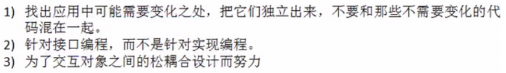
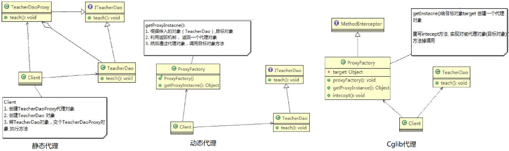
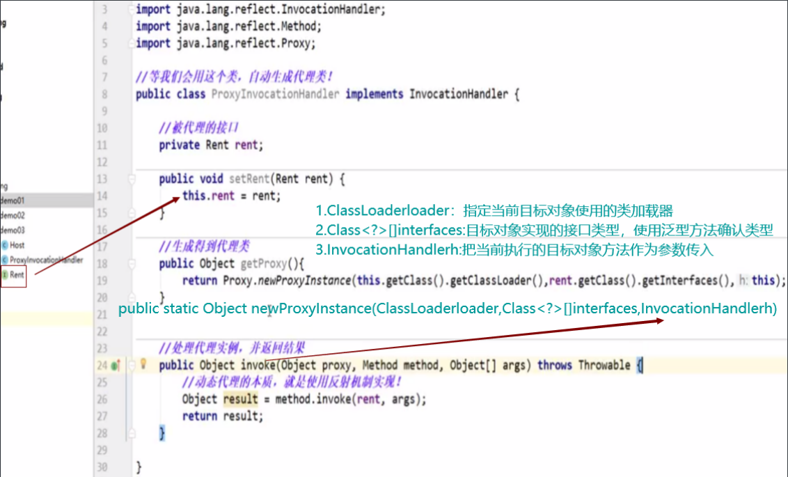
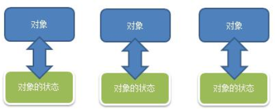

# 设计模式


> ⾯向对象 ==> 功能模块[设计模式⼗算法/数据结构] ==> 框架[多种设计模型] ==> 架构[服务器集群]
>


## 目的


- 站在系统的角度看
- 方便以后更改



## 设计模式七大原则

### 单一职责原则


### 接口隔离原则


### 依赖倒转原则


> 确定了实现该接口 IOpenAndClose 的子类 都将使用 ITV接口时，可以使用普通方法 / ssetter方法形参
>
> 否则，最好使用构造方法
>
> ？？spring容器中，大量使用到setter方法形参


### 里氏替换原则


### 开闭原则


### 迪米特法则


### 合成复用原则


- 组合：同生共死
- 聚和：好聚好散


## UML


## 设计模式类型


### 总述


### 创建型模式：对象的创建


#### 单例模式


1. 私有化构造器
2. 定义静态变量
3. getInstance
4. 怎么new自己


- DCL（双端检查）：使用volatile修饰静态变量，防止 new 的时候指令重排

>  `new Singleton()` 
>
> 1. 分配内存空间  
> 2. 执行构造方法，初始化对象    
> 3. 将这个对象指向这个空间


- 静态内部类和非静态内部类一样，[都不会因为外部类的加载而加载](https://www.cnblogs.com/zouxiangzhongyan/p/10762540.html)   

  1. 静态内部类的变量被调用时，外部类中的静态代码块中的代码执行了，但是并没有被初始化（外部类的构造方法并没有执行），且静态内部类也完成了加载
  2. 外部静态变量调用时，外部类进行了加载（注：静态代码块在类被加载时执行）并且执行了初始化操作（注：构造方法被调用），而静态内部类并没有被加载（注：静态内部类中的静态代码块没有执行），且类的加载顺序必定会在初始化的前面，所有看到先执行了静态代码块中的代码，其次执行了构造方法中的代码，完成上面两部后最后才打印出了静态变量

  - **static**属性在加载时就已经分配内存，并且只分配一次，可以用于对象间共享属性
  - **final**定义的变量为常量，不能被改变，方法不能被覆盖，类不能被继承


- 枚举安全性最高 ==> 反射不能破坏
    


**单例模式在JDK源码中Runtime的应用：**


#### 工厂模式


1. 简单工厂模式（静态工厂模式）：
    - 消费者**不再自己去new**，不用关心生产细节（具体参数之类）
    - 直接去找工厂get，由工厂 **匹配对应条件(if...esle if..)** 去new对应的对象(产品)
    - 缺点：工厂类不满足开闭原则，当新加产品时，工厂类的代码需要变动
2. 工厂方法模式：
    - 将工厂类变成接口，**约束**: 实现的工厂类通过抽象方法去new对应的产品
    
    - 新添加产品时，需要新增两个类，实现*产品接口* 和*工厂接口* ，`不用改变原来代码`
    
    - 实现工厂接口**里面的方法**，具体的方法实现（**区别**抽象工厂的工厂簇）
    
      > 根据设计原则：工厂方法模式；根据实际业务：简单工厂模式
      
      
    
3. 抽象工厂模式：
    - 生产工厂的工厂
    
    - 提供一个可以创建**一系列相关或相互依赖的**对象的接口，无需指定它们具体的类
    
    
       
    
     
    
     - 缺点：**不可以增加**产品类型（手机/路由器），可以增加产品族（品牌）
     


**简单工厂模式在Calendar类的使用：** 


#### 原型模式

> 原型 + 工厂  的设计模式：
>
> 工厂模式的 new ==> `替换成` 原型模式的克隆

原型：首创的模型，是一个类的源实例

原型模式跟直接new的区别：

- new生成的对象的*属性值都是默认的* 
- 通过原型模式返回的对象是*将属性值一同复制* 

1. 实现接口：Cloneable
2. 重写方法：clone()


**spring框架源码分析：**


- **浅拷⻉**

  

  - **String** 属于特殊类型，clone时与基本数据类型效果一样【字符串常量池的原因】

  

  

  

- **深拷⻉**

  

  

  方法一：

  

  


- 注意⚠ 事项

  


#### 建造者模式

动机：

- 在软件开发中，存在着大量类似汽车一样的复杂对象，它们拥有一系列成员属性，这些成员属性中有些是引用类型的成员对象。
- 而且在这些复杂对象中，还可能存在一些限制条件：
- 如某些属性没有赋值则复杂对象不能作为一个完整的产品使用；
- 有些属性的赋值必须按照某个顺序，一个属性没有赋值之前，另一个属性可能无法赋值等；
- 建造者模式创建的对象一般**内部变化是不大，不频繁的**。


> 封装机制：将**稳定的组合算法**与易变的各个组成部分隔离开来  
>
> [局限和细节](https://mp.weixin.qq.com/s?subscene=23&__biz=MzU4Njc1MTU2Mw==&mid=2247484295&idx=5&sn=936cb2dc5a606caeab7adbd04b53ae8d&chksm=fdf7c8a3ca8041b5da05eae3d3f17141969579e9a16c6d9ab2b9775f319be2914ab31f4ee2d1&scene=7&key=4cf40c946f4d610c5dd5f8ec584abcaa1b47b03970b0d2fa3e792272ae2cd1f279a23fc0340d4716d2e31dde256b0bde09e70c80efe0bb34a40f45ba1f4ecf2f8285f0ed8b611494057c2316c728da5a&ascene=0&uin=MTY5ODU1NzUxMA%3D%3D&devicetype=Windows+10+x64&version=62090529&lang=zh_CN&exportkey=A0wL%2Fs6yTAUAvASLRix0TEg%3D&pass_ticket=RcRvRVpZUsgxopBEQSYU27onW31Nk6MzMIecRiu24mnoLBJjycWAFPD%2F0GxkAFaD)	


- Director 相当于包工头，聚和了建造者
    - 当client指定了具体建造者，包工头**调用**具体建造者的方法，并返回产品给client
- Builder相当于工人，组合了产品
    - 如果没有调用工人的方法，得到的产品是**初始化状态**

**建造者模式在StringBuilder的使用：** 


建造者模式的简化:

- 省略抽象建造者角色：如果系统中只需要一个具体建造者的话，可以省略掉抽象建造者
- 省略指挥者角色：在具体建造者只有一个的情况下，如果抽象建造者角色已经被省略掉，那么还可以省略指挥者角色

```java
public AbstractStringBuilder append(String str) {
        if (str == null)
            return appendNull();
        int len = str.length();
        ensureCapacityInternal(count + len);
        str.getChars(0, len, value, count);
        count += len;
        return this;   			// 返回的Product为本身
    }
```


**总结：**


- 抽象工厂模式看作**汽车配件生产工厂**，生产一个产品族(品牌)的产品
- 建造者模式就是**汽车组装工厂**，组装配件返回一辆完整的汽车


### 结构型模式：系统


> 继承/实现 抽象类，并且聚和该抽象类？？


#### 适配器模式


> 整个电源转换器就是 适配器
> 插头面继承 被适配者【220v】
> 插孔面实现 输出者【5v】
> 手机通过构造方法 **聚和** 输出者


> 适配器模式和代理模式的区别：
>
> 适配器类 **继承** 被适配者类和目标类
>
> 代理类 要实现**与目标类**相同的接口


***

Controller变化==>HandlerAdapter变化==>adapter中handle方法的处理细节也变化


#### 桥接模式

**问题：**


- `可扩展性`不好，`耦合性`太强，不符合`单一职责原则`

**解决：**


- 连接`多种维度`**变化**的场景
- 每个维度为一个抽象类 (abstract/interface)
- 抽象类是对事物【电脑】，接口是对行为【品牌】
- 抽象类 **聚和** 接口
- `桥` 就是聚和关系


> 桥接模式：系统设计之初；
>
> 适配器模式：(八竿子打不着的关系) **强行**将某一品牌产生联系 


> 桥接模式和策略模式的区别：

- 桥接模式是**属性**在变，策略模式是**行为**在变
- 相同点：都用聚和代替继承


#### 装饰着模式

**问题：** `单品咖啡  <--  调料`


> 存在的问题：增加或者删除 调料种类时，代码维护量大

**解决：** `单品咖啡  -->  调料`


- 普通方法：       单品咖啡  <--  调料        【将调料类 聚和到 单品咖啡】
- 装饰着者模式：单品咖啡  -->  调料        【将单品咖啡 聚和到 调料类】
  - 调料类 继承 Drink
  - 调料类 **聚和** Drink
  - Drink【咖啡抽象类】

***

**装饰者模式在JDK应用的源码分析：** `IO体系`


```java
public abstract class InputStream implements Closeable{} //是一个抽象类，即Component

// 装饰者类 Decorator
public class FilterInputStream extends InputStream{ 
    protected volatile InputStream in;  // 被修饰的对象==>聚和 
}

// 调料
public class DataInputStream extends FilterInputStream implements DataInput{
    // FilterInputStream 子类， 也继承了被装饰的对象in
    public DataInputStream(InputStream in) {
        super(in);	}
}

// 测试类
public static void main(String[] args) throws Exception{
    DataInputStream dis = new DataInputStream(new FileInputStream("d:\\abc.txt"));
    System.out.println(dis.read());
    dis.close();
}
```

> 桥接和装饰者模式的区别：
>
> - 桥接模式：两个维度，两个抽象类，一个abstract事物【电脑】，一个interface行为【品牌】，abstract **聚和** interface
> - 装饰者模式：有且仅有一个顶级abstract类，装饰者类Decorator**继承**并**聚和**该抽象类

> 静态代理模式和装饰者模式的区别：
>
> - 代理类，下面没有其他子类
> - 装饰者类，下面有其他子类
> - 相同点：**继承**并且**聚和**同一个最高接口，可以对 被代理者/被装饰者 **扩充**


#### 组合模式

> 部分整体模式，它创建了对象组的树形结构，<u>将对象组合成树状结构</u>以表示“整体-部分”的层次关系。
>
> 需要遍历组织机构，或者处理的对象**具有树形结构**时,非常适合使用组合模式.

**问题：**


**解决：**


> 总结：
>
> - 之前的层级关系 `打平` ，全部都实现共同的abstract类 OrganizationComponent
> - 在abstract类中，叶子节点不用实现的方法，add/remove，使用 **protected** 
> - **root**【University】/ **node**【College】，`聚和` List<OrganizationComponent>

**组合模式在JDK集合的源码分析：** HashMap


```java
// 顶级root
public interface Map<K,V> {
    // put, putAll
}
```

```java
// 次级root
public abstract class AbstractMap<K,V> implements Map<K,V> {}
```

```java
// node，相当于University或者College
public class HashMap<K,V> extends AbstractMap<K,V> implements Map<K,V>, Cloneable, Serializable {
    // 聚和Node节点的方式
    transient Node<K,V>[] table;
    // 使用该方法将 下面的Node节点加入HashMap中
    final V putVal(int hash, K key, V value, boolean onlyIfAbsent,boolean evict) {
        Node<K,V>[] tab; 
        Node<K,V> p; int n, i;
        ......
    }
}
```

```java
// leaf, HashMap的静态内部类，相当于Department，实现Map顶级root中的内部接口Entry
static class Node<K,V> implements Map.Entry<K,V> {}
```


#### 外观模式

问题：


**解决：** 


> 定义一个一致的接口(外观类)，用以屏蔽内部子系统的细节
>
> 调用端只需跟这个接口发生调用，而无需关心这个子系统的内部细节

**外观模式在MyBatis框架的应用：** 


#### 享元模式

问题：


- 多个虚拟空间，一个网站的**相同实例对象**很多，造成服务器的资源浪费

解决：


- **内部状态：**指对象`共享`出来的信息，存储在享元对象内部且不会随环境的改变而改变
- **外部状态：**指对象得以依赖的一个标记，是随环境改变而改变的、不可共享的状态


- 工厂中产生**具体**享元对象，只`组合`**内部状态**的对象，<u>不能是抽象享元类</u> 

  ```java
  //集合，充当池的作用
  private HashMap<String,ConcreteWebSite> pool = new HashMap<>();
  ```

  

> 享元：共享对象
>
> 1. 系统底层开发，解决**重复对象**的内存浪费的问题，像数据库连接池 
> 2. 当系统中有大量相似对象，利用`池技术`，不用创建新对象，直接从缓冲池里拿
> 3. 池技术：String常量池、数据库连接池、缓冲池
> 4. spring中的容器，建议使用**setter**传入 引用对象属性，避免冲突

**享元模式在JDK Interger的应用源码：**

```java
public static Integer valueOf(int i) {
        if (i >= IntegerCache.low && i <= IntegerCache.high)
            return IntegerCache.cache[i + (-IntegerCache.low)];
        return new Integer(i);
    }
```

```java
private static class IntegerCache {
        static final int low = -128;
        static final int high;
        static final Integer cache[];
    static { int h = 127; ......; high = h;	// range [-128, 127]
            cache = new Integer[(high - low) + 1];
            int j = low;
            for(int k = 0; k < cache.length; k++)
                cache[k] = new Integer(j++);	// 初始化缓存数组
           }
```

**享元模式在JDK String的应用：**


#### 代理模式

[详细文档](https://mp.weixin.qq.com/s?__biz=MzU4Njc1MTU2Mw==&mid=2247484305&idx=2&sn=543090e4e2d229b9c37df8783cc720f4&chksm=fdf7c8b5ca8041a3faba5e6f6cc9c5b4859c40a80686816c6ce0d773e999249ab44368adf90a&scene=21#wechat_redirect)	

> 不再在**原有类**上修改，而在**代理类**上修改 ==> 完成对原有类的`扩充`(权限验证、日志、缓存、事务...)
>



> 静态代理：
>
> - 代理对象【TeacherDaoProxy】和目标对象【TeacherDao】要实现相同的接口【ITeacherDao】
> - 调用相同的方法【teach()】来调用目标对象【TeacherDao】的方法
>

>  动态代理：又叫JDK代理，接口代理 ==> 相当于上图的代理工厂
>
> - 代理对象【ProxyFactory】，不需要实现接口，**而是**`聚和`接口
> - 代理对象的生成，利用JDK的**反射**机制，动态的在内存中构建代理对象
> - 两个关键类：`java.lang.reflect.Proxy` 和 `InvocationHandler` 





> Cglib代理：可以在内存动态的创建对象，**不需要实现接口**，属于动态代理的范畴
>
> 也叫作子类代理,它是在内存中**构建一个子类对象**从而实现对目标对象功能扩展
>
> `Cglib包`的底层：通过使用**字节码处理框架ASM**来转换字节码并生成新的类

> 静态代理模式和装饰者模式的**区别**：
>
> - 代理类，下面没有其他子类
> - 装饰者类，下面有其他子类
> - 相同点：**继承**并且**聚和**同一个最高接口，可以对 被代理者/被装饰者 **扩充**


### 行为型模式：方法


#### 模板模式


> 又叫模板**方法**模式：
>
> - AbstractClass抽象类
>   - 类中实现了**模板方法**(template)，定义了骨架，模板方法可以做成**final**，不让子类去覆盖
>   - 具体子类需要 *去实现其它的抽象方法* operationr2,3,4
> - ConcreteClass实现类
>   - 实现抽象方法operationr2,3,4，以完成**特定子类**的步骤

- 模板方法模式的`钩子方法`：
  - 在模板方法模式的父类中，我们可以定义一个**方法**，它可以默认不做任何事
  - 子类可以视情况要不要覆盖它，该方法称为“钩子”

**Spring IOC容器初始化时，运用到模板方法模式：**


> 基本思想是：算法只存在于父类中，容易修改
>
> **父类**的模板方法确保了**算法的结构**保持不变，同时由**子类**提供**部分步骤**的实现
>
> `不足之处`：每一个不同的实现都需要一个子类实现，导致类的个数增加，使得系统更加庞大
>
> **使用场景**：当要完成在某个过程，该过程要执行一系列步骤，这一系列的步骤**基本相同**，但其个别步骤在实现时可能不同，通常考虑用模板方法模式来处理


#### 命令模式

问题：


- 不想针对每一种家电都安装一个App，分别控制，我们**希望只要一个app**就可以控制全部智能家电

解决：[视频源码解说](https://www.bilibili.com/video/BV1G4411c7N4?p=103)


**请求发送者**【手机app / Invoker】与 **请求接收者** 【每个家电产品 / Receiver】消除彼此之间的耦合

> 通俗易懂的理解：
>
> - 将军发布命令，士兵去执行。
> - 其中有几个角色：将军（命令发布者）、士兵（命令的具体执行者）、命令(`连接`将军和士兵)
>
> - Invoker是调用者（将军），Receiver是被调用者（士兵）
> - ConcreteCommand 是具体命令，实现了Command接口，持有接收对象


**命令模式在Spring框架JdbcTemplate应用：**


- `StatementCallback`接口，类似命令接口(Command)

- `QueryStatementCallback` 匿名内部类，实现了命令接口(ConcreteCommand)，也充当命令接收者(Receiver)

- `JdbcTemplate`命令调用者(Invoker)，在execute(StatementCallback<T>action)方法中，**调用**action.doInStatement方法

- 实现StatementCallback接口不同的类，对应不同的doInStatemnt实现逻辑，有以下四个内部类子类实现：

  ​	


> 外观模式：通过**外观类**，统一调度
>
> 命令模式：通过**命令**，单独调控


#### 访问者模式

问题：


- 违反了OCP原则，增加新的人员类型，或者管理方法，都不好扩展

解决：


- Visitor是抽象访问者，为该对象结构中的ConcreteElement的每一个类声明一个visit操作
- ConcreteVisitor：是一个具体的访问值实现每个有Visitor声明的操作，是每个操作实现的部分
- ObjectStructure能枚举它的元素，可以提供一个高层的接口，用来允许访问者访问元素
- Element定义一个accept方法，接收一个访问者对象
- ConcreteElement为具体元素，实现了accept方法


> 访问者模式：封装一些对<u>某种数据结构</u>的*各元素* 的**操作** 
>
> - 在不改变数据结构的前提下，定义作用于这些元素的新的操作
> - 主要将数据结构与数据操作分离，解决数据结构和数据操作的耦合性问题

- 主要应用场景是：需要对一个**对象结构中的对象**进行很多不同操作(这些操作彼此没有关联)，同时需要避免让这些操作**污染**这些对象的类，可以选用访问者模式解决


#### 迭代器模式

问题：


- 如果**集合元素**是用不同的方式实现的，有数组，还有java的集合类，或者还有其他方式，当客户端要遍历这些集合元素的时候就要使用<u>*多种*</u> 遍历方式，而且**还会暴露**元素的<u>*内部结构*</u>

解决：


- 将数据【College】 和遍历方式【Iterator】 分开；不同的数据，遍历方式也不一样

> 提供一种遍历集合元素的`统一接口`，用一致的方法遍历集合元素，**不暴露**集合对象的内部结构

**迭代器模式ArrayList集合的应用：**


> 迭代器模式**解决了**不同集合(ArrayList,LinkedList) 统一遍历问题


#### 观察者模式

问题：


- 耦合性太高，直接调用了推送的接口？？【应该做缓存层】
- 违反OCP原则，无法在运行时动态的添加第三方(新浪网站)
- 在WeatherData中，增加一个第三方，都需要创建一个对应的第三方的公告板对象，**并加入到**dataChange

解决：


- 以集合的方式来管理用户(Observer)，包括注册，移除和通知
- 增加观察者(新的公告板)，不需要修改核心类WeatherData的代码，遵守了OPC原则


**观察者模式在JDK的应用Observable:**


- Observable的作用和地位等价于Subject
- Observable**是类**，不是接口，类中已经实现了核心的方法，即管理Observer的方法add..delete..notify...
- Observer的作用和地位等价于我们前面讲过的Observer，有update
- Observable和Observer的使用方法和前面讲过的一样，只是Observable是类，通过继承来实现观察者模式


#### 中介者模式

**问题：**

闹铃响起->咖啡机开始做咖啡->窗帘自动落下->电视机开始播放


- 电器对象彼此联系，你中有我，我中有你，不利于松耦合
- 当系统<u>增加一个新的电器对象</u>时，或者执行流程改变时，代码的可维护性、扩展性都不理想

**解决：**


> 中介者模式，用一个中介对象来**封装**一系列的<u>对象交互</u>
>
> 中介者使各个对象*不需要显式地相互引用*，从而使其耦合松散，而且可以独立地改变它们之间的交互 ==> **解耦**
>
> MVC模式，C 是 M 和 V 的中介者，在前后端交互时起到了中间人的作用

总结：将 colleague子类之间的耦合，交给中介者来统一处理


#### 备忘录模式	

问题：



- 一个对象，就对应一个保存对象状态的对象，当游戏的对象很多时，不利于管理，开销也很大
- 传统方式只是简单地做备份，**new**出另外一个对象，再把需要备份的数据放到这个新对象，但暴露了对象内部的细节

解决：[视频代码讲解](https://www.bilibili.com/video/BV1G4411c7N4?p=128)


- originator:对象(需要保存状态的对象)
- Memento：备忘录对象,负责保存好记录，即Originator内部状态
- Caretaker:守护者对象，负责保存多个备忘录对象，使用集合管理，提高效率

- 现实生活中的备忘录是用来*记录某些要去做的事情*，或者是记录已经达成的共同意见的事情，以防忘记了
- 在软件层面，备忘录模式有着相同的含义，备忘录对象主要用来*记录一个对象的某种状态，或者某些数据*，当要做回退时，可以从备忘录对象里获取原来的数据进行恢复操作

> 在不破坏封装性的前提下，捕获一个对象的内部状态，并在该**对象之外**保存这个状态			
>
> 原型模式：需要new对象，占用资源较大
>
> 备忘录模式：直接调用originator的recover()

```java
//如果只保存一次状态
private Memento memento;
//对GameRole保存多次状态
private ArrayList<Memento> mementos;
//对多个游戏角色保存多个状态
private HashMap<String, ArrayList<Memento>> rolesMementos;
```


#### 解释器模式

传统方案：


- 编写一个方法，接收表达式的形式，然后根据用户输入的数值进行解析，得到结果
- 问题分析：如果加入新的运算符，比如 * /
- 不利于扩展，另外让一个方法来解析会造成程序结构混乱，不够清晰

解决：


**解释器模式在Spring框架中的应用：**


#### 状态模式

问题：


解决：


> 状态模式（State Pattern）：它主要用来解决对象在*多种状态转换* 时，需要对外输出不同的行为的问题。状态和行为是一一对应的，状态之间可以相互转换
>
> 当一个对象的内在状态改变时，允许改变其行为，这个对象看起来像是改变了其类

**状态模式在实际项目-借贷平台：**


- 该类图中，含有**接口适配器模式**


#### 策略模式

问题：


- 玩具鸭子ToyDuck，需要覆盖Duck的所有实现的方法
- 对Duck超类的局部改动，会影响其他部分，有溢出效应

**解决：** 将继承换成 组合/聚和


**策略模式：在Arrays的sort方法中 聚和Comparator接口：**	


==减少方法的创建==

另外个需求：筛选出公司年龄大于35的员工，之后筛选工资大于20K的员工

> 聚和一个接口 ？？ 就是策略模式？？

[策略模式 + 工厂模式 的列子](https://mp.weixin.qq.com/s?__biz=MzU0NDA2MjY5Ng==&mid=2247485568&idx=1&sn=f4808337bfa3bf730e0d8dad42bc707a&chksm=fb00a507cc772c116f890cd740392389f8c880c2ee17b52cd68db57e2bfffb155199876cb982&mpshare=1&scene=1&srcid=0728VJP9ohmQWzB2lqPjyNgm&sharer_sharetime=1595898548941&sharer_shareid=aa55b5520af7873f02181e7e14a32e3e&key=8c9049d0f83009fef791a892866237ee2b8654f81e9923654f22b5082e5dda9b06f3336b5125564ab0fca3d0d78cd83cc0d7fb4ed056ec20a2d1bfa50434e93f0b0d54516fd500b3559d839e0db3a15e&ascene=1&uin=MTY5ODU1NzUxMA%3D%3D&devicetype=Windows+10+x64&version=62090529&lang=zh_CN&exportkey=AxHg9jhFp%2FFmJh2LMJ%2Fz%2BZc%3D&pass_ticket=ryQyEotroU2QEbe7YMAD%2Fz9L9v%2FXqdptngKZGzFNs5w%2BMx%2B6NUxncvT5BCT89RoA)	


#### 职责链模式

问题：


- 接收到一个采购请求后，根据采购金额来调用对应的Approver(审批人)完成审批
- 客户端会使用到分支判断(比如switch)来对不同的采购请求处理
  - 如果各个级别的人员审批金额发生变化，在客户端的也需要变化
  - 客户端必须明确的知道有多少个审批级别和访问
- 采购请求进行处理和Approver(审批人)存在强耦合关系

解决：


- 需要设置好各个审批级别，处理人构成环形，避免空指针异常，**类似链表**
- 一个处理不了，将请求转给下一个

**职责链模式在SpringMVC框架HandlerExecutionChain类的应用：**


> HandlerExecutionChain 获取到内部拦截器，根据实际情况调用不同方法来处理
>
> 最佳应用场景：有多个对象可以处理同一个请求时，比如：多级请求、请假/加薪等审批流程、JavaWeb中Tomcat对Encoding的处理、拦截器

- springmvc请求的流程图中，执行了拦截器相关方法interceptor.preHandler等等
- 在处理SpringMvc请求时，使用到职责链模式还使用到适配器模式
- HandlerExecutionChain主要负责的是请求拦截器的执行和请求处理,但是他本身不处理请求，只是将请求分配给链上注册处理器执行，这是职责链实现方式,减少职责链本身与处理逻辑之间的耦合,规范了处理流
- HandlerExecutionChain维护了HandlerInterceptor的集合，可以向其中注册相应的拦截器


